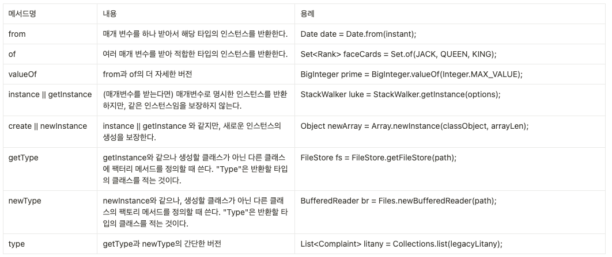

# 02 객체 생성과 파괴

# Item 1. 생성자 대신 정적 팩터리 메서드를 고려하라
## 정적 팩토리 메소드의 장점
1. 이름을 가질 수 있다
    - 생성자는 반환될 객체의 특성을 설명하기 힘들다
    - 이름을 잘 지으면 반환될 객체의 특성을 쉽게 묘사 가능
2. 호출될 때마다 인스턴스를 새로 생성하지 않아도 된다
    - 이 덕분에 불변 클래스는 인스턴스를 `미리 만들어 놓거나` 새로 생성한 `인스턴스를 캐싱`하여 `재활용`하여 불필요 객체 생성을 피한다
    - ex) `Boolean.valueOf(boolean)` 메서드는 객체를 아예 생성하지 않는다
    - `플라이웨이트 패턴`도 이와 비슷한 기법
    - 인스턴스를 통제하여 `싱글턴` 및 `인스턴스화 불가`로 만들 수 있다
3. 반환 타입의 하위 타입 객체를 반환할 수 있는 능력이 있다
    - 인터페이스의 구현체를 일일이 소개하지 않고도 상황에 맞는 서브클래스를 제공함으로써 `API의 노출범위를 최소화` 할 수 있다
        - ex) Collections.emptyList(), Collections.emptyMap(), ...
4. 입력 매개변수에 따라 매번 다른 클래스의 객체를 반환할 수 있다
    - 오버라이딩을 활용해서 매개변수가 다르면 다른 서브클래스를 반환할 수 있다
5. 정적 팩터리 메서드를 작성하는 시점에는 반환할 객체의 클래스가 존재하지 않아도 된다.
    - 이런 유연함은 `서비스 제공자 프레임워크`를 만드는 근간이 된다, ex) JDBC
    - 서비스 제공자 프레임워크는 클라이언트에 구현체를 제공하는 역할을 프레임워크가 통제하여, 클라이언트에게 필요하지 않을 땐 기본 구현체를, 요구사항이 있을 땐 특정 구현체를 반환할 수 있다.

## 정적 팩토리 메소드의 단점
1. 상속을 하려면 public이나 protected 생성자가 필요하니 정적 팩터리 메서드만 제공하면 하위 클래스를 만들 수 없다
    - 정적 팩토리 메서드를 제공하면 private 생성자를 활용하게 되므로 상속을 이용할 수 없다.
    - 이 제약은 상속보다는 조합 원칙 혹은 불변 타입을 만들려면 이 제약을 지켜야 한다는 점에서 장점으로 받아들일 수 도 있다. 
2. 정적 팩토리 메서드는 프로그래머가 찾기 어렵다
    - 사람마다 네이밍 습관이 다르기 때문
    - 혼란을 줄이기 위해 관례적인 네이밍을 활용하기도 한다
    - 

<br>

# Item 2. 생성자에 매개변수가 많다면 빌더를 고려하라
## 빌더 패턴이 필요한 이유
- 선택적 매개변수가 많을 떄 적절히 대응하기 어렵다
- 매개변수의 개수가 많아질수록 어떤 생성자를 이용 중인지 `깊은 주의`가 필요하다 -> 이는 반드시 `휴먼 에러`가 일어날 것임을 암시한다
- `자바빈즈 패턴(set()활용)`으로 해결할 수 있지만 `여러 set()메소드를 호출`해야 하고, 객체가 완전히 생성되기 전까지는 `일관성이 무너진 상태`에 놓인다. 때문에 클래스를 불변으로 만들 수 없다.
- 빌더 패턴을 활용하면 쓰기도 읽기도 쉽다.
    - ``` java
        NutritionFacts cocacola = new NutritionFacts.Builder(240, 8)
                .calories(100)
                .sodium(35)
                .carbohydrate(27)
                .build();
        ```

## 빌더 패턴의 단점
- 객체를 만들기 전에 빌더를 만들어야 한다.
- 빌더 생성 비용이 크진 않지만 성능이 매우 민감한 프로그램이라면 문제가 될 수 있다

<br>

# Item 3. private 생성자나 열거 타입으로 싱글턴임을 보증하라

## 싱글턴 패턴이란?
- 인스턴스를 `오직 하나`만 생성할 수 있는 클래스
- 이를 사용하는 클리이언트를 테스트하기 어려워질 수 있다

## 싱글턴 패턴 만들기
- `생성자 private`로 만들어 생성을 제한
1. public static 인스턴스로 접근하는 방법
    - 싱글턴임이 API에 명백히 들어남
    - 코드 작성의 간결함
    - ``` java
        public class Elvis {
                public static final Elvis INSTANCE = new Elvis();
                private Elvis() { ... }
        }
        ``` 
    

2. 정적 팩토리 메서드를 활용하는 방식
    - 싱글턴이 아니라 다른 방식으로 변환하고 싶을 떄 자유롭게 변경 가능
    - 정적 팩토리를 제네릭 싱글턴 팩토리로 만들 수 있다
    - 해당 메소드를 `Supplier<Elvis>` 에 메소드 레퍼런스로 넘겨줄 수 있다
    - ``` java
        public class Elvis {
                private static final Elvis INSTANCE = new Elvis();

                private Elvis() { ... }
                
                public static Elvis getInstance() {
                        return INSTANCE;
                }
        }
        ```

<br>

# Item 4. 인스턴스화를 막으려거든 private 생성자를 사용하라

## 유틸리티 클래스와 private 생성자
- 유틸리티 클래스는 인스턴스화를 의도하고 만든 클래스가 아니기에 인스턴스화를 막아야 한다
- 추상 클래스로는 인스턴스화를 막을 수 없다
    - 하위 클래스를 만들어 인스턴스화할 수 있음
- 따라서 private 생성자를 추가하여 클래스의 인스턴스화를 막을 수 있다.
- ``` java
    // Noninstantiable utility class
    public class UtilityClass {
        // Suppress default constructor for noninstantiability
        private UtilityClass() {
            throw new AssertionError();
        }
        ... // Remainder omitted
    } 
    ```

<br>

# Item 5. 자원을 직접 명시하지 말고 의존 객체 주입을 사용하라

## 정적 유틸리티 클래스
- 객체지향적으로 좋은 선택지는 아니지만, 분명히 용도(valid uses)가 있다
- java.util.Collections처럼 정적 멤버만 존재하는 클래스를 유틸리티 클래스, 도우미 클래스(Helper class)라고 한다
- 사용하는 자원에 따라 동작이 달라지는 클래스에는 정적 유틸리티 클래스나 싱글턴 방식이 적합하지 않다

## 사례로 알아보기
### 유틸리티 철자 검사기
``` java
public class SpellChecker {
    private static final Lexicon dictionary = ...;

    private SpellChecker() {} // Noninstantiable
    
    public static boolean isValid(String word) { ... }
    public static List<String> suggestions(String typo) { ... }
}
```
### 싱글톤 철자 검사기
``` java
public class SpellChecker {
    private final Lexicon dictionary = ...;

    private SpellChecker(...) {}

    public static INSTANCE = new SpellChecker(...);

    public boolean isValid(String word) { ... }
    public List<String> suggestions(String typo) { ... }
}
```

- 두 방식 모두 인스턴스 생성 없이 dictionary를 바꾸기 쉽지 않다
- setDictinary()와 같은 메서드를 만들어 정적 멤버를 변경한다면, 멀티 스레딩 환경에서 버그를 유발하기 매우 쉽다.
- 그렇기 때문에, 내무 멤버에 의해 다른 행동을 할 수 있는 객체는 싱글턴, 유틸리티 객체보다 `의존성 주입 방식`으로 코딩하는 것이 좋다.

### 의존성 주입 방식의 철자 검사기
``` java
    public class SpellChecker {
        private final Lexicon dictionary;

        public SpellChecker(Lexicon dictionary) {
            this.dictionary = Objects.requireNonNull(dictionary);
        }

        public boolean isValid(String word) { ... }
        public List<String> suggestions(String typo) { ... }
    }
```

# Item 6. 불필요한 객체 생성을 피하라

## 불필요한 객체란?
- 불변 객체로 다루어져서 동일한 인스턴스를 또 생성한 경우
    - ex) `String str = new String("str")`
- `String str = "str"` 을 사용하면 쓸데없는 String 인스턴스 없이 모든 코드가 같은 객체를 재사용함이 보장된다

## 불필요 객체 생성을 피해야 하는 이유
- 불필요 객체 생성으로 인한 `성능 이슈`
- 어떤 객체는 생성 비용이 매우 비쌀 수 있다
- 이런 경우 `캐싱`하여 `재사용`하여 효율적으로 사용 가능하다

## 생성 비용이 큰 객체
- `String.matces()`
- 이 메소드에서 내부에서 사용하는 `Pattern` 인스턴스는 유한 상태 머신을 만들기 때문에 생성 비용이 크다
- 따라서 매번 반복하여 사용하지 말고 클래스 초기화 과정에서 직접 생성해 `캐싱`해두고 `재사용`하여 성능을 개선할 수 있다.
- 개선 전
    - ``` java
        static boolean isRomanNumeral(String s) {
		return s.matches("^(?=.)M*(C[MD]|D?C{0,3})"
		+ "(X[CL]|L?X{0,3})(I[XV]|V?I{0,3})$");
        }
        ```
- 개선 후
    - ``` java
        public class RomanNumerals {
            private static final Pattern ROMAN = Pattern.compile(
            "^(?=.)M*(C[MD]|D?C{0,3})"
            + "(X[CL]|L?X{0,3})(I[XV]|V?I{0,3})$");

            static boolean isRomanNumeral(String s) {
                    return ROMAN.matcher(s).matches();
            }
        }
        ```
- 2차 개선
    - 이렇게 생성된 RomanNumerals이 사용되지 않는다면 쓸데없이 초기화된 꼴이다.
    - 메서드가 처음 호출될 때 필드를 초기화하는 `지연 초기화`로 불필요한 초기화를 없앨 수 있다.
    - 유의미한 성능 개선은 없고 코드가 복잡해지는 경우가 많아 적용할 땐 고민해보자

## 의도치 않은 오토박싱
- Long 타입과 long 타입간의 오토박싱으로 인해 성능 악화가 일어난다.
- '어떤 타입을 써야 한다!'가 아니라 의도치 않은 오토 박싱으로 인해 성능 저하를 막자!
- ``` java
    private static long sum() {
		Long sum = 0L;
		for (long i = 0; i <= Integer.MAX_VALUE; i++)
			sum += i;

		return sum;
    }
    ```

## 효율적인 객체 생성 및 관리
- 요즘의 JVM과 GC는 성능이 뛰어나기 때문에 작은 객체를 생성하고 회수하는 비용은 매우 작다. 
- 프로그램의 명확성, 간결성, 기능성을 개선하기 위한 객체 추가는 권장된다. 
    - `무의미한 객체 생성을 주의`하라는 메시지이다!
- 아주 무거운 객체가 아니고서야 자체적인 나만의 객체 풀을 만들지는 말라. 
    - `객체 풀` 생성 자체가 매우 큰 비용이 된다. 
- 잘 활용된 객체 풀의 예시는 `DB Connection Pool`이다. 
    - 데이터베이스와의 연결 수립비용은 매우 크고, 수립된 커넥션을 재활용 하는 것은 좋은 전략이다. 
- 하지만 나만의 객체 풀을 만들고 유지하는 건 보통 메모리 사용량을 늘려서 성능을 악화하고 코드를 헷갈리게 할 뿐이다.
- 요즘 JVM의 GC는 최적화되어서 가벼운 객체를 다룰 때는 직접 만든 객체 풀보다 훨씬 빠르다

<br>

# Item 7. 다 쓴 객체 참조를 해제하라
## 가비지 컬렉터
- 메모리를 직접 관리하지 않아도 `GC`가 참조하지 않는 객체에 대해 수거해간다.
- 다른 말로는, 참조가 해제되지 않고 유지된다면 수거되지 않는다.
- 이렇게 사용하지 않는 객체가 쌓이다 보면 로직에선 사용되지 않는 메모리로 인해 프로그램 성능에 영향을 받게 되는데 이를 `메모리 누수`라고 한다.

## 메모리 누수가 발생할 수 있는 상황
1. 자기 메모리를 직접 관리하는 클래스
    - 자체 구현한 자료구조 혹은 객체 배열의 경우, 로직 상 사용하지 않지만 참조는 해제되지 않은 경우
    - `null을 할당 = 참조 해제`의 의미로 GC의 수거 대상으로 만든다
    - 하지만 null 할당은 `NPE`를 발생시키는 주범으로 `메모리 누수`를 막는 예외적인 경우에만 사용하자
2. 캐시
    - 객체 참조를 `캐시`에 넣고 한참을 놔두면 메모리 누수의 범인이 된다
    - 여러 해법 중 하나인 `WeakHashMap`을 활용하여 `Key를 참조`하는 동안만 엔트리가 살아있게 만들 수 있다.
    - 혹은 `백그라운드 스레드`에서 사용하지 않는 엔트리를 청소해주거나, 새 엔트리를 추가할 떄 부수작업으로 수행할 수도 있다
3. 리스너, 콜백
    - 클라이언트가 `콜백`을 등록만 하고 명확히 해제하지 않으면 콜백이 계속 쌓인다.
    - 이때 콜백을 `약한 참조`로 등록해 두면 GC가 `즉시 수거`한다.
        - `WeakHashMap`에 키로 저장하면 `약한 참조`를 만들 수 있다.

# Item 8. finalizer와 cleaner 사용을 피하라

## finalizer
- finalize 메소드를 오버라이드 하여 GC 대상이 될 때 수행된다.
- 자바 9부터 deprecated 되고 대안으로 cleaner가 소개됨

## cleaner
- finalizer보다는 덜 위험하지만, 여전히 예측 불가능, 느림, 일반적으로 불필요

## finalizer 또는 cleaner를 쓰면 안 되는 이유
1. 수행 시점은 물론 수행 여부조차 보장해주지 않는다.
    - 자원 회수의 우선순위 때문
2. try-with-resources 문에 비해 심각한 성능 저하가 있다.
3. finalizer attack에 노출된다.

## finalizer 또는 cleaner의 묘안
- AutoCloseable을 구현해주고, 다 사용한 자원에 대해 close()를 수행해준다.
- 되도록 try-with-resources를 사용하는 것이 더 좋다

## finalizer 또는 cleaner의 쓰임새
1. 자원 소유자가 close 메소드를  호출하지 않을 경우를 대비한 안전망 역할
    - 자원 회수를 안 하는 것보단 늦게라도 하는 것이 낫기 때문
    - `FileInputStream`, `FileOutputStream`, `ThreadPoolExecutor는` 안전망 역할의 finalizer를 제공한다
2. 네이티브 피어와 연결된 객체에서 사용
    - `네이티브 피어`는 일반 자바객체가 네이티브 메서드를 통해 기능을 위임한 `네이티브 객체`를 말한다. 
    - 자바 객체가 아니므로 GC는 네이티브 객체의 존재조차 모른다. 
    - 이런 상황이라면 finalizer 또는 cleaner가 처리할 수 있다. 
    - 그러나 성능 저하를 감수할 수 있고 네이티브 피어가 그다지 중요하지 않은 자원을 가지고 있을 때에 해당한다. 
    - 그렇지 않다면 close 메서드를 활용해야한다.

<br>

# Item 9. try-finally 보다는 try-with-resources를 사용하라

## 직접 close() 해줘야 하는 객체들
- InputStream, OutputStream, java.sql.Connection... 
- 외부 자원과 연동되어 있기 떄문에 닫아주지 않으면 예외가 발생한다

## try-finally
- 닫을 자원이 둘 이상이면 코드가 매우 지저분해짐
- 만약 out.close()에서 예외가 발생하면 out.write에서 발생한 예외를 집어삼킬 수 있다.
    - 이는 디버깅을 힘들게 한다. 
    - 이를 해결하려면 코드가 많이 지저분해진다.
    - ``` java
        static void copy(String src, String dst) throws IOException {
            InputStream in = new FileInputStream(src);
            try {
                OutputStream out = new FileOutputStream(dst);
                    try {
                        byte[] buf = new byte[BUFFER_SIZE];
                        int n;
                        while ((n = in.read(buf)) >= 0)
                            out.write(buf, 0, n);
                    } finally {
                        // out 이 null이라면..? NPE
                        if(out != null){
                            out.close();
                        }
                    }
            } finally {
                in.close();
            }
        }
        ```

## try-with-resources
- 자바7부터 등장
- AutoCloseable 인터페이스를 구현해야 한다
- try-finally의 예외를 집어삼키던 문제를 해결
    - 집어삼켜진 예외는 Supperessed 꼬리표를 달고 스택트레이스에 찍힌다
- ``` java
    static void copy(String src, String dst) throws IOException {
        try (InputStream in = new FileInputStream(src);
             OutputStream out = new FileOutputStream(dst))
        {
            byte[] buf = new byte[BUFFER_SIZE];
            int n;
            while ((n = in.read(buf)) >= 0)
            out.write(buf, 0, n);
        }
    }
    ```
