## 1. Garbage Collection, Garbage Collector
- `가비지(Garbage)`는 유효하지 않은 `메모리`
- `가비지 컬렉션`은 가비지를 회수하는 `과정`을 말한다
- `가비지 컬렉터`는 가비지 컬렉션을 수행하는 `알고리즘` 또는 `도구`를 말한다
- 통상 `GC` = `Garbage Collection` = `Garbage Collector` 같은 의미로 쓰이는 것 같다
- `JVM`은 가비지 컬렉터를 통해 가바지를 `자동`으로 정리해준다

### 1.1 System.gc()
C언어에 경우 free()라는 메소드를 통해 메모리를 반납한다.

Java에서는 System.gc()라는 함수를 통해 `가비지 컬렉션` 호출을 요청할 수 있다.
말 그대로 가바지 컬렉션 호출을 강제하는 것이 아닌 요청이다. 즉, 요청한다해서 무조건 실행된다는 의미가 아니다.

하지만 이 작업은 많은 리소스를 소모하기 때문에 무조건 실행된다는 보장이 없기 때문에 무분별한 사용은 `지양`하는 것이 좋다

## 2. GC의 구조

- 크게 Young Generation(Minor GC), Old Generation(Major GC)으로 나뉜다
- 객체는 `대부분 일회성`이며, 메모리에 오랫동안 남아있는 경우는 드물기 때문에 이 같은 두 영역으로 구분이 된다

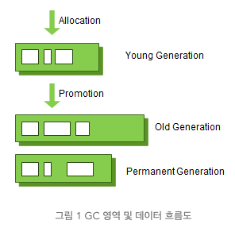

### 2.1. Young Generation (Minor GC)
- `새롭게 생성된 객체`가 할당되는 영역
- 부분의 객체가 금방 Unreachable 상태가 되기 때문에, 많은 객체가 Young 영역에 생성되었다가 사라진다.

### 2.2. Old Generation (Major GC)
- Young 영역에서 Reachable 상태를 유지하여 살아남은 객체가 복사되는 영역
- 보통 Young 영역의 객체들은 짧은 수명으로 큰 공간을 필요로 하지 않기 때문에, `큰 객체`들은 바로 Old 영역에 할당된다 
- 따라서 Young 영역보다 `크게` 할당되며, 영역의 크기가 큰 만큼 가비지는 `적게` 발생한다
- `Full GC` 라고도 한다

### 2.3. Card Table
예외적인 상황으로 Old 영역의 객체가 Young 영역의 객체를 참조하는 경우를 대비해 Old 영역에 512Byte의 덩어리(Chunk)로 되어 있는 카드 테이블이 존재한다

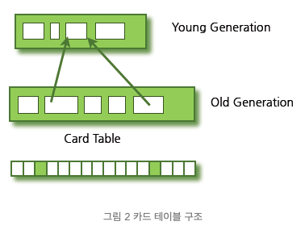

## 3. Garbage Collection(가비지 컬렉션)의 동작 방식
Young 영역과 Old 영역은 서로 다른 메모리 구조로 되어 있기 때문에, 세부적인 동작 방식은 다르다. 
하지만 기본적으로 가비지 컬렉션이 실행된다고 하면 다음의 2가지 공통적인 단계를 따르게 된다.

### 1단계) Stop The World
- 가비지 컬렉션을 실행하기 위해 JVM이 애플리케이션의 `실행을 멈추는 작업`이다. 
- GC가 실행될 때는 GC를 실행하는 쓰레드를 제외한 모든 쓰레드들의 `작업이 중단`되고, GC가 완료되면 작업이 재개된다. 
- 당연히 모든 쓰레드들의 작업이 중단되면 애플리케이션이 멈추기 때문에, GC의 성능 개선을 위해 튜닝을 한다고 하면 보통 stop-the-world의 시간을 줄이는 작업을 하는 것이다. 

### 2단계) Mark and Sweep
- Mark: `사용되는` 메모리(Reachable)와 `사용되지 않는` 메모리(Unreachable)를 식별하는 작업
- Sweep: Mark 단계에서 사용되지 않음으로 식별된 `메모리를 해제`하는 작업

## 4. Minor GC의 동작 방식
### 구조
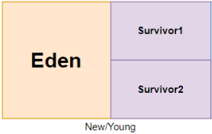
- Eden 영역: `새로 생성된 객체`가 할당(Allocation)되는 영역 
- Survivor 영역(2개): 최소 `1번 이상의 GC에 살아남은 객체`가 존재하는 영역

### 동작 방식
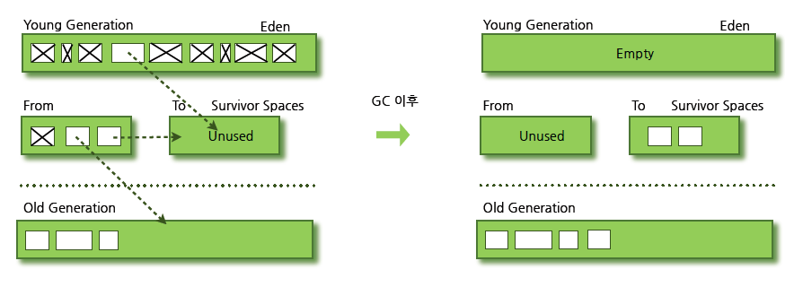
1. 새로 생성된 객체가 Eden 영역에 할당된다.
2. 객체가 계속 생성되어 Eden 영역이 꽉차게 되고 Minor GC가 실행된다. 
   1. Eden 영역에서 사용되지 않는 객체의 메모리가 해제된다. 
   2. Eden 영역에서 살아남은 객체는 Survivor 영역 중 하나로 이동된다.
3. 만약, 하나의 Survivor 영역이 가득 차게 되면 그 중에서 살아남은 객체를 다른 Survivor 영역으로 이동한다. (즉, 하나의 Survivor 영역은 비어있는 상태)
4. 이러한 과정을 반복하여 계속해서 살아남은 객체는 Old 영역으로 이동된다.

> [ Old 영역으로의 이동(Promotion) ]  
> Minor GC는 객체의 생존 횟수(age)를 카운트 하여 Object Header에 기록하고 age를 통해 Promition 여부를 결정한다

### Bump-The-Pointer, TLABs(Thread-Local Allocation Buffers)
`HotSpot JVM`에서는 Eden 영역에 객체를 빠르게 할당(Allocation)하기 위해 사용되는 기술

`Bump-The-Pointer`란 Eden 영역에 마지막으로 할당된 객체의 주소를 캐싱해두는 것이다. 
이로 인해 새로운 객체에 메모리를 할당해 주기 위해 마지막으로 할당된 객체의 주소의 다음 주소를 사용하여 속도를 향상시킨다

멀티쓰레드 환경에서 마지막으로 할당된 객체의 주소에 접근하기 위해 `락(Lock)`을 걸어 `동기화`를 해주어야 한다. 
`TLABs(Thread-Local Allocation Buffers)`란 `각각의 쓰레드마다` Eden 영역에 객체를 할당하기 위한 주소를 부여함으로써 동기화 작업 없이 빠르게 메모리를 할당하도록 하는 기술이다.

## 5. Major GC 동작 방식
- Old 영역이 가득 차면 Major GC를 실행한다. 
- Minor GC에서는 Mark-Sweep 방식이었지만 Major GC는 `Mark-Sweep-Compact` 알고리즘을 사용한다
  - Mark-Sweep 방식에 Compact 작업이 추가된 알고리즘
  - `Compact`: 각 객체들이 연속되게 쌓이도록 힙의 가장 앞 부분부터 채워서 객체가 존재하는 부분과 객체가 없는 부분으로 나눈다
    - 즉, 압축을 통한 메모리 단편화를 줄임
- 일반적으로 Young 영역은 크기가 작기 때문에 GC가 보통 0.5~1초 사이에 끝난다
- Old 영역은 크기가 크기 때문에 Minor GC보다 대략 10배 이상의 시간이 소요된다
- 따라서 이를 개선하기 위한 Major GC의 여러 알고리즘이 존재한다

### 5.1. Serial GC 알고리즘
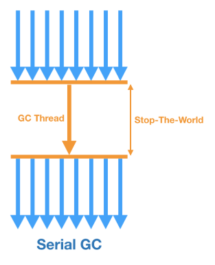
- 서버의 `CPU 코어가 하나`일 때 사용하기 위해 개발된 `가장 단순`한 GC
- GC를 처리하기 위한 스레드가 1개여서 `Stop The World` 시간이 가장 길다
- 거의 사용하지 않는다

### 5.2. Parallel GC 알고리즘
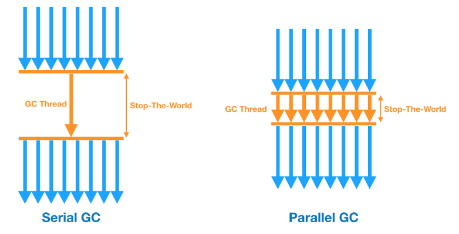
- `Java 8`의 디폴트 GC
- Serial GC와 기본적인 알고리즘은 같지만, Young 영역을`멀티 쓰레드`로 수행 (Old 영역은 여전히 싱글 쓰레드)
- Serial GC에 비해 stop-the-world 시간 감소

### 5.3. Parallel Old GC (Parallel Compacting Collector) 알고리즘
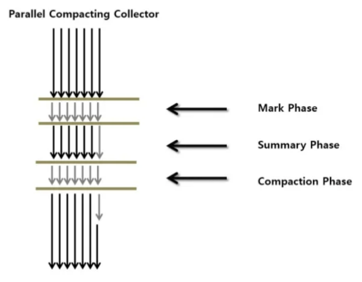
- `Parallel GC`를 개선한 버전
- Young, Old 영역 `모두` `멀티 쓰레드`로 수행
- Mark-Summary-Compact 방식을 이용

**[ Mark Summary Compact ]** 
Mark Sweep Compact 방식은 사용하지 않는 메모리에 대해서 회수하는 작업이 일어난다. 
Mark Summary Compact는 Mark된 결과를 바탕으로, 각 메모리 블록(Region)에 대한 요약 정보를 생성한다.

Sweep과 Summary의 가장 큰 차이는 Sweep은 명시적으로 메모리를 해제하지만, Summary는 메모리 블록의 요약 정보를 바탕으로 재사용이 가능한 블록으로 식별하는 작업을 수행한다

### 5.4. CMS GC (Concurrent Mark Sweep) 알고리즘
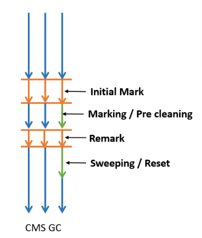
- 어플리케이션의 쓰레드와 GC 쓰레드가 동시에 실행되어 `stop-the-world` 시간을 최대한 줄이기 위해 고안된 GC
- GC 과정이 매우 복잡해짐.
- GC 대상을 파악하는 과정이 복잡한 여러단계로 수행되기 때문에 다른 GC 대비 `CPU 사용량이 높다`
- `메모리 파편화` 문제
- CMS GC는 Java9 버젼부터 `deprecated` 되었고 결국 Java14에서는 사용이 `중지`

### 5.5. G1 GC (Garbage First) 알고리즘
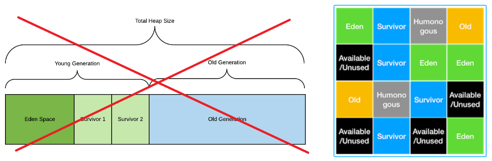
- CMS GC를 대체하기 위해 jdk 7 버전에서 최초로 release된 GC
- `Java 9+` 버전의 디폴트 GC로 지정
- 4GB 이상의 힙 메모리, Stop the World 시간이 0.5초 정도 필요한 상황에 사용 (Heap이 너무작을경우 미사용 권장)
- 고정된 Young(Eden, Survivor), Old 영역이 아닌, `Region`이라는 개념을 도입하여 `동적`으로 영역을 부여
- Garbage로 가득찬 영역을 `빠르게 회수`하여 빈 공간을 확보하므로, 결국 `GC 빈도가 줄어드는 효과`를 얻게 되는 원리

> 어떻게 빠르게 회수할 수 있을까?  
> - Region 단위 작업으로 인한 힙 전체가 아닌 선택된 영역만 메모리 수집
> - 각 Region에 대해 가비지 비율을 관리하여 가득찬 영역을 빠르게 찾아냄

### 5.6. Shenandoah GC 알고리즘
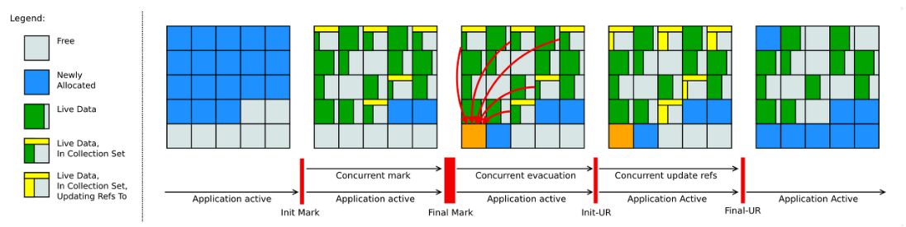
- `Java 12`에 release
- `Red Hat`에서 개발한 GC
- 기존 CMS가 가진 단편화, G1이 가진 pause의 이슈를 해결
- `강력한 Concurrency`와 `가벼운 GC` 로직으로 heap 사이즈에 영향을 받지 않고 일정한 pause 시간이 소요가 특징

> [ Pause 이슈 ] 
> Stop-the-World, Compacting(압축) 작업으로 인해 애플리케이션이 일시적으로 멈추는 현상 
> 힙 사이즈가 크면 객체가 더 많이 존재하기 때문에 pause 시간이 길어질 수 있다

### 5.7. ZGC (Z Garbage Collector) 알고리즘
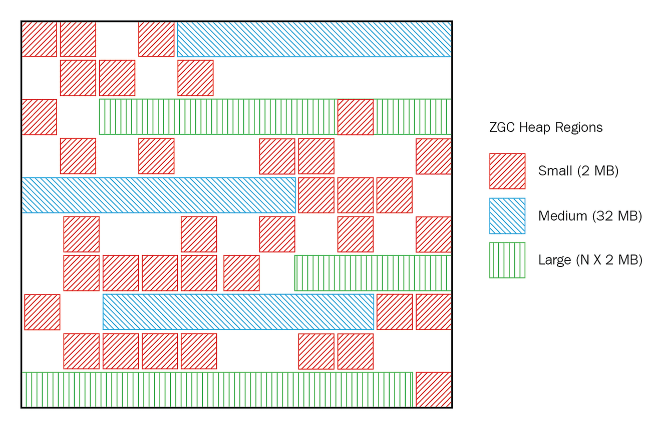
- `Java 15`에 release
- `대량의 메모리`(8MB ~ 16TB)를 low-latency로 잘 처리하기 위해 디자인 된 GC
- 크기가 고정인 Region 대신, `2mb(mega byte) 배수`의 `동적 크기`로 운영되는 `ZPage`를 사용
- 최대 장점
  - 힙 크기가 증가하더도 `stop-the-world`의 시간이 `절대 10ms를 넘지 않는다`는 것

**ZGC가 이러한 장점을 가질 수 있는 이유**
1. ZGC는 대부분의 작업을 애플리케이션 스레드와 동시에 수행 가능
2. Color Point와 Load Barrierfmf 활용해 객체의 상태를 추적하여 객체 이동 시간 감소
3. ZPage를 통한 효율적인 메모리 관리

## 6. Minor GC vs Major GC
| **GC 종류**  | **Minor GC**            | **Major GC**          |
|--------------|--------------------------|-----------------------|
| **대상**      | Young Generation        | Old Generation        |
| **실행 시점** | Eden 영역이 꽉 찬 경우 | Old 영역이 꽉 찬 경우 |
| **실행 속도** | 빠르다                  | 느리다                |

