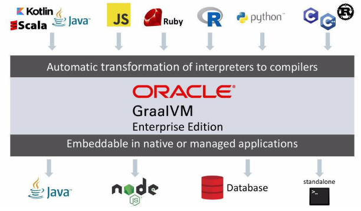

## GraalVM이란?

- 2018년 4월 오라클 연구소에서 "Run programs faster anywhere"라는 구호와 함께 발표한 기술
- '유너버셜 VM', '폴리그랏 VM'이라고도 부르며, 가상 머신 위에 구축된 크로스 언어 풀 스택 가상 머신이다
- JVM의 한계를 극복하고, 다양한 언어를 지원하기 위해 탄생

## 다양한 언어 지원
GraalVM은 자바, 코틀린, 스칼라, 그루비 같은 JVM 머신 언어들은 물론 LLVM(Low Leve Virtual Machine) 기반 컴파일러를 사용하는 C, C++, 러스트 같은 언어들을, 그 외 JS, 루비, 파이썬, R, 웹어셈블리어까지도 지원한다

또한, 추가 비용 없이 이 언어들을 혼합해 사용할 수 있으며, 서로 다른 언어들이 데이터를 `같은 메모리 공간`에서 주고받을 수 있고, 각 언어용으로 작성된 기존 `네이티브 라이브러리`들도 사용할 수 있다.

## AOT (Ahead Of Time)
GraalVM의 핵심 기능이라고 할 수 있다

JVM에서 실행되는 JIT 컴파일러는 프로그램이 `실행되는 동안` `자주 호출되는 코드`를 `실시간`으로 `기계어`로 `컴파일`하는 방식으로 작동한다

GraalVM은 JVM이 프로그램을 실행하기 전에 `미리` 컴파일을 가능하게 해준다. 이 기능을 `실행 전에 앞서` 컴파일을 해준다 해서 `AOT(Ahead Of Time)`이라 부른다
따라서 프로젝트 구동 직후 성능은 JIT로 동작하는 핫스팟 보다 압도적으로 빠르다.
하지만, 런타임에 정보를 얻어오는 작업을 못 하게 되어 런타임 환경에 완전히 최적화된 핫스팟보다는 느리다는 단점이 있다

## Spring + GraalVM
앞서 살펴본 AOT의 단점으로 런타임 정보를 얻어올 수 없다고 한다.
웹 프레임워크로 Spring을 사용하고 있다면 많은 부분에서 리플랙션을 사용하고 있을 것이다. 의존성 주입, AOP, 빈 생성 및 초기화, 핸들러 매핑 초기화 등등..
그렇기 때문에 GraalVM을 적용하기에는 상당히 까다로울 것으로 예상된다

실제로 Spring에서 GraalVM을 적용할 때의 제한사항을 [docs](https://github.com/spring-projects/spring-boot/wiki/Spring-Boot-with-GraalVM)로 제공하고 있다.

## 이슈
kakao에서도 GraalVM을 도입하여 JVM 백엔드 애플리케이션의 구동 초기 성능 문제를 해결했다는 발표가 있다

[kakao tech 발표 영상 바로가기](https://www.youtube.com/watch?v=9fbq3umnSeA)
