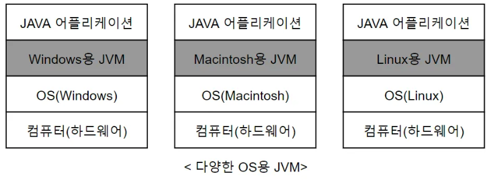
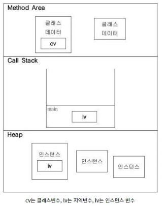

## 1. JVM (Java Virtual Machine)
- 자바를 실행하기 위한 가상 머신
    - 가상 머신이란 넓은 의미로 소프트웨어로 구현된 하드웨어
- 자바는 JVM하고만 상호작용하기 때문에 OS와 하드웨어에 독립적이다.
    - 즉, 다른 OS에서도 프로그램의 변경없이 실행 가능하다
- JVM은 OS에 종속적이기 때문에 해당 OS에서 실행 가능한 JVM이 필요하다
  

### 1.1 JVM의 메모리 구조

**메서드 영역**
- 클래스에 대한 정보(클래스 데이터)를 저장
- ex) 클래스 변수

**호출 스택**
- 메서드 작업에 필요한 공간 제공
- 메소드 호출 -> 호출 스택에 호출된 메서드를 위한 메모리 할당
- 메소드 종료 -> 할당된 메모리 공간 반환

**힙**
- 인스턴스 변수들이 생성되는 공간
