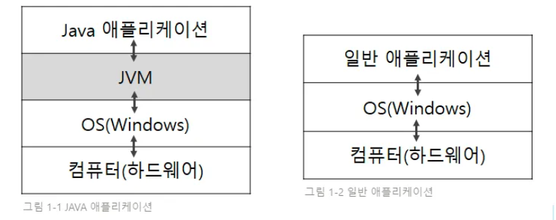
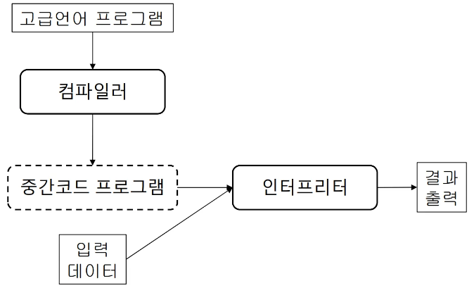
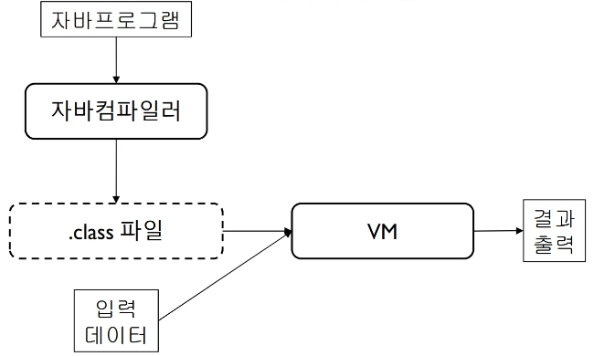
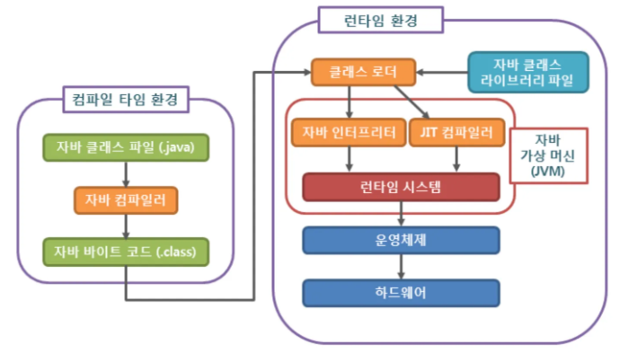

## 1. 자바의 탄생
- `썬 마이크로시스템즈`에서 개발하여 1996년 1월에 공식 발표한 `객체지향` 프로그래밍 언어
- 2010년에 썬이 오라클에 인수되면서 현재는 `오라클`사의 제품
- `c++의 장점`을 채택하는 동시에 잘 사용되지 않는 부분은 과감히 제외하여 개발된 언어

## 2. 자바의 장점 (특징)
1. 운영체제 독립적
   - 자바 응용프로그램은 OS나 하드웨어가 아닌 JVM과만 통신하기 때문
   - JVM이 OS와 통신한다
2. 객체 지향 언어
   - 상속, 캡슐화, 다형성
3. 자동 메모리 관리 (Gabage Collection)
   - 프로그래머의 생산성 증대
4. 멀티쓰레드 지원
   - 일반적으로, 멀티쓰레드는 OS에 따라 구현 방법이 상이
   - 자바는 시스템과 관계없이 구현 가능하며, 관련된 라이브러리 제공

## 3. 자바의 단점

1. 자바 애플리케이션과 OS간 JVM을 한 번 더 거침
2. 자바의 혼합 모델(컴파일 + 인터프리터)  
   - 자바는 처음에 `바이트 코드`로 컴파일되어 JVM에서 실행된다. 
   - JVM은 매번 바이트 코드를 해석하여 `기계어`로 변환하기 때문에 느리다

## 4. JIT 컴파일러 도입
- Just In Time, 적시 컴파일러라고 부름
- 말 그대로 원하는 때에 컴파일을 실행한다
- JIT 컴파일러는 프로그램이 `실행되는 동안` `자주 호출되는 코드`를 `실시간`으로 `기계어`로 `컴파일`하는 방식으로 작동한다

## 5. 자바의 혼합 모델
 

- 자바는 인터프리터와 컴파일러를 모두 가지는 `혼합 모델`이다
- `중간 프로그램(Intermediate program)`을 통해 `플랫폼 독림성`을 가진다

아래 사진을 통해 더 자세히 확인해볼 수 있다

