Google-Form + Lambda를 통한 db에 자동저장

# 1. 스크립트 편집기
구글폼 메뉴 -> 스크립트 편집기


# 2. appsscript.json 설정

설정 -> 편집기에 'appsscript.json' 매니페스트 파일 표시
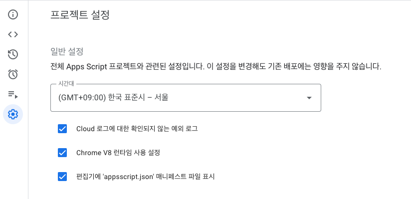

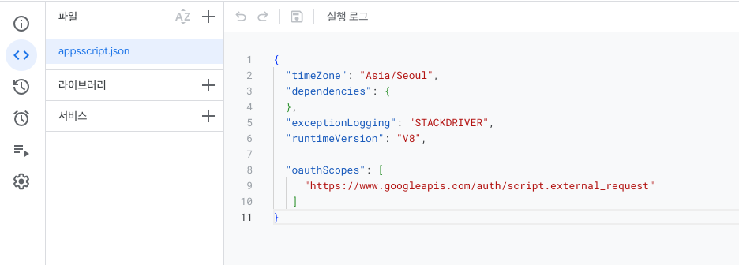
```json
"oauthScopes": [
     "https://www.googleapis.com/auth/script.external_request"
   ]
```
(Google Apps Script에서 외부 API 호출을 허용하기 위해 OAuth 2.0 범위를 정의하는 부분)

# 3. onSubmit()함수 구현
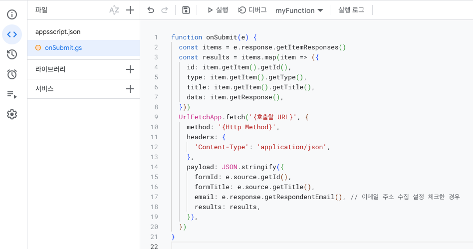
꼭 저장 누르기
``` js
function onSubmit(e) {
  const items = e.response.getItemResponses()
  const results = items.map(item => ({
    id: item.getItem().getId(),
    type: item.getItem().getType(),
    title: item.getItem().getTitle(),
    data: item.getResponse(),
  }))

  UrlFetchApp.fetch('https://ktjx6kqbumvbhp35jjmm2dzwce0gxfac.lambda-url.ap-northeast-2.on.aws/', {
    method: '{Http Method}',
    headers: {
      'Content-Type': 'application/json',
    },
    payload: JSON.stringify({
      formId: e.source.getId(),
      formTitle: e.source.getTitle(),
      email: e.response.getRespondentEmail(), // 이메일 주소 수집 설정 체크한 경우
      results: results,
    }),
  })
}
```

# 4. 트리거 설정
트리거 -> 트리거 추가
실행할 함수 : 3번에서 만든 함수 설정
이벤트 유형 : 양식 제출 시

접근 권한 설정
접근을 허용할 계정 선택 후
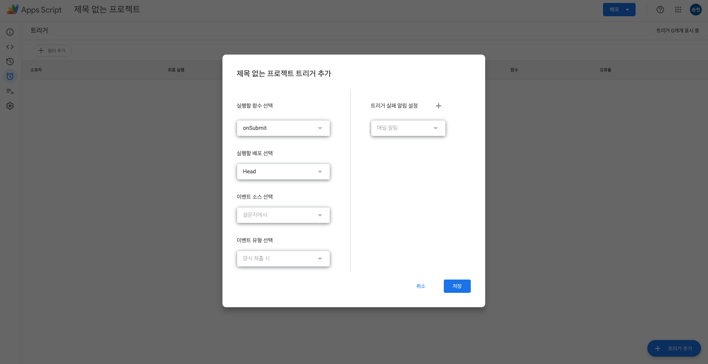
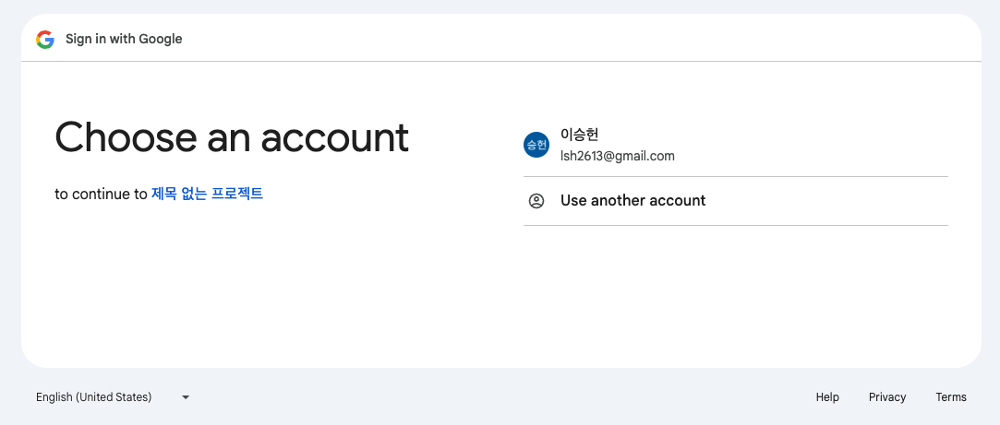
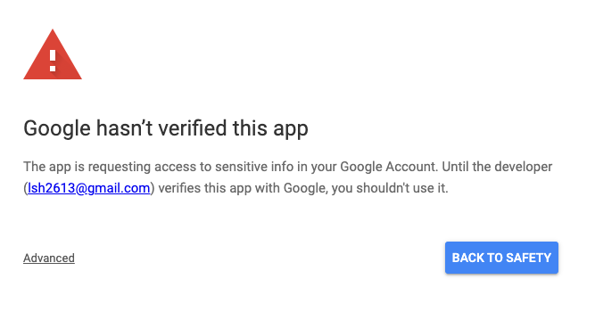
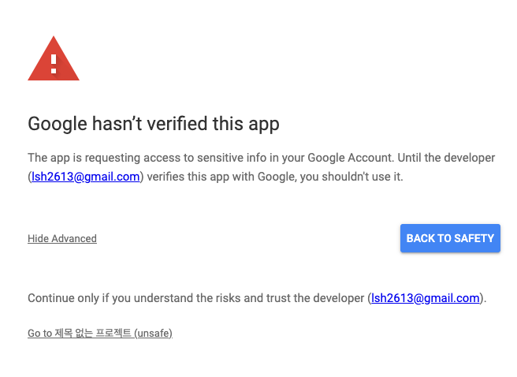
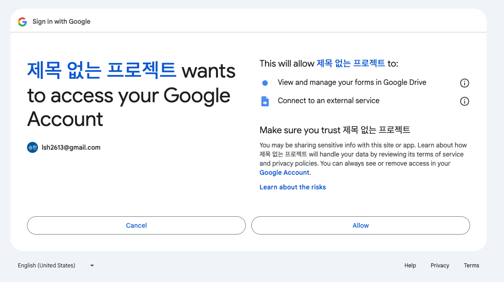

# 5. 결과
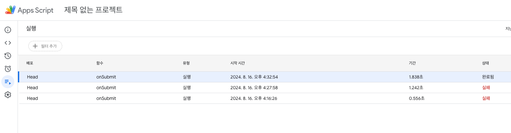
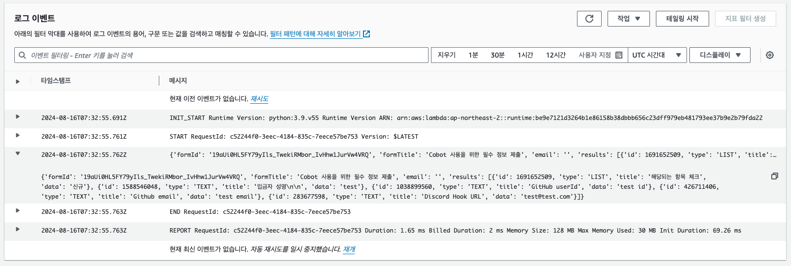

이제 해당 내용을 가지고 람다에서 데이터를 처리하여 db에 넣어주는 로직만 작성해주면 된다


# 6. Trouble Shooting!
위 설정대로 똑같이 했는데 502 bad gateway 에러가 발생했다면 람다에서 return해주는 값이 없기 때문이다

이처럼 response 형식에 맞게 return 해주면 트리거 실패 없이 성공적으로 완료될 것이다

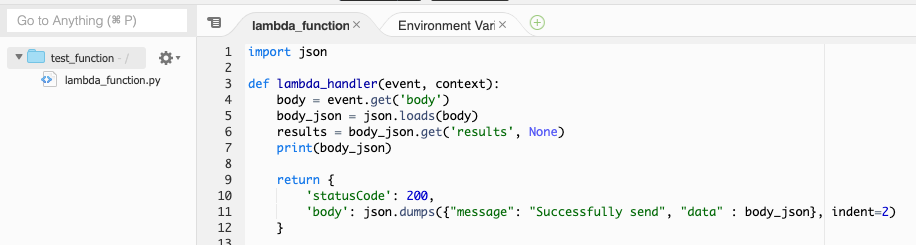