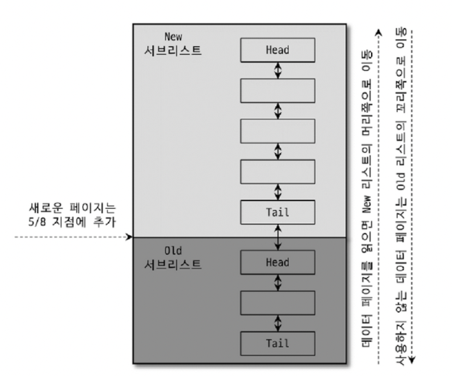
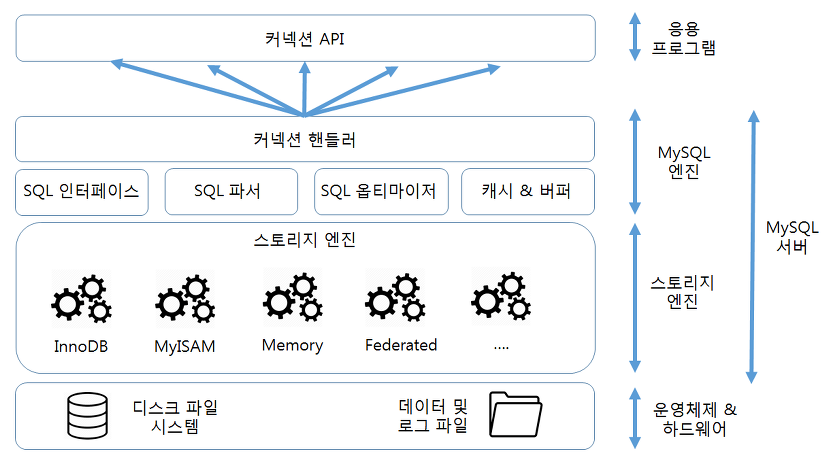
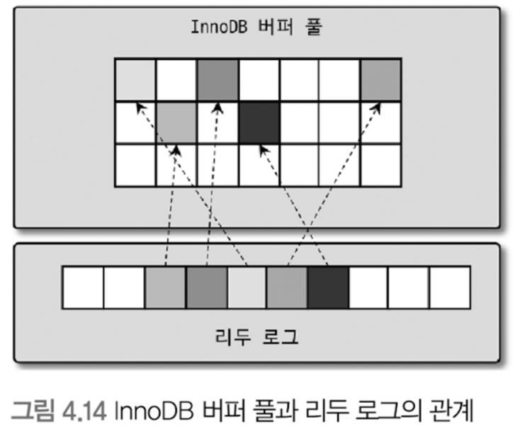
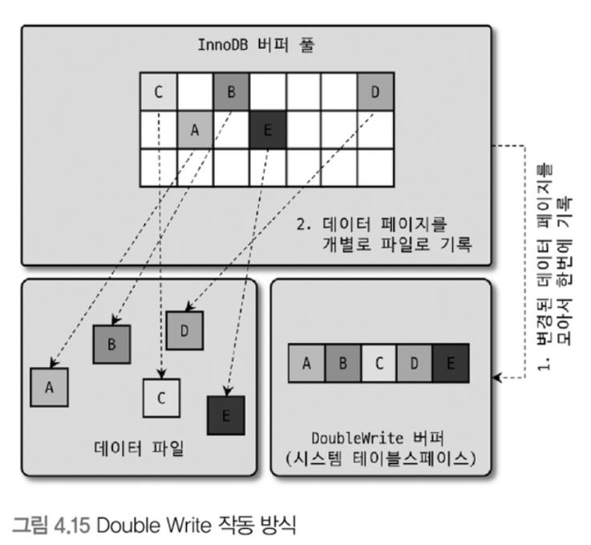
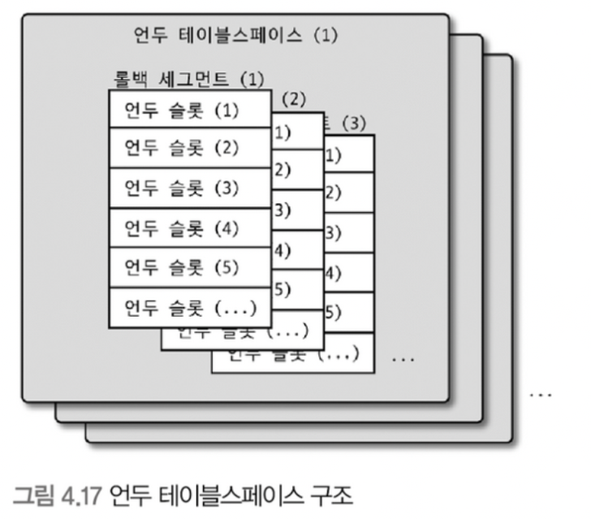

# 04 아키텍처

## 4.1 MySQL의 전체 구조


### 4.1.1.1 MySQL 엔진
- 클라이언트로부터의 접속 및 쿼리 요청을 처리하는 `커넥션 핸들러`와 SQL 파서 및 전처리기, 쿼리의 최적화된 실행을 위한 `옵티마이저`가 중심을 이룬다.
- 요청된 SQL 문장을 분석하거나 최적화하는 등 `DBMS의 두뇌`에 해당하는 처리를 수행

### 4.1.1.2 스토리지 엔진
- 실제 데이터를 디스크 스토리지에 `저장`하거나 디스크 스토리지로부터 데이터를 `읽어`온다.
- MySQL 서버에서 MySQL 엔진은 하나지만 스토리지 엔진은 여러 개를 동시에 사용할 수 있다.
- 아래 처럼 스토리지 엔진을 sql에 명시해줄 수 있음
- ``` sql
    CREATE TABLE test_table (fd1 INT, fd2 INT) ENGINE=INNODB
    ```

### 4.1.1.3 핸들러 API
- MySQL 엔진의 쿼리 실행기에서 데이터를 쓰거나 읽어야 할 떄 각 스토리지 엔진에 쓰기 또는 읽기를 요청하는데, 이러한 요청을 핸들러 요청이라 하고, 여기서 사용되는 API를 핸들러 API라 한다.
- `MySql 엔진` 과 `스토리지 엔진` 이 데이터를 주고 받기 위해서는 `핸들러 API` 를 이용한다.
- ``` sql
    SHOW GLOBAL STATUS LIKE 'Handler%';
    ```
    - 위의 명령어를 사용하면, 이 핸들러 api 를 통해 어떤 데이터 작업이 있었는지 알 수 있다.
  
    

## 4.1.2 MySQL 스레딩 구조
- MySQL 섭버는 프로세스 기반이 아니라 `스레드 기반`으로 작동하며, 크게 `포그라운드 스레드`와 `백그라운드 스레드`로 구분할 수 있다.


### 4.1.2.1 포그라운드 스레드 (클라이언트 스레드)
- 최소한 MySQL 서버에 접속된 클라이언트의 수만큼 존재
- 스레드는 담당 클라이언트가 사용을 마치면 다시 스레드 캐시로 되돌아가거나 종료된다.
- 주로 데이터 버퍼나 캐시로부터 `데이터를 가져오며`, 없을 경우 직접 디스크에서 가져온다.

### 4.1.2.2 백그라운드 스레드
- 가장 중요한 역할은 `로그 스레드`와 버퍼의 데이터를 디스크로 내려쓰는 작업을 처리하는 `쓰기 스레드`
- mysql 5.5 버전부터 쓰기 스레드를 2개 이상 지정할 수 있고, 쓰기 스레드는 아주 많은 작업을 처리하기 때문에, 일반적인 재장 디스크를 사용할 때는 2~4개 정도로 충분히 설정하는 것이 좋다.
- 읽기 지연은 절대 일어나지 않지만, os 여건에 따라 쓰기 지연을 일어날 수 있다. 따라서 보통 쓰기 작업을 버퍼링 해서 일괄처리 하도록 설계되어 있다. => 데이터가 디스크에 완전히 저장되는 걸 기다리지 않아도 된다!
- 하지만 MyISAM 은 사용자 스레드가 쓰기작업까지 함께 처리하도록 설계돼 있어서, 일반적인 쿼리는 쓰기 버퍼링을 이용할 수 없다.


> ⭐ 프로세스 기반 db 와 쓰레드 기반 db 의 차이?
> 
> postgreSQL 은 프로세스 기반 db 라고 한다.
> 
> 1. single-process & multi-thread 기반인 경우, 프로세스 충돌이 일어났을 때 db 자체가 그냥 죽어버리게 된다
> 2. 쓰레드 관련 라이브러리가 OS 마다 상이하기 때문에 자잘한 오류가 많이 발생한다. (예로 BSD 계열 리눅스는 mysql 관련 해당 오류가 발생한다고)
> 3. multi-thread 기반 db 는 시스템 자원에 대한 경합이 너무 심하다. (이 경합을 잘 조율하는 게 기술적으로 어렵기도 하기 때문에 버그가 자주 발생하기도 한다고) 등의 이유로 멀티 프로세스 방식을 채택하고 있다고 한다.
>
> 대신 
> 1. 프로세스를 fork 하는 비용이 쓰레드에 비해 너무 크다. => 속도도 느림
> 2. 하나의 쿼리에 대해서 병렬처리를 할 수 없다. (멀티 프로세스로 병렬처리를 구현하더라도, 비효율적이다.)
> 3. 멀티 쓰레드가 병렬처리 시에 쓰레드 간 소통이 더 빠르다. 과 같은 단점들이 존재한다.
>
> 아마 멀티 프로세스를 사용하는 이유는 최적의 속도보다는, 시스템의 안정성을 추구하기 위함인 듯하다. 시중에 다중 프로세스와 다중 쓰레드를 동시에 지원하는 db 도 있던 것 같았는데, 안정성과 속도를 적절히 잘 배합하려는 시도인 듯하다.

## 4.1.3 메모리 할당 및 사용 구조


### 4.1.3.1 글로벌 메모리 영역
- MySQL 서버가 시작되면서 OS로부터 할당된다
- 보통 하나의 메모리 공간만 할당되지만, 필요에 따라 2개 이상의 공간을 할당받을 수도 있다
- 모든 스레드에 의해 공유된다
- ex)
    - 테이블 캐시
    - InnoDB 버퍼 풀

### 4.1.3.2 로컬 메모리 영역
- = 세션 메모리 영역 = 클라이언트 메모리 영역
- 클라이언트 스레드가 쿼리를 처리하는 데 사용
- 각 클라이언트 스레드별로 독립적으로 할당
- 절대 공유되지 않음
- 쿼리의 용도별로 필요할 떄만 공간이 할당된다
- ex)
    - 커넥션 버퍼, 결과 버퍼
        - 커넥션이 열려 있는 동안 계속 할당된 상태로 남아 있는 공간
    - 정렬 버퍼(sort buffer), 조인 버퍼
        - 쿼리를 실행하는 순간에만 할당됐다가 다시 해제하는 공간

## 4.1.4 플러그인 스토리지 엔진 모델
- MySQL 은 플러그인 형태로 다양한 `스토리지 엔진`을 제공한다
- 스토리지 엔진 뿐만 아니라, 인증이나 파서(parser) 등도 플러그인 형태로 제공되고, 직접 개발해서 사용할 수 있다
- 스토리지 엔진의 데이터 `읽기/쓰기` 작업은 대부분 1건의 레코드 단위로 처리된다. 
- `group by` 나 `order by` 등 복잡한 처리는 MySQL 엔진의 `쿼리실행기`에서 처리된다.

## 4.1.5 컴포넌트
- MySQL 8.0부터 플러그인 아키텍처 단점을 보완하기 위해 등장

> ⭐ 플러그인 모델의 단점
> - 플러그인은 MySQL 서버와 인터페이스할 수 있고, 플러그인끼리는 통신할 수 없다.
> - MySQL 서버의 변수나 함수를 직접 호출하기 때문에 안전하지 않다.
> - 상호 의존관계를 설정할 수 없어서 초기화가 어렵다.

## 4.1.6 쿼리 실행 구조


## 4.1.6.1 쿼리 파서
- 쿼리를 토큰(MySQL이 인식할 수 있는 최소 단위의 어휘나 기호)으로 분리해 트리 형태의 구조를 만들어내는 작업
- 쿼리 문장의 기본 문법 오류를 인식하는 단계

### 4.1.6.2 전처리기
- 파서 트리를 기반으로 쿼리 문장에 구조적 문제점을 확인
- 토큰을 테이블/칼럼 이름, 객체의 존재 여부, 객체의 접근 권한 등을 확인하는 과정
- 실제로 존재하지 않거나 권한상 사용할 수 없는 개체의 토큰을 거름

### 4.1.6.3 옵티마이저
- 쿼리 문장을 저렴한 비용으로 가장 빠르게 처리할지를 결정

### 4.1.6.4 실행 엔진
- 만들어진 계획대로 각 핸들러에게 요청해서 받은 결과를 또 따른 핸들러 요청의 입력으로 연결하는 역할

### 4.1.6.5 핸들러 (스토리지 엔진)
- MySQL 서버 가장 밑단에서 MySQL 실행 엔진의 요청에 따라 데이터를 읽고 쓰기 역할을 담당 -> 따라서 스토리지 엔진을 의미함

### 4.1.8 쿼리 캐시
⭐️ MySQL 8.0부터 사라진 기능
- SQL 실행 결과를 메모리에 캐시 -> 빠른 성능을 얻음
- 테이블 데이터가 변경되면 캐시에 저장된 결과 중에서 변경된 테이블과 관련된 것들을 모두 삭제해야 한다.
- 이로 인한 동시 처리 성능 저하 및 버그 발생 등의 문제

### 4.1.9 스레드 풀
- 엔터프라이즈 에디션은 스레드 풀 기능을 제공하지만 커뮤니티 에디션은 지원하지 않는다
- 내부적으로 사용자 요청을 처리하는 스레드 개수를 줄여서 동시 처리되는 요청이 많더라도 CPU가 제한된 개수의 스레드 처리에만 집중하게 해줌으로써 서버의 자원 소모를 줄이는 것이 목적

### 4.1.10 트랜젝션 지원 메타데이터
- 데이터 딕셔너리(메타데이터) : 테이블의 구조 정보와 스토어드 프로그램 등의 정보. 파일 기반으로 관리했었다. 파일 기반의 메타데이터는 트랜잭션을 지원하지 않기 때문에 테이블을 생성 또는 변경 중에 서버가 비정상 종료되면 테이블 깨지는 현상이 있었다.
- 8.0 버전부터는 데이터 딕셔너리를 모두 InnoDB의 테이블에 저장하도록 개선됐다. 시스템 테이블과 데이터 딕셔너리를 mysql DB에 저장한다. mysql DB는 통째로 mysql.ibd라는 이름의 테이블스페이스에 저장된다. 시스템 정보라 해당 db 에는 사용자가 접근할 수 없다.
- MyISAM이나 CSV 등과 같은 스토리지 엔진의 메타 정보는 여전히 저장할 공간이 필요하다.

## 4.2 InnoDB 스토리지 엔진 아키텍처

- MySQL의 스토리지 엔진 중 거의 유일하게 레코드 기반의 잠금을 제공 -> 높은 동시성 처리가 가능, 성능 향상

### 4.2.1 프라이머 키에 의한 클러스터링
- InnoDB의 모든 테이블은 기본적으로 `pk를 기준`으로 `클러스터링`이 저장
- 즉, pk 값의 순서대로 디스크에 저장된다는 뜻이며, 모든 세컨더리 인덱스는 레코드의 주소 대신 pk 값을 논리적인 주소로 사용
- pk가 클러스터링 인덱스이기 때문에 pk를 이용한 `레인지 스캔`이 상당히 빨리 처리 -> 쿼리 실행 계획에서 pk가 다른 보조 인덱스에 비해 비중이 높게 설정
- MyISAM은 클러스터링 키를 지원X -> pk와 세컨더리 인덱스는 구조적으로 아무런 차이가 없다

### 4.2.2 외래 키 지원
- 외래 키는 `InnoDB 스토리지 엔진 레벨`에서만 지원하는 기능
- 부모 테이블과 자식 테이블에 해당 칼럼에 `인덱스 생성`이 필요하고, 변경 시 해당 두 테이블에 데이터가 있는지 확인이 필요하므로 -> 잠금이 여러 테이블로 전파되고, 그로 인해 `데드락` 발생이 빈번하기 때문에 주의가 필요
- 외래 키 체크를 일시적으로 멈춰 작업을 빠르게 처리 가능
    - ``` sql
        SET foreign_key_check=OFF;
        -- // 작업 실행
        SET foreign_key_check=ON;
        ```
    - 외래 키 체크가 비활성화 되면 CASCADE 옵션도 무시되므로 부모 테이블와 자식 테이블의 일관성을 고려해야 한다.

### 4.2.3 MVCC (Multi Version Concurrency Control)
- 레코드 레벨의 트랜잭션을 지원하는 DBMS가 제공하는 기능
- 잠금을 사용하지 않는 `일관된 읽기`를 제공하기 위한 목적
- `Undo log`를 이용하여 구현됨
- 하나의 레코드에 대해 `여러 개의 버전`이 동시에 관리 된다는 의미
- ex)
- 
    - ``` sql
        INSERT INTO member(m_id, m_name, m_area) VALUES (12, '홍길동', '서울');
        COMMIT;
        UPDATE member SET m_area='경기' WHERE m_id=12;
        ```
    - 해당 그림은 위 sql에 의한 영역 변화이다
    - 이때 `다른 사용자`가 `SELECT * FROM member WHERE m_id=12`를 실행하면 `격리수준`에 따라 다른 값을 조회한다
    - `READ_UNCOMMITTED`인 경우 InnoDB `버퍼 풀`이 가지고 있는 `변경된 데이터`를 읽어서 반환
    - READ COMMITTED나 `그 이상의 격리 수준`인 경우 아직 커밋되지 않았기 때문에 InnoDB 버퍼 풀이나 데이터 파일에 있는 내용 대신 변경되기 이전의 내용을 보관하고 있는 `언두 영역의 데이터`를 반환한다.
- 위와 같이 하나의 레코드에 대해 2개의 버전이 유지되고, 필요에 따라 어느 데이터가 보여지는지 여러가지 상황에 따라 달라지는 구조로 이를 MVCC라 한다
- 이 상태에서 `COMMIT`을 실행하면 지금의 상태를 `영구적인 데이터`로 만든다.
- 하지만 `ROLLBACK`을 실행하면 언두 영역에 있는 백업된 데이터를 InnoDB 버퍼 풀로 다시 복구하고, 언두 영역의 내용을 삭제해버린다

## 4.2.4 잠금 없는 일관된 읽기 (Non-Locking Consistent Read)
- InnoDB는 MVCC 기술을 이용해 잠금을 걸지 않고 읽기 작업을 수행한다.
- 따라서 격리 수준이 SERIALIZABLE이 아니면 INSERT와 연결되지 않은 순수한 읽기 작업은 다른 트랜잭션의 변경 작업과 관계없이 항상 잠금을 대기하지 않고 바로 실행된다.
- 레코드를 변경하고 커밋하지 않더라도 다른 사용자의 SELECT 작업을 방해하지 않는다. 이를 `잠금 없는 일관된 읽기`라고 표현한다
    - 이를 위해 InnoDB에는 변경되기 전 데이터를 읽기 위해 `언두 로그`를 사용한다

## 4.2.5 자동 데드락 감지
- InnoDB는 내부적으로 데드락을 체크하기 위해 잠금 `대기 목록을 그래프(Wait-for List)` 형태로 관리한다.
- `데드락 감지 스레드`를 통해 주기적으로 그래프를 검사하여 데드락에 빠진 트랜잭션 중 하나를 `강제 종료`(롤백)한다
    - 언두 로그 양이 적은 트랜잭션을 선택하여 종료한다.
- 동시 처리 스레드가 매우 많아지거나 각 트랜잭션이 가진 잠금의 개수가 많아지면 데드락 감지 스레드가 느려진다
    - 데드락 감지 스레드가 느려지면 서비스 쿼리를 처리 중인 스레드는 더는 작업을 진행하지 못하고 대기하며 서비스에 악영향을 미친다.
- 이런 문제점을 처리하기 위해 `innodb_deadlock_detect`, `innodb_lock_wait_timeout` 시스템 변수를 사용할 수 있다.

## 4.2.6 자동화된 장애 복구
- InnoDB 데이터 파일은 기본적으로 MySQL 서버가 시작될 때 항상 `자동 복구`를 수행한다. 이 단계에서 자동으로 복구될 수 없는 손상이 있다면 자동 복구를 멈추고 MySQL 서버는 종료돼버린다.
- 이때는 MySQL 서버의 설정 파일에 `innodb_force_recovery` 시스템 변수를 설정해서 MySQL 서버를 시작해야한다. 이 설정값은 MySQL 서버가 시작될 때 InnoDB 스토리지 엔진이 데이터 파일이나 로그파일의 손상 여부 검사 과정을 선별적으로 진핼할 수 있게 한다.
    - InnoDB의 로그 파일이 손상됐다면 6으로 설정하고 MySQL 서버를 기동한다.
    - InnoDB 테이블의 데이터 파일이 손상됐다면 1로 설정하고 MySQL 서버를 기동한다.
    - 어떤 부분이 문제인지 알 수 없다면 innodb_force_recovery 설정값을 1부터 6으로 변경하면서 MySQL을 재시작해본다. 즉, innod _forece_recovery 설정값을 1로 설정한 후 MySQL 서버를 재시작해보고, MySQL이 시작되지 않으면 다시 2로 설정하고 재시작해보는 방식이다. 
    - innodb_force_recovery 값이 커질 수록 그만큼 심각한 상황이어서 데이터 손실 가능성이 커지고 복구 가능성은 적어진다.
- innodb_force_recovery 옵션에 설정 가능한 값은 1~6이며 자세한 내용은 생략한다.

## 4.2.7 InnoDB 버퍼 풀
- 디스크의 `데이터 파일`이나 `인덱스 정보`를 `메모리에 캐시`해 두는 공간
- `버퍼 역할`
    - `쓰기 작업을 지연`시켜 `일괄 작업`으로 처리
- 데이터를 변경하는 쿼리는 데이터 파일의 이곳저곳에 위치한 레코드를 변경하기 때문에 `Random Disk I/O`를 발생시킨다.
    - 버퍼 풀을 통해 데이터를 `모아서 처리`하면 Random Disk I/O를 줄일 수 있다.

## 4.2.7.1 버퍼 풀의 크기 설정
- OS와 클라이언트 스레드가 사용할 메모리를 고려하여 설정
- 클라이언트 세션에서 레코드를 읽고 쓸 때 사용하는 공간인 `레코드 버퍼`는 커넥션과 테이블의 수가 많아지면 해당 공간이 많이 필요하게 될 수 있음
    - 다만, 레도드 버퍼 공간은 별도로 설정할 수 없으므로, 정확한 메모리 공간의 크기를 알 수 없다.
- MySQL 5.7부터, InnoDB 버퍼 풀의 크기를 `동적으로 조절` 가능
- `innodb_buffer_pool_size` 시스템 변수로 크기를 설정할 수 있으며, 동적으로 버퍼풀의 크기를 확장 간으
    - 다만 `크리티컬한 변경`이므로 사용량이 많은 시점 혹은, 용량을 줄이는 작업은 `주의가 필요`
- 기존에는 `Semaphore`를 사용하여 버퍼 풀의 Lock을 관리했는데, 현재는 하나의 큰 버퍼 풀을 여러 개로 쪼개면서 각 Semaphore에 대한 경쟁을 줄였다.

## 4.2.7.2  버퍼 풀의 구조

- `페이징 구조`를 가짐
- 페이지 조각을 관리하기 위해서, `LRU 리스트`, `Flush 리스트`, `Free 리스트`를 관리함
    - Free 리스트
        - InnoDB 버퍼 풀에서 실제 사용자 데이터로 채워지지 않은 `비어 있는 페이지`들의 목록
        - 사용자의 쿼리가 새롭게 디스크의 데이터 페이지를 `읽어`와야 하는 경우 사용
    - LRU 리스트
        - 엄밀하게는 LRU와 MRU가 결합된 형태
        - Old 서브리스트는 LRU
        - New 서브리스트는 MRU
        - 디스크로부터 읽어온 페이지를 최대한 오랫동안 버퍼풀의 메모리에 유지하여 `디스크 읽기를 최소화` 하기 위함
    - Flush 리스트
        - 디스크로 동기화되지 않은 페이지(이하 Dirty Page)의 `변경 시점 기준의 페이지` 목록을 관리
        - 일단 한 번 데이터 변경이 일어난 페이지는 Flush 리스트에서 관리
        - 디스크에서 읽은 그대로 전혀 변경이 없다면 Flsuh 리스트에서 관리X
- 데이터가 변경되면 InnoDB는 변경 내용을 `Redo 로그`에 기록하고 버퍼 풀의 데이터 페이지에도 변경 내용을 반영한다
- InnoDB는 `체크포인트`를 발생시켜 디스크의 Redo 로그와 데이터 페이지의 상태를 `동기화`
- 과정
    1. 필요한 레코드가 저장된 데이터 페이지가 `버퍼 풀에 있는지 검사`
        - InnoDB Adaptive Hash Index를 사용
        - 해당 테이블의 인덱스를 이용해 버퍼 풀에서 페이지 검색
        - 버퍼 풀에 데이터 페이지가 있다면 해당 페이지의 포인터를 MRU 방향으로 승급
    2. 디스크에서 필요한 데이터 페이지를 버퍼 풀에 적재하고, 적재된 페이지에 대한 포인터를 LRU 헤더에 추가
    3. LRU에 적재된 데이터 페이지가 실제로 읽히면 MRU 헤더로 이동
    4. 버퍼 풀에 상주하는 데이터 페이지는 사용자 쿼리가 얼마나 최근에 접근했냐에 따라 Age가 부여되고, 쿼리에서 오랫동안 사용되지 않으면 데이터 페이지에 부여된 나이가 오래되고 버퍼 풀에서 페이지가 제거 됨
    5. 필요한 데이터가 자주 접근되면 해당 페이지의 인덱스 키를 Adaptive Hash Index에 추가

> LRU (Least Recently Used)
> - 가장 오랫동안 사용되지 않은 페이지를 제거
>
> MRU (Most Recently Used)
> - 가장 최근에 사용된 데이터를 제거

### 4.2.7.9 버퍼 풀과 Redo 로그

- InnoDB의 버퍼 풀은 서버 메모리가 허용하는 만큼 크게 설정하면 할수록 쿼리의 성능은 빨라진다.
- 버퍼 풀은 서버의 성능 향상을 위해 `1 데이터 캐시`, `2 쓰기 버퍼링`이라는 두 용도로 사용
    - 버퍼 풀의 메모리 공간을 늘리는 것은 데이터 캐시 기능만 향상시키는 것
    - 쓰기 버퍼링의 성능을 올리려면 Redo 로그를 이해해야 함
- 버퍼 풀의 데이터
    - 변경되지 않은 `Clean Page`
    - INSERT, UPDATE, DELETE 등으로 변경된 `Dirty Page`
- 하지만 Dirty Page는 버퍼 풀에 무한정 머무를 수 없다
- Redo 로그는 1개 이상의 고정 크기 파일을 연결하여 순환 고리처럼 사용하고, 결국 언젠가는 기존 로그가 덮어씌어짐
    - 그러다보니, 재사용 가능한 공간과 그렇지 않은 공간(Active Redo Log)을 표시해야 할 필요가 있음.
    - 재사용 되어도 매번 기록될 때 마다 로그 포지션을 증가된 값을 갖는데, 이를 `LSN (Log Sequence Number)` 라고 함
    - InnoDB는 주기적으로 `체크포인트` 이벤트를 발생시켜 Redo 로그와 Dirty Page를 디스크로 `동기화` 하는데, 이때 가장 최근 체크포인트 지점의 LSN이 활성 Redo 로그 공간의 시작점이 된다고 할 수 있음.
    - 체크포인트가 발생하면 체크포인트 LSN 보다 작은 Redo 로그 엔트리와 관련된 Dirty Page는 모두 동기화가 된다고 할 수 있음.

### 4.2.7.4 버퍼 풀 플러시
- 버퍼 풀에서 아직 디스크로 기록되지 않은 더티 페이지들을 성능상의 악영향 없이 디스크에 동기화하기 위해 다음과 같이 2개의 플러시 기능을 백그라운드로 실행함.

## 4.2.7.4.1 플러시 리스트 플러시 (Flush_list Flush)
- 플러시 리스트에서 `오래 전에 변경된` 데이터 페이지 `순서대로` 디스크에 동기화 함
- 얼마나 많은 Dirty Page를 한 번에 기록하냐가 성능에 영향을 미칠 수 있음,
- InnoDB에서 Dirty Page를 디스크로 동기화하는 스레드를 `클리너 스레드`라고 하는데, 이는 변수 값을 통해 조정 가능함.
- 또한, 기본적으로 전체 버퍼 풀이 가진 페이지의 90%까지 Dirty Page를 가질 수 있는데 이 또한 조정 가능함.
- 하지만 Dirty Page의 수가 너무 많아지면 Disk I/O Burst가 발생할 수 있음 → 설정을 변경하여 일정 수준 이상의 더티 페이지가 발생하면 조금씩 기록하도록 할수도 있음.
- `Adaptive Flush` 기능을 사용하면, InnoDB는 Redo 로그의 증가 속도를 `분석`하여 `적절한 수준`의 Dirty Page가 버퍼 풀에 유지될 수 있도록 디스크 쓰기를 실행한다.

### 4.2.7.4.2 LRU_list 플러시 (LRU_list Flush)
- LRU 리스트에서 사용 빈도가 낮은 데이터 페이지들을 제거해서 새로운 페이지들을 읽어올 공간을 만들어야 함.
- LRU 리스트를 스캔하면서 `Dirty Page`는 `동기화`하고, `Clean Page`는 `Free 리스트`로 페이지를 옮김.

### 4.2.7.5 버퍼 풀 상태 백업 및 복구
- 버퍼 풀은 성능에 큰 영향을 줌
- 디스크의 데이터를 미리 버퍼 풀에 적재(Warming Up) 함으로써 성능을 수십배 올릴 수 있다
- 서버 점검이나 기타 작업을 위해 MySQL 서버를 재시작해야 하는 경우 InnoDB 버퍼 풀의 상태를 백업할 수 있다.
    ``` sql
    -- // 셧다운 전에 버퍼 풀의 상태 백업
    SET GLOBAL innodb_buffer_pool_dump_now=ON;

    -- // 재시작 후, 백업된 버프 풀의 상태 복구
    SET GLOBAL innodb_buffer_pool_load_now=ON;
    ```
- 백업은 데이터 디렉터리에 ib_buffer_pool 이름의 파일로 생성
- LRU 리스트에서 적재된 데이터 페이지의 메타 정보만 가져와 저장하기 떄문에 해당 파일의 크기가 매우 작다

### 4.2.7.6 버퍼 풀의 적재 내용 확인
- MySQL 5.6부터 `information_schema` 데이터베이스의 `inno_db_buffer` 테이블을 이용해 어떤 테이블의 페이지들이 적재되어 있는지 확인할 수 있었음.
    - 버퍼 풀이 크다면 이 테이블 조회 자체가 큰 부하를 일으킴으로써 서비스 쿼리가 느려지는 문제가 있었음.
- MySQL 8.0 부터는 `information_schema` 데이터베이스에 `innodb_cached_indexed`가 추가되어, 테이블의 인덱스별로 얼마나 버퍼 풀에 적재되어있는지 확인할 수 있음.

## 4.2.8 Double Writer Buffer

- InnoDB의 Redo 로그는 공간의 낭비를 막기 위해 페이지의 `변경된 내용`만 기록함.
- 이로 인해 Dirty Page를 디스크로 플러싱할 때 일부만 기록되는 문제가 발생하면 페이지의 내용을 복구할 수 없을 수도 있음.
    - Partial-Page 또는 Torn-Page 라고 부름.
- 이런 문제를 방지하기 위해, `Double-Write` 기법을 사용함.
- InnoDB는 실제 데이터 파일에 변경 내용을 기록하기 전, ‘A’ ~ ‘E’ 까지의 Dirty Page를 묶어서 `한 번`의 `Disk Write`로 DoubleWrite 버퍼에 기록한 이후에 쓰기를 진행
- DoubleWrite 버퍼 공간에 기록된 내용은 실제 데이터 파일의 쓰기가 `실패`할 때만 사용

## 4.2.9 언두 로그
- InnoDB는 트랜잭션과 격리 수준을 보장하기 위해 DML로 변경되기 이전 버전의 데이터를 별도로 `백업`한다
- 중요한 역할을 하지만, 관리 비용도 많이 필요함

### 4.2.9.1 언두 로그 모니터링
- Undo 영역의 목적
    -  트랜잭션의 `롤백` 대비
    - `격리 수준 유지`하면서 `높은 동시성` 제공이 목적
- MySQL 5.5 이전엔 한 번 증가한 Undo 로그 공간은 다시 작아지지 않았음.
    - 대용량의 데이터가 적재된 테이블이나, 트랜잭션의 기간이 긴 경우엔 로그 공간이 비대하게 커지게 됨.
    - Undo 로그의 크기로 인해 백업시에도 오버헤드가 과도하게 커지게 됨.
- MySQL 8.0 부터는 Undo 로그를 `순차적`으로 사용함으로써 디스크 공간 사용량 자체를 줄여버림.
- 그럼에도 활성 상태의 트랜잭션이 장기간 유지되는 것은 좋진 않음.
    - `SHOW ENGINE INNODB STATUS \G` 를 통해 `모니터링` 가능

### 4.2.9.2 언두 테이블스페이스 관리
- Undo 로그가 저장되는 공간을 `Undo 테이블스페이스`라고 함.
- 기존에는 시스템 테이블스페이스에 저장했으나, 해당 구역은 서버 초기화때 생성되므로 한계가 있었음.
- 현재는 별도의 `파일`로 관리함.
- 언두 테이블스페이스는 1~128개의 `롤백 세그먼트`를 가지며, 각각의 롤백 세그먼트는 1개 이상의 `Undo Slot`을 가짐



### 4.2.10 체인지 버퍼
- 레코드가 변경될 경우 인덱스 페이지 또한 업데이트가 필요
    - 이 작업 또한 랜덤한 디스크 읽기 작업을 수반
- InnoDB는 변경해야 할 인덱스 페이지가 버퍼 풀에 있다면 바로 업데이트를 진행하지만, 그렇지 않다면 이를 바로 실행하지 않고 체인지 버퍼에 저장함.
- 임시로 저장된 인덱스 레코드 조각은 이후 `체인지 버퍼 머지 스레드`라는 백그라운드 스레드에 의해 `병합`됨.

### 4.2.11 리두 로그 및 로그 버퍼
- 리두 로그는 비정상 종료 시 기록되지 못한 `데이터를 유지`시켜주는 안정 장치로 ACID 중 `D`와 밀접하게 연관됨
- 대부분의 DBMS는 데이터 변경 내용을 로그로 먼저 기록함
    - 상당수의 DBMS는 쓰기보다 읽기에 최적화되어 있기 때문
    - 따라서 쓰기 비용이 낮은 자료구조를 갖는 Redo 로그를 활용
- Redo 로그를 버퍼링할 수 있는 로그 버퍼와 같은 자료구조도 존재
- 리두 로그를 사용하는 예
    - 커밋되었지만 데이터 파일에 기록되지 않은 데이터
    - 롤백했지만 데이터 파일에 이미 기록된 데이터

### 4.2.11.1 Redo 로그 아카이빙
...

### 4.2.12 어댑팁브 해시 인덱스 (Adaptive Hash Index)
- 일반적으로 인덱스라고 하면 B-Tree 형식의 테이블 인덱스를 떠올림
- `Adaptive Hash Index`는 InnoDB에서 사용자가 자주 요청하는 데이터에 대해 `자동`으로 생성하는 인덱스
- `B-Tree`는 빠른 편이지만, 속도는 상대적이고 스레드의 수가 늘게 되면 엄청난 성능의 영향을 받음 (스케줄링으로 인해)
- Adaptive Hash Index를 사용하면, 자주 읽히는 데이터 페이지의 키 값을 활용해 `해시 인덱스`를 생성하고, 이에 접근하면 `즉시` 데이터 페이지로 찾아갈 수 있음.
- 자주 접근하는 페이지를 다뤄야 하므로, 버퍼 풀에 올려진 데이터 페이지에 대해서만 관리하고, 사라지면 같이 없앰
- 다만 이런 기능임에도 불구하고 이전에는 `Semaphore의 경쟁`이 있었기에 정체가 발생했었지만, MySQL 8.0 부터는 `파티션` 기능을 추가함.
    - `innodb_adaptive_hash_index_parts` 시스템 변수 사용
- 파티션이 도움이 되지 않는 경우
    - 디스크 읽기가 많은 경우
    - 특정 패턴의 쿼리 (LIKE나 조인 같은) 가 많은 경우
    - 매우 큰 데이터를 가진 테이블의 레코드를 폭넓게 읽는 경우
- 도움이 되는 경우
    - 디스크의 데이터가 InnoDB 버퍼 풀 크기와 큰 차이가 없는 경우
    - 동등 조건 검색 (IN이나 비교 같은) 이 많은 경우
    - 쿼리가 데이터 중에서 일부 데이터에만 집중되는 경우
- 파티션은 메모리를 사용하기 떄문에 도움이 되지 않을 경우 제거하는 것이 좋다

# 4.2.133 InnoDB vs MyISAM vs MEMORY
- MySQL 5.5 부터 InnoDB 스토리지 엔진이 기본 스토리지 엔진으로 채택되었고, 이전에는 MyISAM을 사용했었음.
- MySQL 8.0 부턴 모든 시스템 테이블이 InnoDB로 교체되었음

(따라서 4.3 MyISAM은 생략)

## 4.4.3 슬로우 쿼리 로그
- MySQL 서버의 쿼리 튜닝은 크게 `서비스가 적용되기 전에 전체적으로 튜닝하는 경우`와 `서비스 운영 중에 MySQL 서버의 전체적인 성능 저하를 검사하거나 정기적인 점검을 위한 튜닝`으로 나뉜다.
- 슬로우 쿼리 로그는 후자를 판단하는 데 큰 도움을 준다
- 슬로우 쿼리 로그 파일에는 `long_query_time` 시스템 변수에 설정한 시간 이상의 시간이 소요된 쿼리가 모두 기록된다
- `log_output` 옵션을 이용해 슬로우 쿼리 로그를 `파일`로 기록할지 `테이블`로 기록할지 선택
- 슬로우 쿼리 로그 ex)
    ``` sql
    # Time: 2020-07-19T15:44:22. 178484+09:00
    # User@Host: root[root] @ localhost [] Id: 14
    # Query_time: 1.180245  Lock_time: 0.002658  Rows_sent: 1  Rows_examined: 2844047
    use employees;
    SET timestamp=1595141060
    select emp_no, max(salary) from salaries;
    ```
    - Time 항목은 쿼리가 시작된 시간이 아니라 쿼리가 종료된 시점
    - 'User@Host'는 쿼리를 실행한 사용자의 계정
    - 'Query_time'은 쿼리가 실행되는데 걸린 전체 시간
    - 'Rows examined'는 이 쿼리가 처리되기 위해 몇 건의 레코드에 접근했는지를 의미
- 일반적으로 슬로우 쿼리 또는 제너럴 로그 파일의 내용이 상당히 많아서 직접 쿼리를 하나씩 검토하기에는 시간이 너무 많이 걸리거나 어느 쿼리를 집중적으로 튜닝해야 할지 식별하기가 어려울 수도 있다.
- 이런 경우에는 `Percona`에서 개발한 `Percona Toolkit`의 `pt-query-digest` 스크립트를 이용하면 쉽게 `빈도`나 `처리 성능별`로 쿼리를 `정렬`해서 살펴볼 수 있다.  
    ``` sql
    ## General Log 파일 분석
    linux> pt-query-digest --type='genlog' general.log > parsed_general.log

    ## Slow Log 파일 분석
    linux> pt-query-digest --type='slowlog' mysql-slow.log > parsed_mysql-slow.log
    ```
