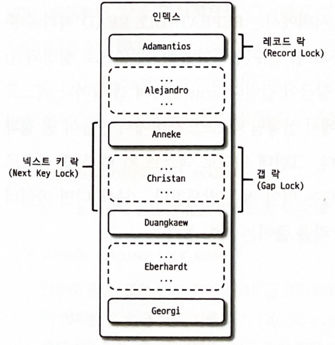
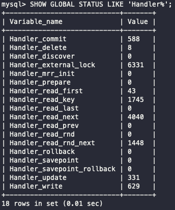
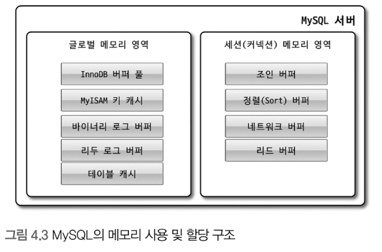
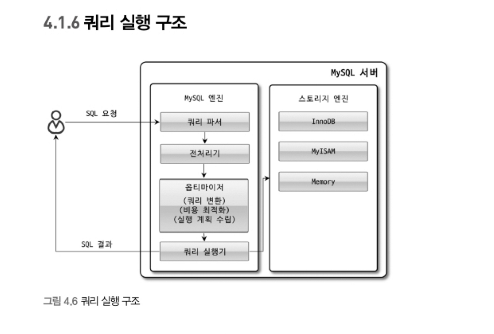
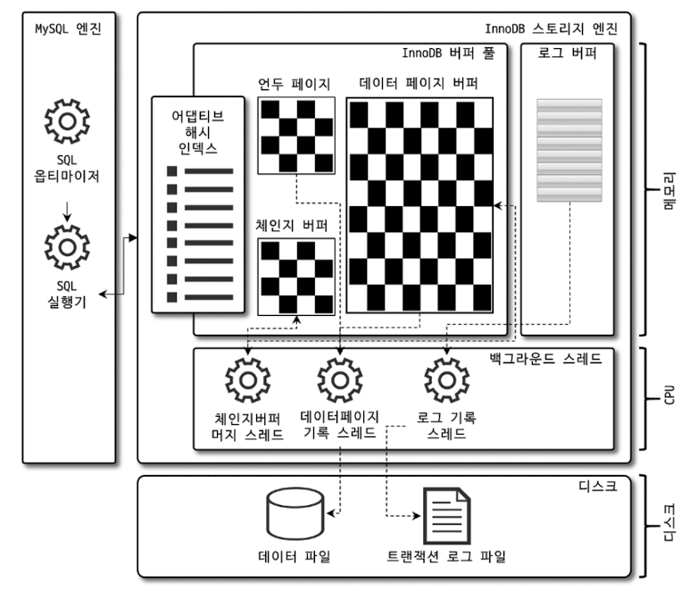
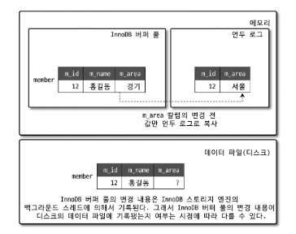

# 04 아키텍처

## 4.1 MySQL의 전체 구조


### 4.1.1.1 MySQL 엔진
- 클라이언트로부터의 접속 및 쿼리 요청을 처리하는 `커넥션 핸들러`와 SQL 파서 및 전처리기, 쿼리의 최적화된 실행을 위한 `옵티마이저`가 중심을 이룬다.
- 요청된 SQL 문장을 분석하거나 최적화하는 등 `DBMS의 두뇌`에 해당하는 처리를 수행

### 4.1.1.2 스토리지 엔진
- 실제 데이터를 디스크 스토리지에 `저장`하거나 디스크 스토리지로부터 데이터를 `읽어`온다.
- MySQL 서버에서 MySQL 엔진은 하나지만 스토리지 엔진은 여러 개를 동시에 사용할 수 있다.
- 아래 처럼 스토리지 엔진을 sql에 명시해줄 수 있음
- ``` sql
    CREATE TABLE test_table (fd1 INT, fd2 INT) ENGINE=INNODB
    ```

### 4.1.1.3 핸들러 API
- MySQL 엔진의 쿼리 실행기에서 데이터를 쓰거나 읽어야 할 떄 각 스토리지 엔진에 쓰기 또는 읽기를 요청하는데, 이러한 요청을 핸들러 요청이라 하고, 여기서 사용되는 API를 핸들러 API라 한다.
- `MySql 엔진` 과 `스토리지 엔진` 이 데이터를 주고 받기 위해서는 `핸들러 API` 를 이용한다.
- ``` sql
    SHOW GLOBAL STATUS LIKE 'Handler%';
    ```
    - 위의 명령어를 사용하면, 이 핸들러 api 를 통해 어떤 데이터 작업이 있었는지 알 수 있다.
    

## 4.1.2 MySQL 스레딩 구조
- MySQL 섭버는 프로세스 기반이 아니라 `스레드 기반`으로 작동하며, 크게 `포그라운드 스레드`와 `백그라운드 스레드`로 구분할 수 있다.


### 4.1.2.1 포그라운드 스레드 (클라이언트 스레드)
- 최소한 MySQL 서버에 접속된 클라이언트의 수만큼 존재
- 스레드는 담당 클라이언트가 사용을 마치면 다시 스레드 캐시로 되돌아가거나 종료된다.
- 주로 데이터 버퍼나 캐시로부터 `데이터를 가져오며`, 없을 경우 직접 디스크에서 가져온다.

### 4.1.2.2 백그라운드 스레드
- 가장 중요한 역할은 `로그 스레드`와 버퍼의 데이터를 디스크로 내려쓰는 작업을 처리하는 `쓰기 스레드`
- mysql 5.5 버전부터 쓰기 스레드를 2개 이상 지정할 수 있고, 쓰기 스레드는 아주 많은 작업을 처리하기 때문에, 일반적인 재장 디스크를 사용할 때는 2~4개 정도로 충분히 설정하는 것이 좋다.
- 읽기 지연은 절대 일어나지 않지만, os 여건에 따라 쓰기 지연을 일어날 수 있다. 따라서 보통 쓰기 작업을 버퍼링 해서 일괄처리 하도록 설계되어 있다. => 데이터가 디스크에 완전히 저장되는 걸 기다리지 않아도 된다!
- 하지만 MyISAM 은 사용자 스레드가 쓰기작업까지 함께 처리하도록 설계돼 있어서, 일반적인 쿼리는 쓰기 버퍼링을 이용할 수 없다.


> ⭐ 프로세스 기반 db 와 쓰레드 기반 db 의 차이?
> 
> postgreSQL 은 프로세스 기반 db 라고 한다.
> 
> 1. single-process & multi-thread 기반인 경우, 프로세스 충돌이 일어났을 때 db 자체가 그냥 죽어버리게 된다
> 2. 쓰레드 관련 라이브러리가 OS 마다 상이하기 때문에 자잘한 오류가 많이 발생한다. (예로 BSD 계열 리눅스는 mysql 관련 해당 오류가 발생한다고)
> 3. multi-thread 기반 db 는 시스템 자원에 대한 경합이 너무 심하다. (이 경합을 잘 조율하는 게 기술적으로 어렵기도 하기 때문에 버그가 자주 발생하기도 한다고) 등의 이유로 멀티 프로세스 방식을 채택하고 있다고 한다.
>
> 대신 
> 1. 프로세스를 fork 하는 비용이 쓰레드에 비해 너무 크다. => 속도도 느림
> 2. 하나의 쿼리에 대해서 병렬처리를 할 수 없다. (멀티 프로세스로 병렬처리를 구현하더라도, 비효율적이다.)
> 3. 멀티 쓰레드가 병렬처리 시에 쓰레드 간 소통이 더 빠르다. 과 같은 단점들이 존재한다.
>
> 아마 멀티 프로세스를 사용하는 이유는 최적의 속도보다는, 시스템의 안정성을 추구하기 위함인 듯하다. 시중에 다중 프로세스와 다중 쓰레드를 동시에 지원하는 db 도 있던 것 같았는데, 안정성과 속도를 적절히 잘 배합하려는 시도인 듯하다.

## 4.1.3 메모리 할당 및 사용 구조


### 4.1.3.1 글로벌 메모리 영역
- MySQL 서버가 시작되면서 OS로부터 할당된다
- 보통 하나의 메모리 공간만 할당되지만, 필요에 따라 2개 이상의 공간을 할당받을 수도 있다
- 모든 스레드에 의해 공유된다
- ex)
    - 테이블 캐시
    - InnoDB 버퍼 풀

### 4.1.3.2 로컬 메모리 영역
- = 세션 메모리 영역 = 클라이언트 메모리 영역
- 클라이언트 스레드가 쿼리를 처리하는 데 사용
- 각 클라이언트 스레드별로 독립적으로 할당
- 절대 공유되지 않음
- 쿼리의 용도별로 필요할 떄만 공간이 할당된다
- ex)
    - 커넥션 버퍼, 결과 버퍼
        - 커넥션이 열려 있는 동안 계속 할당된 상태로 남아 있는 공간
    - 정렬 버퍼(sort buffer), 조인 버퍼
        - 쿼리를 실행하는 순간에만 할당됐다가 다시 해제하는 공간

## 4.1.4 플러그인 스토리지 엔진 모델
- MySQL 은 플러그인 형태로 다양한 `스토리지 엔진`을 제공한다
- 스토리지 엔진 뿐만 아니라, 인증이나 파서(parser) 등도 플러그인 형태로 제공되고, 직접 개발해서 사용할 수 있다
- 스토리지 엔진의 데이터 `읽기/쓰기` 작업은 대부분 1건의 레코드 단위로 처리된다. 
- `group by` 나 `order by` 등 복잡한 처리는 MySQL 엔진의 `쿼리실행기`에서 처리된다.

## 4.1.5 컴포넌트
- MySQL 8.0부터 플러그인 아키텍처 단점을 보완하기 위해 등장

> ⭐ 플러그인 모델의 단점
> - 플러그인은 MySQL 서버와 인터페이스할 수 있고, 플러그인끼리는 통신할 수 없다.
> - MySQL 서버의 변수나 함수를 직접 호출하기 때문에 안전하지 않다.
> - 상호 의존관계를 설정할 수 없어서 초기화가 어렵다.

## 4.1.6 쿼리 실행 구조


## 4.1.6.1 쿼리 파서
- 쿼리를 토큰(MySQL이 인식할 수 있는 최소 단위의 어휘나 기호)으로 분리해 트리 형태의 구조를 만들어내는 작업
- 쿼리 문장의 기본 문법 오류를 인식하는 단계

### 4.1.6.2 전처리기
- 파서 트리를 기반으로 쿼리 문장에 구조적 문제점을 확인
- 토큰을 테이블/칼럼 이름, 객체의 존재 여부, 객체의 접근 권한 등을 확인하는 과정
- 실제로 존재하지 않거나 권한상 사용할 수 없는 개체의 토큰을 거름

### 4.1.6.3 옵티마이저
- 쿼리 문장을 저렴한 비용으로 가장 빠르게 처리할지를 결정

### 4.1.6.4 실행 엔진
- 만들어진 계획대로 각 핸들러에게 요청해서 받은 결과를 또 따른 핸들러 요청의 입력으로 연결하는 역할

### 4.1.6.5 핸들러 (스토리지 엔진)
- MySQL 서버 가장 밑단에서 MySQL 실행 엔진의 요청에 따라 데이터를 읽고 쓰기 역할을 담당 -> 따라서 스토리지 엔진을 의미함

### 4.1.8 쿼리 캐시
⭐️ MySQL 8.0부터 사라진 기능
- SQL 실행 결과를 메모리에 캐시 -> 빠른 성능을 얻음
- 테이블 데이터가 변경되면 캐시에 저장된 결과 중에서 변경된 테이블과 관련된 것들을 모두 삭제해야 한다.
- 이로 인한 동시 처리 성능 저하 및 버그 발생 등의 문제

### 4.1.9 스레드 풀
- 엔터프라이즈 에디션은 스레드 풀 기능을 제공하지만 커뮤니티 에디션은 지원하지 않는다
- 내부적으로 사용자 요청을 처리하는 스레드 개수를 줄여서 동시 처리되는 요청이 많더라도 CPU가 제한된 개수의 스레드 처리에만 집중하게 해줌으로써 서버의 자원 소모를 줄이는 것이 목적

### 4.1.10 트랜젝션 지원 메타데이터
- 데이터 딕셔너리(메타데이터) : 테이블의 구조 정보와 스토어드 프로그램 등의 정보. 파일 기반으로 관리했었다. 파일 기반의 메타데이터는 트랜잭션을 지원하지 않기 때문에 테이블을 생성 또는 변경 중에 서버가 비정상 종료되면 테이블 깨지는 현상이 있었다.
- 8.0 버전부터는 데이터 딕셔너리를 모두 InnoDB의 테이블에 저장하도록 개선됐다. 시스템 테이블과 데이터 딕셔너리를 mysql DB에 저장한다. mysql DB는 통째로 mysql.ibd라는 이름의 테이블스페이스에 저장된다. 시스템 정보라 해당 db 에는 사용자가 접근할 수 없다.
- MyISAM이나 CSV 등과 같은 스토리지 엔진의 메타 정보는 여전히 저장할 공간이 필요하다.

## 4.2 InnoDB 스토리지 엔진 아키텍처

- MySQL의 스토리지 엔진 중 거의 유일하게 레코드 기반의 잠금을 제공 -> 높은 동시성 처리가 가능, 성능 향상

### 4.2.1 프라이머 키에 의한 클러스터링
- InnoDB의 모든 테이블은 기본적으로 `pk를 기준`으로 `클러스터링`이 저장
- 즉, pk 값의 순서대로 디스크에 저장된다는 뜻이며, 모든 세컨더리 인덱스는 레코드의 주소 대신 pk 값을 논리적인 주소로 사용
- pk가 클러스터링 인덱스이기 때문에 pk를 이용한 `레인지 스캔`이 상당히 빨리 처리 -> 쿼리 실행 계획에서 pk가 다른 보조 인덱스에 비해 비중이 높게 설정
- MyISAM은 클러스터링 키를 지원X -> pk와 세컨더리 인덱스는 구조적으로 아무런 차이가 없다

### 4.2.2 외래 키 지원
- 외래 키는 `InnoDB 스토리지 엔진 레벨`에서만 지원하는 기능
- 부모 테이블과 자식 테이블에 해당 칼럼에 `인덱스 생성`이 필요하고, 변경 시 해당 두 테이블에 데이터가 있는지 확인이 필요하므로 -> 잠금이 여러 테이블로 전파되고, 그로 인해 `데드락` 발생이 빈번하기 때문에 주의가 필요
- 외래 키 체크를 일시적으로 멈춰 작업을 빠르게 처리 가능
    - ``` sql
        SET foreign_key_check=OFF;
        -- // 작업 실행
        SET foreign_key_check=ON;
        ```
    - 외래 키 체크가 비활성화 되면 CASCADE 옵션도 무시되므로 부모 테이블와 자식 테이블의 일관성을 고려해야 한다.

### 4.2.3 MVCC (Multi Version Concurrency Control)
- 레코드 레벨의 트랜잭션을 지원하는 DBMS가 제공하는 기능
- 잠금을 사용하지 않는 `일관된 읽기`를 제공하기 위한 목적
- `Undo log`를 이용하여 구현됨
- 하나의 레코드에 대해 `여러 개의 버전`이 동시에 관리 된다는 의미
- ex)
- 
    - ``` sql
        INSERT INTO member(m_id, m_name, m_area) VALUES (12, '홍길동', '서울');
        COMMIT;
        UPDATE member SET m_area='경기' WHERE m_id=12;
        ```
    - 해당 그림은 위 sql에 의한 영역 변화이다
    - 이때 `다른 사용자`가 `SELECT * FROM member WHERE m_id=12`를 실행하면 `격리수준`에 따라 다른 값을 조회한다
    - `READ_UNCOMMITTED`인 경우 InnoDB `버퍼 풀`이 가지고 있는 `변경된 데이터`를 읽어서 반환
    - READ COMMITTED나 `그 이상의 격리 수준`인 경우 아직 커밋되지 않았기 때문에 InnoDB 버퍼 풀이나 데이터 파일에 있는 내용 대신 변경되기 이전의 내용을 보관하고 있는 `언두 영역의 데이터`를 반환한다.
- 위와 같이 하나의 레코드에 대해 2개의 버전이 유지되고, 필요에 따라 어느 데이터가 보여지는지 여러가지 상황에 따라 달라지는 구조로 이를 MVCC라 한다
- 이 상태에서 `COMMIT`을 실행하면 지금의 상태를 `영구적인 데이터`로 만든다.
- 하지만 `ROLLBACK`을 실행하면 언두 영역에 있는 백업된 데이터를 InnoDB 버퍼 풀로 다시 복구하고, 언두 영역의 내용을 삭제해버린다

## 4.2.4 잠금 없는 일관된 읽기 (Non-Locking Consistent Read)
- InnoDB는 MVCC 기술을 이용해 잠금을 걸지 않고 읽기 작업을 수행한다.
- 따라서 격리 수준이 SERIALIZABLE이 아니면 INSERT와 연결되지 않은 순수한 읽기 작업은 다른 트랜잭션의 변경 작업과 관계없이 항상 잠금을 대기하지 않고 바로 실행된다.
- 레코드를 변경하고 커밋하지 않더라도 다른 사용자의 SELECT 작업을 방해하지 않는다. 이를 `잠금 없는 일관된 읽기`라고 표현한다
    - 이를 위해 InnoDB에는 변경되기 전 데이터를 읽기 위해 `언두 로그`를 사용한다

## 4.2.5 자동 데드락 감지
- InnoDB는 내부적으로 데드락을 체크하기 위해 잠금 `대기 목록을 그래프(Wait-for List)` 형태로 관리한다.
- `데드락 감지 스레드`를 통해 주기적으로 그래프를 검사하여 데드락에 빠진 트랜잭션 중 하나를 `강제 종료`(롤백)한다
    - 언두 로그 양이 적은 트랜잭션을 선택하여 종료한다.
- 동시 처리 스레드가 매우 많아지거나 각 트랜잭션이 가진 잠금의 개수가 많아지면 데드락 감지 스레드가 느려진다
    - 데드락 감지 스레드가 느려지면 서비스 쿼리를 처리 중인 스레드는 더는 작업을 진행하지 못하고 대기하며 서비스에 악영향을 미친다.
- 이런 문제점을 처리하기 위해 `innodb_deadlock_detect`, `innodb_lock_wait_timeout` 시스템 변수를 사용할 수 있다.

## 4.2.6 자동화된 장애 복구
- InnoDB 데이터 파일은 기본적으로 MySQL 서버가 시작될 때 항상 `자동 복구`를 수행한다. 이 단계에서 자동으로 복구될 수 없는 손상이 있다면 자동 복구를 멈추고 MySQL 서버는 종료돼버린다.
- 이때는 MySQL 서버의 설정 파일에 `innodb_force_recovery` 시스템 변수를 설정해서 MySQL 서버를 시작해야한다. 이 설정값은 MySQL 서버가 시작될 때 InnoDB 스토리지 엔진이 데이터 파일이나 로그파일의 손상 여부 검사 과정을 선별적으로 진핼할 수 있게 한다.
    - InnoDB의 로그 파일이 손상됐다면 6으로 설정하고 MySQL 서버를 기동한다.
    - InnoDB 테이블의 데이터 파일이 손상됐다면 1로 설정하고 MySQL 서버를 기동한다.
    - 어떤 부분이 문제인지 알 수 없다면 innodb_force_recovery 설정값을 1부터 6으로 변경하면서 MySQL을 재시작해본다. 즉, innod _forece_recovery 설정값을 1로 설정한 후 MySQL 서버를 재시작해보고, MySQL이 시작되지 않으면 다시 2로 설정하고 재시작해보는 방식이다. 
    - innodb_force_recovery 값이 커질 수록 그만큼 심각한 상황이어서 데이터 손실 가능성이 커지고 복구 가능성은 적어진다.
- innodb_force_recovery 옵션에 설정 가능한 값은 1~6이며 자세한 내용은 생략한다.