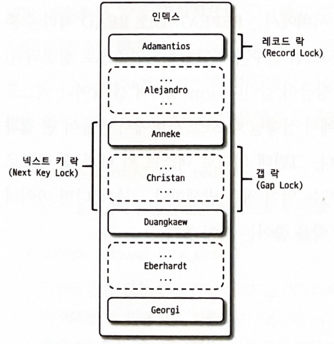
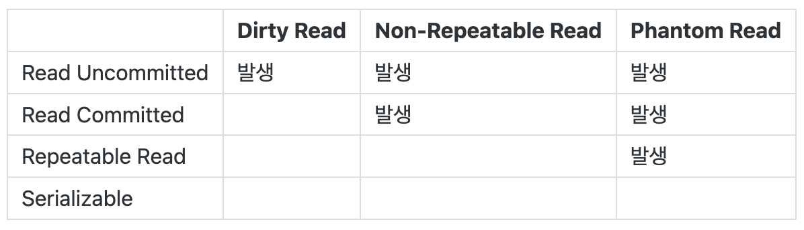
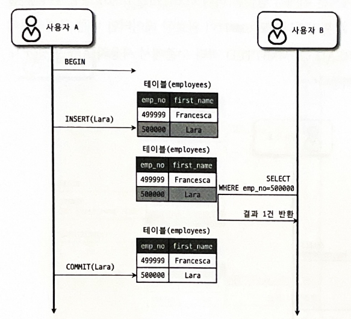
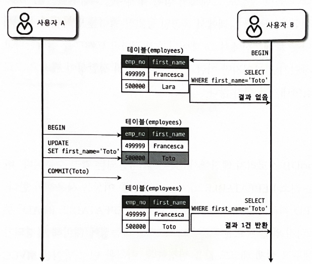
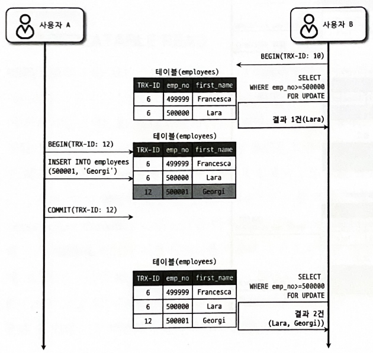

# 05 트랜잭션과 잠금

# 5.1 트랜잭션
- 작업의 `완전성을 보장`해주는 것
  - 논리적인 작업 셋을 모두 `완벽하게 처리`하거나 처리하지 못할 경우 `원 상태로 복구`해서 작업의 일부(partial update)만 적용되는 현상이 발생하지 않게 만들어주는 기능
- InnoDB는 트랜잭션을 지원하지만 MyISAM은 트랜잭션을 지원하지 않는다

## 5.1.1 MySQL에서의 트랜잭션
- 트랜잭션은 여러 쿼리가 조합됐을 때만 의미 있는 개념이 아니라, 하나의 논리적인 작업 셋에 하나의 쿼리든 두 개 이상의 쿼리가 있든 관계없이 `논리적인 작업 셋`에 대해 적용된다

### MyISAM vs InnoDB
``` sql
mysql> CREATE TABLE tab_myisam (fdpk INT NOT NULL, PRIMARY KEY (fdpk) ) ENGINE=MyISAM;
mysql> INSERT INTO tab_myisam (fdpk) VALUES (3);

mysql> CREATE TABLE tab_innodb (fdpk INT NOT NULL, PRIMARY KEY (fdpk) ) ENGINE=INNODB;
mysql> INSERT INTO tab_innodb (fdpk) VALUES (3);
```

``` sql
# AUTO-COMMIT 활성화
mysql> SET autocommit=ON;

mysql> INSERT INTO tab_myisam (fdpk) VALUES (1), (2), (3);
mysql> INSERT INTO tab_innodb (fdpk) VALUES (1), (2), (3);
```

``` sql
mysql> INSERT INTO tab_myisam (fdpk) VALUES (1), (2), (3);
ERROR 1062 (23000): Duplicate entry '3' for key 'tab_myisam.PRIMARY'

mysql> INSERT INTO tab_innodb (fdpk) VALUES (1), (2), (3);
ERROR 1062 (23000): Duplicate entry '3' for key 'tab_innodb.PRIMARY'

mysql> SELECT * FROM tab_myisam;
+------+
| fdpk |
+------+
|    1 |
|    2 |
|    3 |
+------+
3 rows in set (0.00 sec)

mysql> SELECT * FROM tab_innodb;
+------+
| fdpk |
+------+
|    3 |
+------+
1 row in set (0.00 sec)
```

### 정리
- MyISAM, InnoDB에서 모두 3을 저장하려 할 때 pk 중복 에러 발생
- MyISAM은 에러가 발생하기 전인 1, 2 저장 성공 -> 이를 `부분 업데이트(Partinal Update)`라 부름
  - 이러한 부분은 테이블 `데이터의 정합성`을 맞추는데 상당하 어려운 문제를 야기
- 반면, InnoDB는 에러가 발생하기 전으로 롤백
- 부분 업데이트가 발생하면 실패한 쿼리로 인해 남은 레코드를 다시 삭제하는 재처리 작업이 필요할 수 있다. 즉, 오히려 트랜잭션은 골치 아픈 기능이 아니라 개발에 고민해야 할 문제를 줄여주는 필수적인 기능이다

## 5.1.2 주의사항
프로그램 코드에서 트랜잭션의 범위를 최소화하는 것이 좋다!

### 최적의 트랜잭선 설계
- 데이터베이스 커넥션을 가지고 있는 범위와 트랜잭션이 활성화되어 있는 범위를 최소화해야 함
- 네트워크 작업이 있는 경우, 반드시 트랜잭션에서 배제해야 함
  - DBMS 서버가 높은 부하 상태에 빠지거나 위험한 상태에 빠지는 경우가 빈번히 발생하기 때문
- 예시
  ```
  1. 처리 시작
  2. 사용자의 로그인 여부 확인
  3. 사용자의 글쓰기 내용의 오류 여부 확인
  4. 첨부로 업로드된 파일 확인 및 저장
    => 데이터베이스 커넥션 생성 (또는 커넥션 풀에서 가져오기)
    => 트랜잭션 시작
  5. 사용자의 입력 내용을 DBMS에 저장
  6. 첨부 파일 정보를 DBMS에 저장
    <= 트랜잭션 종료 (COMMIT)
  7. 저장된 내용 또는 기타 정보를 DBMS에서 조회
  8. 게시물 등록에 대한 알림 메일 발송 (= 네트워크 작업)
    => 트랜잭션 시작
  9. 알림 메일 발송 이력을 DBMS에 저장
    <= 트랜잭션 종료 (COMMIT)
    <= 데이터베이스 커넥션 종료 (또는 커넥션 풀에 반납)
  10. 처리 완료
  ```

## 5.2 MySQL 엔진의 잠금
- MySQL에서 사용하는 잠금은 크게 `스토리지 엔진 레벨`과 `MySQL 엔진 레벨`로 나뉨
  - MySQL 엔진 레벨의 잠금은 모든 스토리지 엔진에 영향을 미치지만, 스토리지 엔진 레벨의 잠금은 스토리지 엔진 간 상호 영향을 미치지 않는다
- MySQL 엔진에서는 테이블 데이터 동기화를 위한 `테이블 락`, 테이블의 구조를 잠그는 `메타데이터 락`, 사용자 필요에 맞게 사용할 수 있는 `네임드 락`이라는 잠금 기능을 제공

## 5.2.1 글로벌 락
- `FLUSH TABLES WITH READ ROCK` 명령으로 획득 가능
- MySQL에서 제공하는 `가장 큰 범위의 잠금`
  - 한 세션에서 글로벌 락을 획득하면 다른 세션에서 SELECT를 제외한 대부분의 DDL, DML같은 `변경 작업이 대기 상태`가 됨
- 글로벌 락은 MySQL 서버 전체에 영향을 미치며, 작업 대상 테이블이나 DB가 다르더라도 동일하게 영향을 미침
  - MyISAM이나 MEMORY 테이블에 대해 mysqldump로 일관된 백업을 받아야 할 때 사용

## 5.2.2 테이블 락
- `개별 테이블 단위`로 설정되는 잠금
- `명시적` 또는 `묵시적`으로 특정 테이블의 락을 획득
- 명시적 테이블 락
  - `LOCK TABLES table_name [READ | WRITE]` 명령을 통해 명시적 락 획득 가능
  - `NROCK TABLES`을 통해 명시적 락 반납 가능
  - 명시적 테이블 잠금은 글로벌 락과 동일하게 온라인 작업에 상당한 영향을 미쳐 특별한 상황이 아니면 애플리케이션에 사용할 필요가 거의 없다
- 묵시적 테이블 락
  - `MyISAM, MEMROY` 테이블에 `데이터 변경 쿼리를 실행할 때`
  - `InnoDB` 테이블에 스키마를 변경하는 `쿼리(DDL)를 실행할 때`
    - 데이터 변경(DML) 쿼리는 무시됨 (`레코드 기반의 잠금`을 사용하기 때문)

## 5.2.3 네임드 락
- `GET_LOCK()` 함수를 통해 임의의 `문자열에 대해 잠금`을 설정
- 단순히 지정한 문자열에 대해 획득하고 반납하는 잠금으로 자주 사용되지는 않는다
- 주로 사용되는 경우
  - 여러 클라이언트가 상호 동기화를 처리할 때
  - 많은 레코드에 대해 복잡한 요건으로 레코드를 변경할 때

## 5.2.4 메타데이터 락
- 데이터베이스 객체(테이블, 뷰 등)의 `이름이나 구조를 변경`하는 경우 `자동으로 획득`하는 잠금
- `RENAME TABLE tab_a TO tab_b` 명령의 경우 원본 이름과 변경될 이름 두 개 모두 잠금을 설정한다
- 테이블의 구조를 변경해야 하는 경우
  - 새로운 구조의 테이블 생성 -> 최근 데이터까지는 id 값을 범위 별로 나눠서 여러 개의 스레드로 빠르게 복사
  - 나머지 데이터를 복사할 때 트랜잭션과 테이블 잠금, 그리고 `RENAME TABLE` 명령으로 응용 프로구램의 중단 없이 실행할 수 있음

# 5.3 InnoDB 스토리지 엔진 잠금
- InnoDB 스토리지 엔진은 MySQL에서 제공하는 잠금과는 별개로 스토리지 엔진 내부에서 레코드 기반의 잠금 방식을 탑재하고 있다.
- 때문에 MyISAM 보다 훨씬 `뛰어난 동시성 처리를 제공`한다

## 5.3.1 InnoDB 스토리지 엔진의 잠금
- `레코드 기반의 잠금 기능을 제공`
- 레코드 띾뿐 아니라 레코드와 레코드 사이의 간격을 잠그는 갭(GAP) 락도 존재
- 
- 

### 5.3.1.1 레코드 락
- `레코드 자체만을 잠그는 것`
- InnoDB 스토리지 엔진은 레코드 자체가 아니라 인덱스의 레코드를 잠금
  - 인덱스가 하나도 없는 테이블 -> 내부적으로 자동 생성된 클러스터 인덱스를 이용해 잠금을 설정
  - pk 또는 uk 인덱스에 의한 변경 작업 -> 레코드 자체에만 잠금
  - 보조 인덱스를 이용한 변경 작업 -> 넥스트 키 락 또는 갭 락을 사용

### 5.3.1.2 갭 락
- 레코드와 바로 인접한 레코드 사이의 간격만을 잠금
- 레코드와 레코드 사이의 간격에 새로운 레코드가 생성되는 것을 제어
- 넥스트 키 락의 일부로 자주 사용됨

### 5.3.1.3 넥스트 키 락
- 레코드 락과 갭 락을 합쳐 놓은 형태의 잠금

### 5.3.1.4 자동 증가 락
- `AUTO_INCREMENT` 칼럼이 사용된 테이블에 동시에 여러 레코드가 `INSERT`된 경우 저장되는 각 레코드는 중복되지 않고 저장된 순서대로 증가하는 일련번호 값을 가져야 한다.
- 이를 위해 내부적으로 `AUTO_INCREMENT` 락이라고 하는 `테이블 수준의 잠금`을 사용
- `INSERT`, `REPLACE`처럼 새로운 `레코드를 저장하는 쿼리`에서만 사용
- AUTO_INCREMENT값을 가져오는 순간만 락이 걸렸다가 즉시 해제됨
- 테이블에 단 하나만 존재
  - 하나의 쿼리가 `AUTO_INCREMENT 락`을 걸면 나머지 쿼리는 대기

## 5.3.2 인덱스와 잠금
- InnoDB의 잠금은 레코드를 잠그는 것이 아니라 `인덱스를 잠그는 방식`으로 처리
- 변경해야 할 레코드를 찾기 위해 `검색한 인덱스의 레코드를 모두 락`을 건다.
  - 즉, 하나의 row를 업데이트 하는 경우라도, 여러 개의 레코드에 잠금이 걸리 수 있다.
  - ex) 
  - ``` sql
    UPDATE employees SET hire_date=NOW() WHERE first_name='L' AND last_name='Seung Heon'
    ```
  - first_name에만 인덱스가 지정되어있고 다음 쿼리의 where이 만족하는 row는 하나이다.
  - 하지만, first_name='LEE'인 row에 대해 모두 락을 건다.
- 만약 인덱스가 설정되어 있지 않으면 테이블을 `풀스캔`하면서 UPDATE를 실행하기 때문에 모든 레코드가 잠긴다
- 따라서 `잠금의 범위를 최소화` 하도록 인덱스 설계를 잘 하는 것이 중요하다

## 5.3.3 레코드 수준의 잠금 확인 및 해제
- `테이블 잠금`은 잠금의 대상이 테이블 자체이므로 문제 원인이 쉽게 발견 및 해결됨
- `레코드 잠금`은 테이블의 레코드 각각에 잠ㅈ금이 걸리므로 자주 사용되지 않는다면 오랜 시간 잠긴 상태로 남아 있어도 잘 발견되지 않음
- `KILL` 명령을 통해 MySQL 서버의 프로세스를 강제 종료하여 잠금을 해제 가능

# 5.4 MySQL의 격리 수준
- `트랜잭션의 격리 수준`이란 여러 트랜잭션이 `동시에 처리`될 떄 특정 트랜잭션이 다른 트랜잭션에서 변경하거나 조회하는 `데이터를 볼 수 있게 허용할지 말지`를 결정하는 것
- 크게 `READ UNCOMMITED`, `READ COMMITED`, `REPEATABLE READ`, `SERIALIZABLE`이 존재
- 
- 일반적인 온라인 서비스 용도는 `READ COMMITED`와 `REPETABLE READ`를 사용한다

## 5.4.1 READ UNCOMMITTED
- 각 트랜잭션에서의 변경 내용이 `COMMIT`이나 `ROLLBACK` 여부에 상관없이 다른 트랜잭션에서 보임

## 5.4.2 READ COMMITED
- 오라클 DBMS의 기본 격리 수준
- 온라인 서비스에서 가장 많이 선택되는 격리 수준
- `COMMIT`된 데이터만 조회할 수 있다
- 새로운 값은 테이블에 즉시 기록되고, 이전 값은 `언두 영역`으로 백업됨
  - 커밋 수행 전 SEELCT -> 언두영역의 백업된 레코드의 값을 조회

## 5.4.3 REPEATABLE READ
- MySQL-InnoDB의 기본 격리 수준
  - 바이너리 로그를 가진 MySQL 서버에서는 최소 `REPEATABLE READ` 격리 수준 이상을 사용해야 한다
- `MVCC`를 위해 `언두 영역`에 백업된 이전 데이터를 이용해 동일 트랜잭션 내에서는 동일한 결과 보장
  - READ COMMITTED와의 차이는 언두 영역에서 여러 버전의 레코드 중 어느 이전 버전까지 찾아야 하느냐에 있다.

## 5.4.4 SERIALIZABLE
- 가장 단순, 가장 엄격한 격리 수준
- 그만큼 동시 처리 성능도 떨어짐
- 한 트랜잭션에서 읽고 쓰는 레코드를 다른 트랜잭션에서 `절대 접근 불가능`
  - `SELECT` 작업도 `공유 잠금(읽기 잠금)`을 획득해야 한다
- `InnoDB`는 `갭 락`과 `넥스트 키 락` 덕분에 `PHANTOM READ`가 발생하지 않기 때문에 굳이 `SERIALIZABLE`을 사용할 필요가 없다


### 더티 리드(Dirty read)
- 완료되지 않은 작업에 대해 다른 트랜잭션이 볼 수 있는 현상
- 데이터가 나타났다 사라졌다 하는 현상
- 

### NON-REPETABLE READ
- 변경된 데이터를 커밋하기 전/후에 조회할 때 결과가 달라짐
- 

### PHANTOM READ
- SELECT ... FOR UPDATE 쿼리를 여러 번 수행하면 결과가 다름
  - 다른 트랜잭션에서 수행한 변경 작업에 의해 레코드가 보였다 안 보였다 하는 현상
- SELECT ... FOR UPDATE 쿼리는 SELECT하는 레코드에 쓰기 잠금을 걸어야 함
  - 그러나 언두 레코드에는 잠금을 걸 수 없음 → 현재 레코드의 값을 가져오게 됨
- 