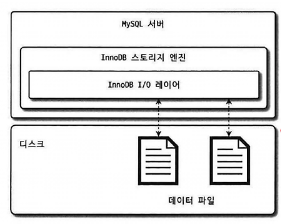
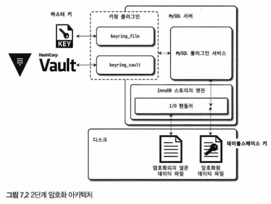

# 07 데이터 암호화
- MySQL 8.0부터 데이터 파일뿐만 아니라 리두 로그, 언두 로그, 바이너리 로그 등 모두 암호화 지원
- 데이터 암호화 여부는 보안 감사 시 필수로 언급되는 부분
- 응용 프로그램에서 암호화 후 DB에서 재 암호화하는 이중 암호화를 진행하기도 한다
    - 응용 프로그램에서는 `칼럼 단위`로 암호화를
    - DB에서는 `테이블 단위`로 암호화를 적용

# 7.1 MySQL 서버의 데이터 암호화
- MySQL의 암호화 기능은 `DB 서버`와 `디스크` 사이의 데이터를 읽고 쓰기 지점에서만 일어나기 때문에 쿼리를 처리하는 과정에서 데이터가 내부적으로 암호화 처리되어 있는지 여부를 신경 쓸 필요가 없는데, 이러한 방식을 `TDE(Transparent Data Encrpytion)`라고 한다.
    - 

## 7.1.1 2단계 키 관리
- MySQL의 TDE의 암호화 키는 `키링(KeyRing)` 플러그인에 의해 관리된다
- 각 키링 플러그인의 내부적인 동작 방식은 모두 2단계 키 관리 방식으로 동일

- MySQL에서는 `마스터 키`, `테이블스페이스 키`라는 두 종류의 키를 사용
- 마스터 키
    - 테이블스페이스 키를 암호화 하는데 사용
    - KMS나 Valut같은 외부 키 관리 솔루션 또는 디스크 파일 형태로 저장
    - `외부에 노출`되는 키로 주기적으로 변경해줘야 함
- 테이블스페이스 키
    - 실제 테이블 데이터를 암호화 하는데 사용
    - 마스터 키로 암호화되어 디스크의 테이블 데이터 파일 헤더에 저장
    - 외부로 노출되지 X -> 주기적 변경 불필요
    - 오히려 변경 시 암호화된 테이블을 전부 복호화 후 재암호화 해야 하는 부하 발생

## 7.1.2 암호화와 성능
- MySQL의 TED는 디스크로부터 읽고 쓸 때 암호화가 적용되기 때문에 암호화된 데이터 페이지가 복호화 처리를 거친 후 한 번 메모리(버퍼 풀)에 적재되면 그 이후로는 암호화되지 않은 테이블의 동일한 성능을 가짐
### 읽기 지연
- 버퍼풀에 조회하려는 데이터가 없다면 디스크에서 꺼내와야 하는데, 이때 데이터 복호화로 인해 쿼리가 지연되는 현상
### 쓰기 지연
- 암호화된 테이블 내의 데이터가 변경되면 다시 디스크로 변경사항을 동기화 시킬 때, 데이터 암호화로 인한 추가 시간 발생
- 디스크 쓰기 작업은 백그라운드 쓰레드에서 실행되기 때문에, 실제 쿼리 지연은 발생X