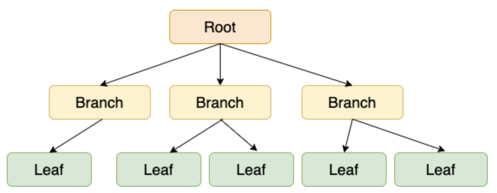
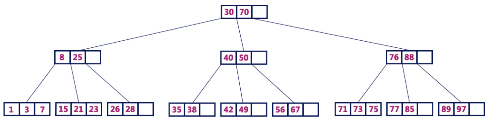
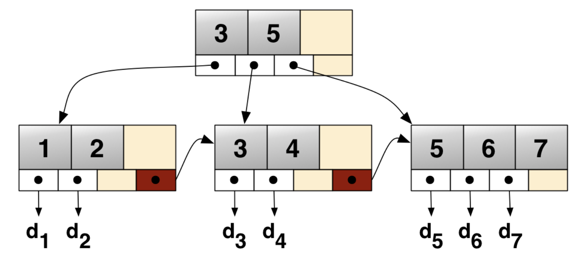
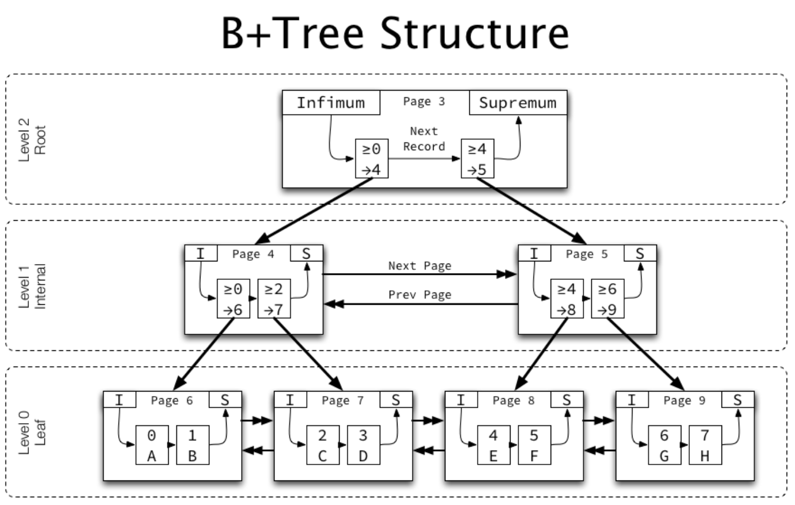

# B-Tree
- 구조
    - 
    - 가장 상단의 `루트 노드`(Root Node)
    - 중간의 `브랜치 노드`(Branch Node)
    - 가장 아래의 `리프 노드`(Leaf Node)
- 균형 트리 구조
    - 데이터를 추가, 수정, 삭제할 때 트리의 높이를 유지하기 위해 `추가 연산` 필요
    - `균일한 높이`로 인해 어떤 값을 조회해도 비슷한 시간(`O(logN)`)의 결과를 얻는다
- 모든 노드에 데이터 저장 가능
    - 

> 균형 트리란? 
> 노드가 삽입, 삭제될 때 트리의 균형을 체크하고 유지하는 트리

# B+Tree
- B-Tree의 확장된 개념

- 리프 노드가 `Linked-List`로 연결됨
    - 범위 검색, 순차 검색이 빨라짐
    - 여러 데이터가 한 번에 캐시에 적재되므로 캐시 효율 증가
- 루트, 브랜치 노드는 key만 가지고 리프 노드에서만 key, value를 가진다
    - value가 리프노드에만 저장 -> 더 많은 key를 확보 -> 트리의 높이가 감소 -> 빠른 검색
- InnoDB의 B+Tree 구조
    - 

## B-Tree VS B+Tree
| **구분**             | **B-Tree**                                                                 | **B+Tree**                                                                  |
|-----------------------|-----------------------------------------------------------------------------|-----------------------------------------------------------------------------|
| **데이터 저장**       | 리프 노드, 브랜치 노드 모두 데이터 저장 가능                               | 오직 리프 노드에만 데이터 저장 가능                                         |
| **트리의 높이**       | 높음                                                                      | 낮음(한 노드 당 key를 많이 담을 수 있음)                                   |
| **풀 스캔 시 검색 속도** | 모든 노드 탐색                                                           | 리프 노드에서 선형 탐색                                                     |
| **키 중복**           | 없음                                                                      | 있음(리프 노드에 모든 데이터가 있기 때문)                                  |
| **검색**              | 자주 access 되는 노드를 루트 노드 가까이 배치할 수 있고, 브랜치 노드에도 데이터가 존재하여 빠름 | 리프 노드까지 가야 데이터 존재                                              |
| **링크드 리스트**      | 없음                                                                      | 리프 노드끼리 링크드 리스트로 연결                                          |
