# 08 인덱스
데이터베이스 `쿼리 성능`을 언급하면 빼놓을 수 없는 부분

# 8.1 디스크 읽기 방식
- CPU나 메모리처럼 `전기적 특성`이 아닌 `기계적 장치`인 디스크에 저장하는 방법이 가장 느리다
- 데이터베이스나 성능 튜닝은 어떻게 `디스크 I/O`를 줄이느냐가 관건이다

## 8.1.1 하드 디스크 드라이브(HDD)와 솔리드 스테이트 드라이브(SSD)
- SSD는 DRAM보다는 느리지만, HHD보다 1000배 가량 빠르다
- SSD가 HDD보다 순차 I/O에서는 약간 빠르지만, 랜덤 I/O에서는 압도적으로 빠르다
- 랜덤 I/O가 대부분인 DBMS에서는 SSD가 최적이다

## 8.1.2 랜덤 I/O와 순차 I/O
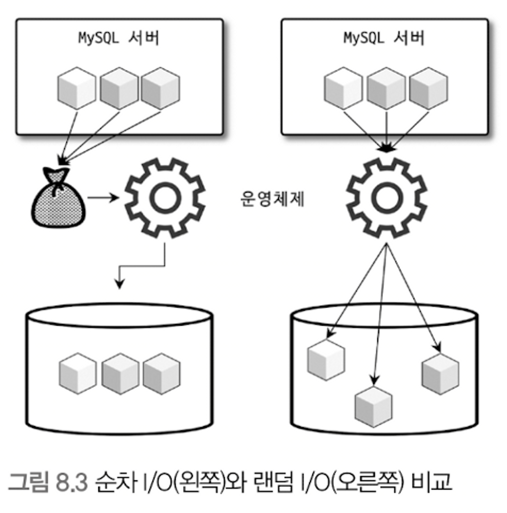
- 디스크의 데이터를 읽기 위해서 `디스크 헤더`를 데이터 위치로 이동시켜야 한다
- `순차 I/O`는 디스크의 헤더를 1번만 움직이면 되지만 `랜덤 I/O`는 3번을 움직여야 한다
- 즉, 성능은 디스크의 헤더를 적게 사용하도록 랜덤 I/O에서 순차 I/O로 바꿔주는 것이 중요하다

# 8.2 인덱스란?
- DBMS에서 데이터의 `쓰기(INSERT, UPDATE, DELETE) 성능`을 희생하고 `읽기 성능`을 높이는 기능
- DBMS는 `SortedList` 자료구조를 활용하여 인덱스를 관리한다
- 인덱스 알고리즘에는 `B-Tree`, `Hash`, `Fractal-Tree`, `Merge-Tree` 등 다양하다

# 8.3 B-Tree 인덱스
- 가장 일반적인 알고리즘
- 칼럼의 값을 변형하지 않고 `원래의 값`을 이용
- 여러 변형된 형태의 알고리즘이 존재하지만 주로 `B+-Tree`, `B*-Tree`를 사용
- 여기서 'B'는 Binary가 아닌 `Balanced` 이다

## 8.3.1 구조 및 특성
- 하나의 최상위 `루트 노드`, 가장 하위의 `리프 노드`, 그리고 중간 노드인 `브랜치 노드`로 구성
- 인덱스의 리프 노드는 데이터 파일에 저장된 `레코드의 주소`를 가진다
    - 인덱스는 키 컬럼만 가지고 있기 때문
- 인덱스 키 값은 모두 정렬되지만, 데이터 파일의 레코드는 정렬되어 있지 않다
- `MyISAM`은 세컨터리 인덱스가 `물리적인 주소`를 가지는 반면, `InnoDB`는 프라이머리 키를 주소처럼 사용하기 때문에 `논리적인 주소`를 가진다
    - 따라서 InooDB는 세컨더리 인덱스에 저장된 pk 값을 활용해 pk 인덱스의 리프 페이지에 저장된 레코드를 읽는다
    - 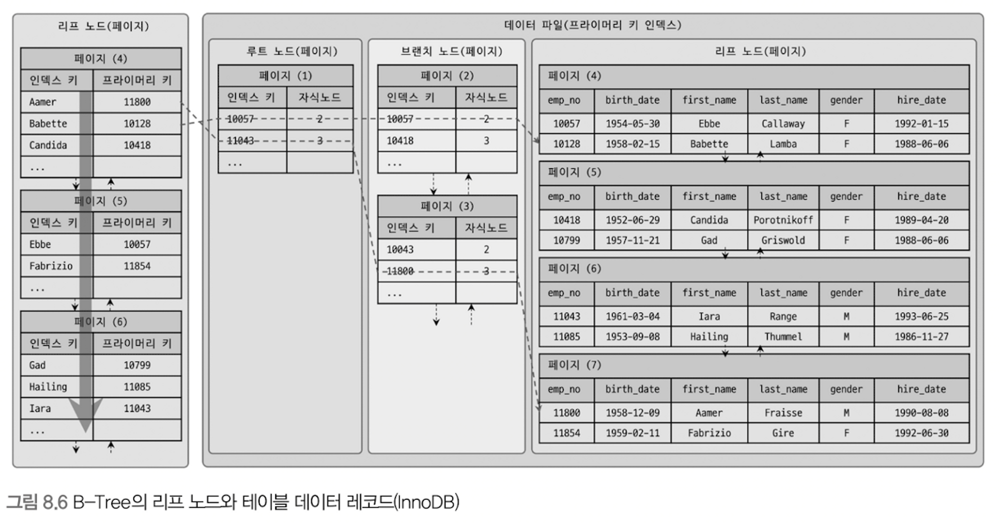

## 8.3.2 B-Tree 인덱스 키 추가 및 삭제
- 테이블의 레코드를 저장하거나 변경하는 경우 인덱스 키 추가나 삭제 작업이 발생한다

### 8.3.2.1 인덱스 키 추가
- 쓰기 작업으로 인해 인덱스 키가 추가되면 B-Tree에 추가하는 과정에서 리프 노드의 분리가 일어날 수 있어 비교적 비용이 많이 든다
- MyISAM, MEMORY 엔진은 즉시 B-Tree 인덱스에 반영하지만, InnoDB는 `체인지 버퍼`를 통해 지연시켜 비용을 절감할 수 있다
    - 단, 중복 체크가 필요한 pk, uk는 불가능

### 8.3.2.2 인덱스 키 삭제
- 해당 키 값이 저장된 B-Tree의 리프 노드를 찾아 삭제
- 삭제된 공간은 방치 or 재활용
- 삭제 작업도 디스크 I/O가 필요한 작업으로 InnoDB는 버퍼를 통해 지연 처리 가능

### 8.3.2.3 인덱스 키 변경
- 인덱스 키 값은 그 값에 따라 저장될 리프 노드의 위치가 결정 되므로 단순히 `인덱스 키 값을 변경할 수 없다`
- 인덱스 키 값의 변경은 `키 삭제 후, 키 추가 작업 형태`로 이루어진다
- 마찬가지로 InnoDB는 체인지 버퍼를 활용해 지연 처리 가능

### 8.3.2.4 인덱스 키 검색
- 이러한 추가 비용을 감당하면서 인덱스를 사용하는 이유는 `빠른 검색`을 위함

**B-Tree 인덱스 검색 시 주의점**
1. 100% 일치, 앞 부분만 일치, 부등호 비교 조건에서는 인덱스를 활용할 수 있지만, 인덱스를 구성하는 키 값의 뒷부분만 검색하는 용도로는 인덱스를 사용할 수 없다.
    - 인덱스 사용 O
        - “John”인 사람 검색
        - “Jo”로 시작하는 사람 검색
        - “J” 이후 인 사람 검색 
    - 인덱스 사용 X
        - 이름이 “hn”로 끝나는 사람 검색
        - 이름이 “John”이 아닌 사람 검색
        - 이름이 “Jo”로 시작하지 않는 사람 검색 (경우에 따라 사용됨, 비효율적)
2. 인덱스를 이용한 검색 시 인덱스의 키 값에 변형이 가해진 후 비교되는 경우는 사용할 수 없다
    - 연산을 수행한 결과로 검색하는 작업은 B-Tree의 장점을 이용 불가
3. InnoDB는 검색을 수행한 인덱스를 잠근 후 레코드를 잠근다. 인덱스가 없다면 테이블 풀 스캔을 통해 불필요한 레코드를 잠구게 된다.

## 8.3.3 B-Tree 인덱스 사용에 영향을 미치는 요소
- B-Tree 인덱스는 인덱스를 구성하는 칼럼의 크기와 레코드 수, uk 인덱스 값 개수 등에 의해 검색이나 변경 작업의 성능이 영향을 받는다

### 8.3.3.1 인덱스 키 값의 크기
- InnoDB 버퍼 풀에서 데이터를 버퍼링 하는 단위를 `페이지` or `블록`
- 일반적으로 DBMS의 B-Tree 노드 개수는 가변적인 구조다
    - MySQL은 인덱스 페이지 크기와 키 값의 크기에 따라 결정된다
- 인덱스 키 값이 커짐 -> 가질 수 있는 자식 노드의 수 감소 -> 디스크 IO 증가 -> 속도 저하

### 8.3.3.2 B-Tree 깊이
- 인덱스 키 값이 커짐 -> 한 페이지에 담을 수 있는 키의 수 감소 -> B-Tree 깊이 증가 -> 더 많은 디스크 읽기 필요 -> 속도 저하

### 8.3.3.3 선택도(기수성, 카디널리티)
- 인덱스 키 값 가운데 유니크한 값의 수를 의미
- 기수성이 높을수록 검색 대상이 줄어 더 빠르게 처리된다

### 8.3.3.4 읽어야 하는 레코드의 건수
- 인덱스를 통해 테이블 읽기 비용 > 바로 테이블의 레코드를 읽기 비용
- 옵티마이저에서 인덱스를 통한 읽기가 대략 4~5배 더 많이 드는 작업으로 예측
- 전체 테이블 레코드의 `20~25%`가 넘어서는 경우만 인덱스를 사용하는 것이 효율적

## 8.3.4 B-Tree 인덱스를 통한 데이터 읽기

### 8.3.4.1 인덱스 레인지 스캔
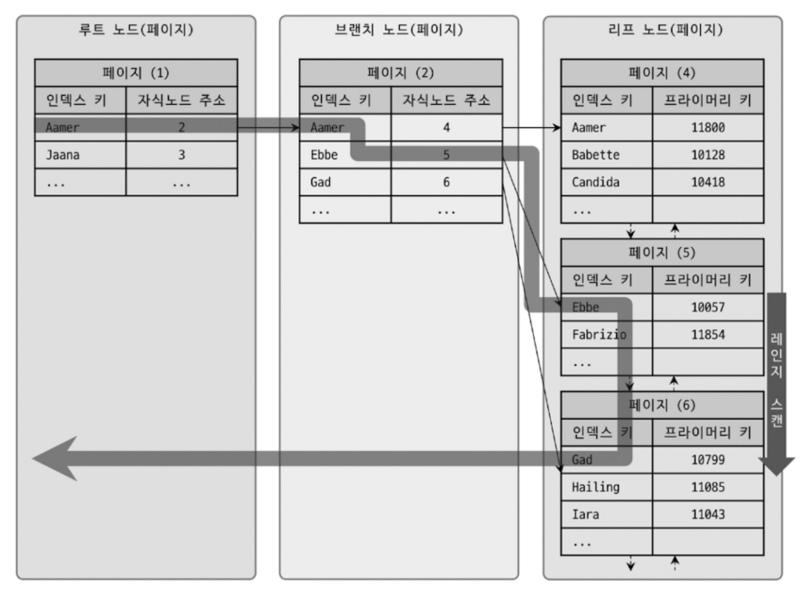 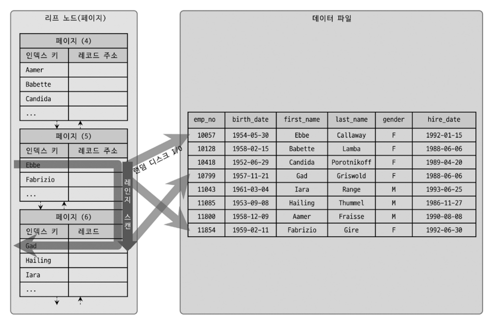
- 가장 대표적인 접근 방식
- `가장 빠름`
- 검색해야 될 `인덱스의 범위`가 결정됐을 때 사용하는 방식
- 동작 과정
    1. 조건이 만족하는 인덱스의 저장 위치를 찾는다. `(인덱스 탐색)`
    2. 탐색된 위치에서 필요한 만큼 인덱스를 차례대로 읽는다. `(인덱스 스캔)`
    3. 읽은 인덱스 키와 레코드 주소를 이용해 레코드가 저장된 페이지를 가져와 읽는다
        - 레코드 한 건당 `랜덤 I/O` 발생

### 8.3.4.2  인덱스 풀 스캔
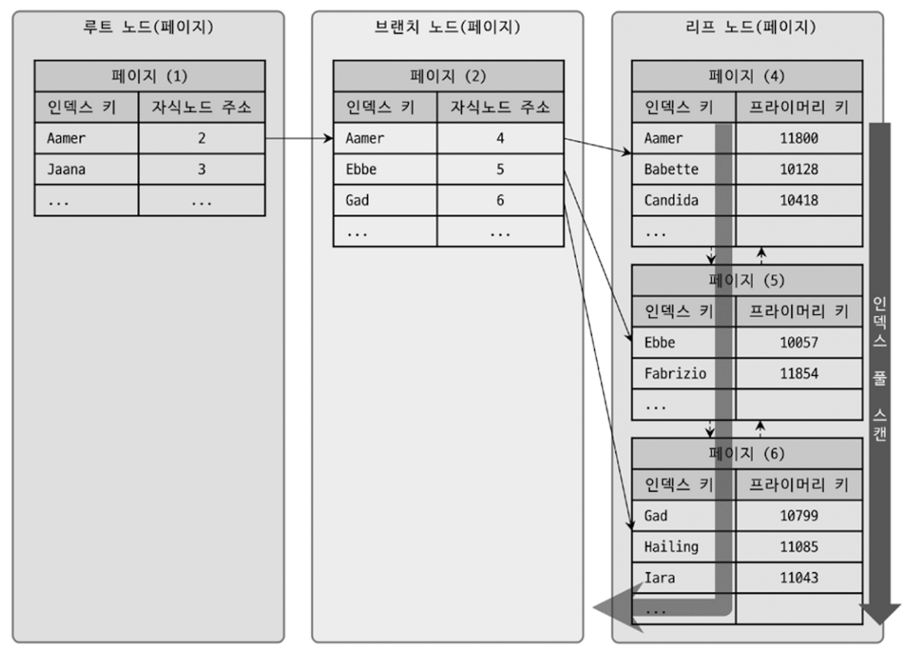
- 인덱스를 `모두` 읽는 방식
- 쿼리의 조건절에 사용된 컬럼이 인덱스의 첫 번째 칼럼이 아닌 경우 사용됨
    - ex) 인덱스 (A, B, C)를 설정했지만 조건절은 B 칼럼이나 C 칼럼으로 검색하는 경우
- 인덱스 크기가 테이블의 크기보다 작으므로, `인덱스만으로` 조건을 처리할 수 있을 때 효율적

### 8.3.4.3 루스 인덱스 스캔
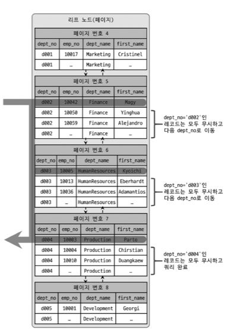
- 중간에 필요치 않은 인덱스 키 값은 `무시`하여 스캔
- 일반적으로 `GROUP BY`, `MIN()`, `MAX()` 함수를 최적화 하는 경우 사용

### 8.3.4.4 인덱스 스킵 스캔
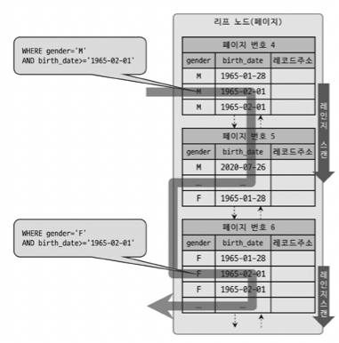
- 앞 칼럼을 뛰어넘어서 `뒤 칼럼만으로도` 인덱스 검색이 가능하게 해주는 최적화 기능
- ``` sql
    ALTER table employees ADD INDEX ix_gender_birthdate (gender, birth_date);
    ```
  ``` sql
    -- 1번
    SELECT * FROM employees WHERE birth_date >= '1965-02-01';

    -- 2번
    SELECT * FROM employees WHERE gender='M' AND birth_date >= '1965-02-01';
    ```
- 원래는 1번 쿼리에 경우 인덱스를 사용할 수 없었지만 인덱스 스킵 스캔을 통해 인덱스 처리가 가능하게 되었다

## 8.3.5 다중 칼럼(Mutli-column) 인덱스 (=복합 인덱스)
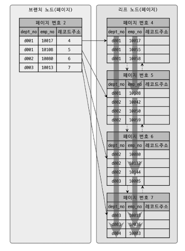
- 여러 칼럼을 포함하는 인덱스
- 인덱스 칼럼 순서에 따라 정렬 값이 결정된다
- index_tmp(A, B)가 있다면 A로 정렬된 뒤 A값이 같은 경우 B컬럼으로 정렬하겠다는 의미

## 8.3.6 B-Tree 인덱스의 정렬 및 스캔 방향
- 옵티마이저가 실시간으로 오름차순과 내림차순 어떤 방향으로 읽을지 실행계획을 결정한다


### 8.3.6.1 인덱스 정렬
- 인덱스 정렬은 오름 차순(정순), 내림 차순(역순)을 설정할 수 있다
- 하지만 역순 스캔은 정순보다 약 30% 정도 느리다
    1. 페이지 잠금이 정순 스캔에 적합한 구조
    2. 페이지 내에서 인덱스 레코드가 단방향으로만 연결된 구조

## 8.3.7 B-Tree 인덱스의 가용성과 효율성
1. 복합 인덱스의 경우 카디널리티가 높은 컬럼을 앞으로 해서 생성하는 것이 좋다.
2. 복합 인덱스의 첫 번째 컬럼이 없으면 인덱스 레인지 스캔 방식을 이용할 수 없어서 효율이 떨어진다.
3. 인덱스를 효율적으로 활용할 수 없는 경우
    - `NOT-EQUAL`로 비교된 경우 (`<>`, `NOT IN`, `NOT BETWEEN`, `IS NOT NULL`)
    - `LIKE %??`로 앞이 아닌 뒷 부분이 일치하는 형태로 비교된 경우
    - 인덱스 컬럼이 변형된 후 비교
    - 데이터 타입이 다른 경우 ( `.. WHERE char_column = 10`)
    - 등등

# 8.4 R-Tree 인덱스
- `공간 인덱스`는 R-Tree 인덱스 알고리즘을 이용해 `2차원의 데이터`를 인덱싱하고 검색하는 목적
- B-Tree와 흡사하지만 B-Tree는 1차원, R-Tree는 2차원이라는 특징
- MySQL의 `공간 확장 기능`을 활용
    - 공간 데이터를 저장할 수 있는 데이터 타입
    - 공간 데이터의 검색을 위한 공간 인덱스(R-Tree 알고리즘)
    - 공간 데이터의 연산 함수(거리 또는 포함 관계의 처리)

## 8.4.1 구조 및 특성
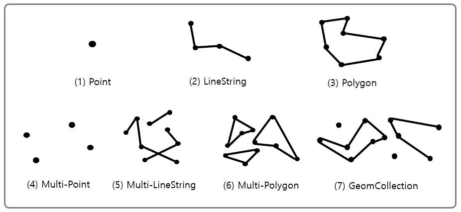
- 모든 타입의 슈퍼 타입으로 `GEOMETRY`가 있다
- 각 타입의 도형은 MBR(Minimum Bounding Rectangle) 즉, 최소 크기의 사각형으로 만들어 포함관계를 구현한 것이 R-Tree이다
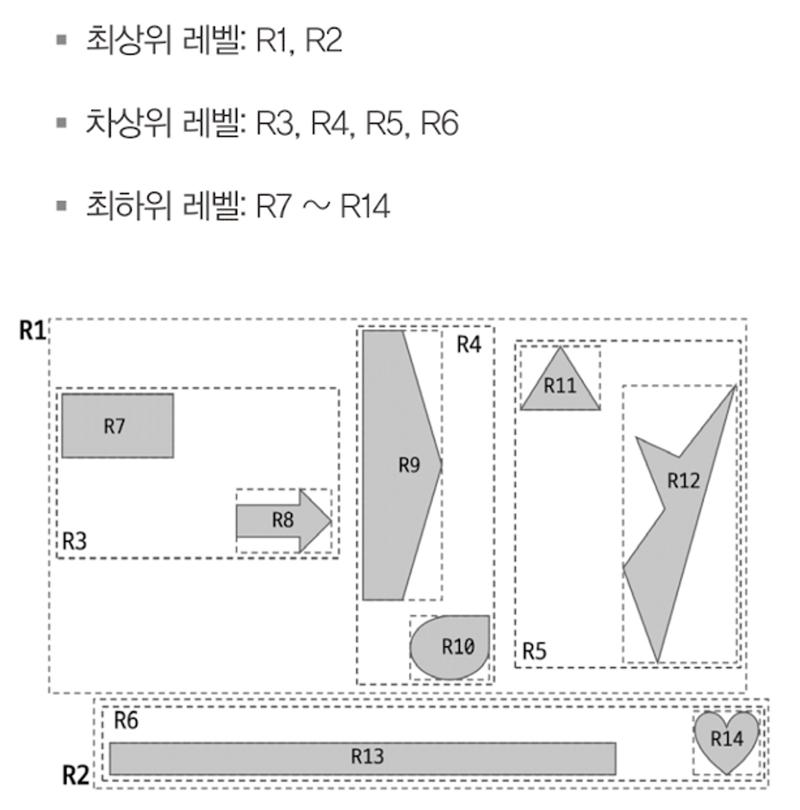

## 8.4.2 R-Tree 인덱스의 용도
- R-Tree는 MBR 정보를 이용해 B-Tree 형태로 인덱스를 구축한다
- 일반적으로 `WGS84(GPS)` 기준의 위도, 경도 좌표 저장에 사용된다
- R-Tree는 MBR의 `포함 관계`를 이용해 만들어진 인덱스이기 때문에 거리 비교 함수(`ST_Distance()`, `ST_Distance_Sphere()`)가 아닌 포함 관계 비교 (`ST_Contains()`, `ST_Within()`) 시 인덱스가 사용된다

# 8.5 전문 검색 인덱스
- 문서 전체에 대한 분석과 검색을 위한 인덱싱 알고리즘

## 8.5.1 인덱스 알고리즘
- 전문 검색에는 문서 본문의 내용에서 사용자가 검색하게 될 키워드를 분석해 내고, 빠른 검색용으로 사용할 수 있게 이러한 키워드로 인덱스를 구축한다
- 전문 검색 인덱스는 문서의 키워드를 인덱싱하는 기법에 따라 `단어의 어근 분석`과 `n-gram 분석` 알고리즘으로 구분

### 8.5.1.1 어근 분석 알고리즘
- MySQL 서버의 전문 검색 인덱스는 `불용어 처리`, `어근 분석` 과정을 거쳐 색인 작업이 수행된다
- 불용어 처리란 가치가 없는 단어를 필터링하여 제거하는 작업
- 어근 분석은 선정된 단어의 뿌리인 원형을 찾는 작업
    - MySQL은 분석 라이브러리인 `MeCab`을 플러그인 형태로 사용할 수 있게 지원해준다

### 8.4.1.2 n-gram 알고리즘
- MeCab을 위한 `형태소 분석`은 전문적인 알고리즘이 아니라 범용적으로 적용하기 쉽지 않다
- 이를 개선하기 위해 n-gram 알고리즘이 도입
- 형태소 분석이 문장을 이해하는 알고리즘이라면, n-gram은 단순히 `키워드를 검색`해내기 위한 인덱싱 알고리즘이다
- n-gram은 본문을 무조건 `몇 글자씩 잘라서` 인덱싱하는 방법

## 8.5.2 전문 검색 인덱스의 가용성
- 전문 검색 인덱스를 사용하려면 다음 두 가지 조건을 모두 갖춰야 한다
    1. 쿼림 문장이 전문 검색을 위한 문법 `(MATCH ... AGAINST ...)`을 사용
    2. 테이블이 전문 검색 대상 컬럼에 대해서 `전문 인덱스` 보유
``` sql
CREATE TABLE tb_test {
    doc_id INT,
    doc_body TEXT,
    PRIMARY KEY (doc_id),
    FULLTEXT KEY fx_docbody (doc_body) WITH PARSER ngram
} ENGINE=InnoDB;

-- 풀 테이블 스캔
SELECT * FROM tb_test WHERE doc_body LIKE '%애플%';

-- 전문 검색 인덱스
SELECT * FROM tb_test WHERE MATCH(doc_body) AGAINST ('애플' IN BOOLEAN MODE);
```

# 8.6 함수 기반 인덱스
- 칼럼의 값을 변형해서 만들어진 값에 대해 인덱스를 구축해야 할 때 사용
- 구현 방법
    1. 가상 컬럼을 이용한 인덱스
    2. 함수를 이용한 인덱스

## 8.6.1 가상 컬럼 인덱스
``` sql
CREATE TABLE user {
    user_id BIGINT,
    first_name VARCHAR(10),
    last_name VARCHAR(10),
    PRIMARY KEY (user_id)
};

ALTER TABLE user
ADD full_name VARCHAR(30) AS (CONCAT(first_name, ' ' , last_name)) VIRTUAL,
ADD INDEX ix_fullname (full_name);
```
- first_name과 last_name을 합쳐 full_name으로 칼럼을 관리하여 인덱스를 생성하던 기존 방식에서, 가상 칼럼을 추가하여 그 가상 칼럼에 인덱스를 생성할 수 있게 됐다
- 가상 칼럼은 새로운 칼럼을 추가하는 것과 같은 효과를 내기 때문에, 실제 테이블의 구조가 변경된다는 단점

## 8.6.2 함수를 이용한 인덱스
``` sql
CREATE TABLE user {
    user_id BIGINT,
    first_name VARCHAR(10),
    last_name VARCHAR(10),
    PRIMARY KEY (user_id),
    INDEX ix_fullname ((CONCAT(first_name, ' ' , last_name)))
};
```
- 테이블의 구조를 변경하지 않고 함수를 직접 사용하는 인덱스를 생성

# 8.7 멀티 밸류 인덱스
- 하나의 레코드에 여러 키 값을 가질 수 있는 인덱스
- 주로 JSON 배열 타입의 필드에 저장된 원소들에 대한 인덱스를 구현하기 위해 사용
- 정규화에 위배되는 형태지만, 최근 RDBM들이 JSON을 지원하기 시작하면서 등장

# 8.8 클러스터링 인덱스
- 테이블의 레코드를 비슷한 것(PK를 기준)끼리 묶어서 저장하는 형태로 구현
- 클러스터링 인덱스는 InnoDB에서만 지원

## 8.8.1 클러스터링 인덱스
- 클러스터링 인덱스 `= 클러스터링 테이블`
- 클러스터링 기준이 되는 pk는 `클러스터링 키`라고도 표현
- 테이블의 pk에 대해서만 `pk 값이 비슷한 값끼리 묶어서 저장`
    - 중요한 것은 pk에 의해 레코드의 저장 위치가 결정된다
    - 또한, pk가 변경되면 레코드의 물리적 저장 위치도 바뀌어야 한다는 것을 의미
- `InnoDB`는 항상 테이블이 클러스터링 인덱스로 저장되어 pk 기반의 `검색이 매우 빠르지만`, pk `변경이 상대적으로 느리다`

> B-Tree 인덱스 VS 클러스터링 인덱스 <br>
> B-Tree 인덱스도 키 값으로 정렬하기 때문에 키를 기준으로 클러스터링 된 것이다. <br>
> 하지만 pk를 기준으로 정렬된 경우만 `클러스터링 인덱스`, `클러스터링 테이블`이라고 부른다

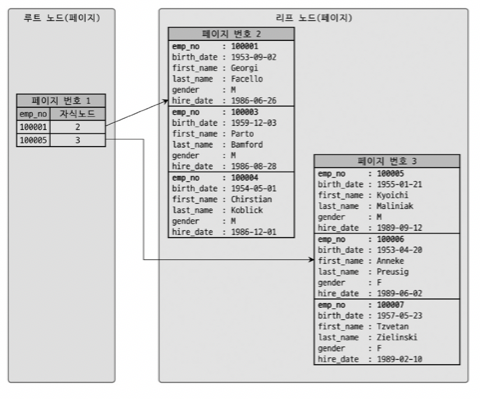
- B-Tree와 구조는 비슷하지만 B-Tree와 달리 클러스터링 인덱스의 리프 노드에는 `레코드의 모든 칼럼`이 같이 저장되어 있다
- PK가 없는 경우
    1. 프라이머리 키가 있으면 기본적으로 프라이머리 키를 클러스터링 키로 선택
    2. NOT NULL 옵션의 유니크 인덱스 중에서 첫 번째 인덱스를 클러스터링 키로 선택
    3. 자동으로 유니크한 값을 가지도록 증가되는 칼럼을 내부적으로 추가한 후, 클러스터링 키로 선택

## 8.8.2 세컨더리 인덱스에 미치는 영향
- `MyISAM`, `MEMORY` 같이 클러스터링을 지원하지 않은 테이블은 레코드가 처음 저장된 곳에서 `절대 이동하지 않는다`
- 하지만 InnoDB는 클러스터링 인덱스로 인해 PK가 변경되면 레코드의 위치도 변경된다
- 따라서 세컨더리 인덱스에서 레코드의 물리적인 주소를 가지면 pk가 변경될 때 `같이` 변경이 이루어져야 한다.
- 이러한 `오버헤드`를 제거하기 위해 InnoDB의 세컨더리 인덱스는 레코드의 논리적인 주소인 PK값을 저장한다

## 8.8.3 클러스터링 인덱스의 장단점
- 장점
    - PK 검색 시 `처리 성능`이 매우 빠르다.
    - 모든 세컨더리 인덱스가 PK를 가지고 있으므로 인덱스만으로 처리될 수 있는 경우가 많다. (`커버링 인덱스`)
- 단점
    - 테이블의 모든 세컨더리 인덱스가 클러스터링 키를 갖기 때문에  클러스터링 키 값의 크기가 클 경우 전체적인 인덱스의 크기가 커진다.
    - 세컨더리 인덱스를 통해 검색할 때 PK로 `한번 더 검색`해야 하므로 성능이 느리다.
    - INSERT할 때 PK에 의해 저장 위치가 결정되므로 처리 성능이 느리다.
    - PK를 변경할 때 레코드를 DELETE하고 INSERT하는 작업이 필요하기 - 때문에 처리 성능이 느리다.

### 8.8.4.1 클러스터링 인덱스의 크기
- 클러스터링 테이블의 경우 모든 세컨더리 인덱스가 PK 값을 포함한다
- 따라서 pk의 크기가 커지면 세컨더리 인덱스의 크기도 자동으로 커진다
- 인덱스가 커질수록 같은 성능을 내기 위해 더 많은 메모리가 필요해지므로 pk는 신중히 선택하자

### 8.8.4.2 PK는 AUTO-INCREMENT 보다는 업무적인 칼럼으로 생성
- PK는 대부분 검색에서 상당히 빈번하게 사용되므로 설령 그 크기가 크더라도 업무적으로 해당 레코드를 대표할 수 있다면 매우 빠른 성능을 얻을 수 있을 것이다

### 8.8.4.3 PK는 반드시 명시할 것
- InnoDB는 pk를 설정하지 않아도 사용자가 전혀 접근할 수 없는 자동으로 일련번호 칼럼이 추가된다. 
- 어차피 추가될 거 접근할 수 있는 pk를 만들자

# 8.9 유니크 인덱스
- 같은 값이 `2개 이상 저장될 수 없는` 인덱스
- 하지만 NULL은 특정 값이 아니므로 2개 이상 저장될 수 있다

## 8.9.1 유니크 인덱스 VS 세컨더리 인덱스
- 인덱스 읽기
    - 유니크 인덱스는 데이터가 고유하므로 일치하는 레코드를 하나 찾으면 바로 검색이 끝난다.
    - 반면, 일반 인덱스는 같은 인덱스 키 값인 레코드가 여러개일 수 있어서 여러 값중 어떤 것이 만족하는 레코드인지 찾는 연산이 필요하다.
    - 하지만 이는 디스크 접근이 아닌 메모리 상에서 이뤄지는 작업이므로 성능에 영향이 거의 없다.
    - 그러므로 유니크 vs 일반 인덱스는 같은 수의 레코드를 읽을 때 성능 차이가 거의 없다.
    - 물론 일반 인덱스는 중복된 데이터 때문에 더 많은 데이터를 읽을 수 있다.
    - 결론: 같은 수의 레코드를 읽을 때 두 인덱스의 읽기 성능은 차이가 거의 없다.
- 인덱스 쓰기
    - 유니크 인덱스의 키 값을 쓸 때는 중복 체크 과정이 필요해서 일반 인덱스 보다 느리다.
    - 근데, MySQL에선 유니크 인덱스에서 중복 체크 시 읽기 잠금을 사용하고, 쓰기 시 쓰기 잠금을 사용하므로 데드락이 자주 발생한다.
    - 또한, 유니크 인덱스는 저장 및 변경 시 중복 체크를 해야하므로 작업을 버퍼링하지 못한다.

# 8.10 외래키
- MySQL의 외래키는 `InnoDB`에서만 생성 가능
- 왜래키 제약이 설정되면 `자동`으로 연관되는 테이블의 컬럼에 인덱스가 생성
- 두 가지 특징
    1. 테이블의 변경(쓰기 잠금)이 발생하는 경우에만 잠금 경합(잠금 대기)가 발생
    2. 외래키와 연관되지 않은 칼럼의 변경은 최대한 잠금 경합(잠금 대기)을 발생시키지 않는다
``` sql
// 커넥션 1 시작
// 커넥션 1 부모 테이블 컬럼 업데이트
UPDATE users SET name = 'change' WHERE id = 1;
// 커넥션 2 시작
// 커넥션 2 자식 테이블 컬럼 업데이트
UPDATE posts SET user_id = 1 WHERE id = 100;
```
- 커넥션 1의 `UPDATE` 쿼리는 외래키의 연관되지 않은 칼럼의 변경을 시도하기 때문에 잠금 경합이 발생하지 않는다
- 하지만 커넥션 2의 `UPDATE` 쿼리는 외래키로 인한 잠금 경합이 발생한다