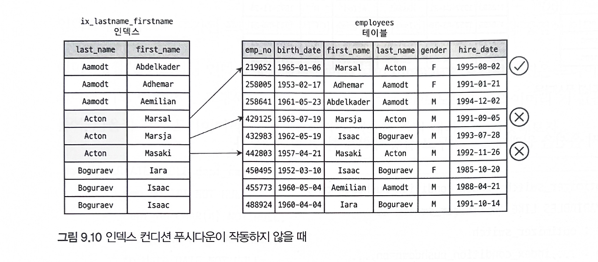
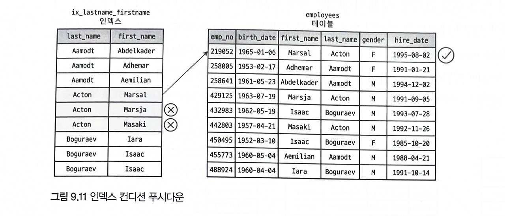
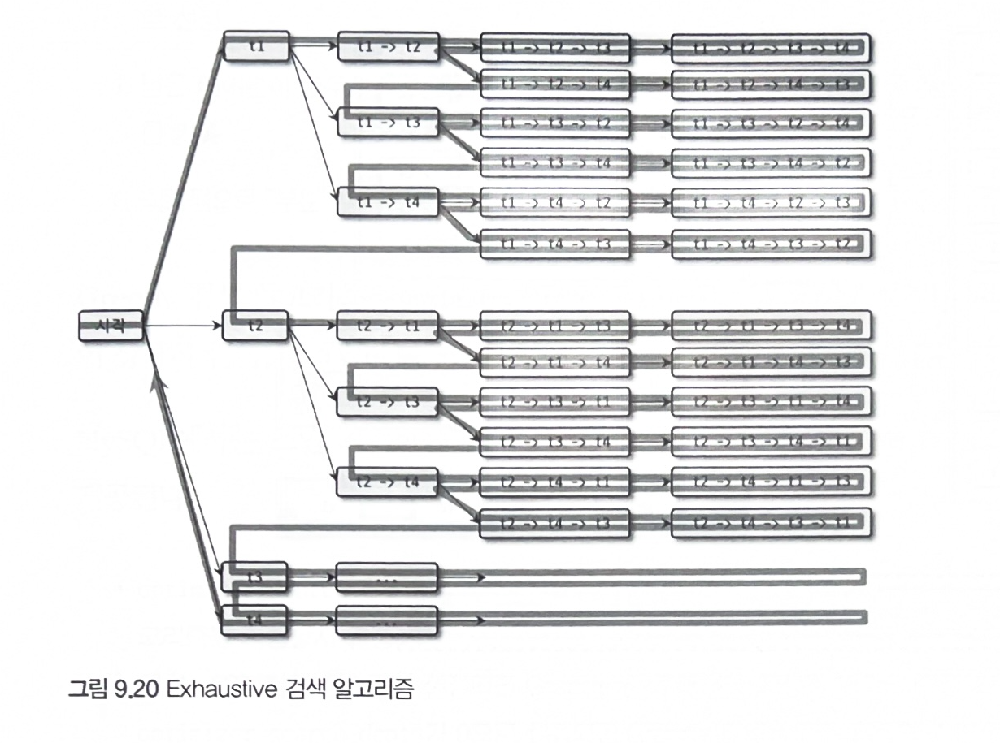

# 09 옵티마이저와 힌트

# 9.1 개요
- MySQL 서버로 요청된 쿼리의 결과는 동일하지만 내부적으로 결과를 만들어내는 방법은 다양하다
- 최적의 방법, 최소의 비용을 통해 최적의 실행계획을 만들어내는 작업을 `옵타마이저`가 담당한다
- `EXPLAIN` 명령어를 통해 쿼리의 실행계획을 확인할 수 있다

## 9.1.1 쿼리 실행 절차
1. SQL 파서 - SQL 문장을 잘게 쪼개서 MySQL 서버가 이해할 수 있는 수준으로 분리하여 SQL 파스 트리를 생성
2. 옵티마이저 - SQL 파스 트리를 확인하며 실행 계획 수립
    - 불필요 조건 제거
    - 복잡한 연산 단순화
    - 여러 조인 -> 어떤 순서로 테이블 읽을지
    - 어떤 인덱스 사용할지
    - 등등
3. MySQL 엔진과 스토리지 엔진 - 실행계획에 따라 스토리지 엔진에서 데이터 조회


## 9.1.2 옵티마이저의 종류
### 비용 기반 옵티마이저 (Cost Based Optimizer, CBO)
- 쿼리를 처리하기 위한 여러 가지 가능한 방법을 만듦
- 각 단위 작업의 비용 정보와 대상 테이블의 예측된 통계 정보를 통해 실행 계획별 비용 산출
- 최소 비용의 실행 계획을 통해 쿼리 처리
- 대부분의 DBMS가 선택

### 규칙 기반 옵티마이저 (Rule Based Optimizer, RBO)
- 테이블의 레코드 건수, 선택도 등을 고려하지 않고 옵티마이저에 내장된 우신선위에 따라 실행계획을 수립
- 따라서 같은 쿼리에 대해 거의 항상 같은 실행 방법을 만들어낸다
- 데이터 분포가 매우 다양하기 때문에 거의 사용되지 않는다

# 9.2 기본 데이터 처리
## 9.2.1 풀 테이블 스캔과 풀 인덱스 스캔
### 옵티마이저의풀 테이블 스캔 선택 조건
  - 레코드 건수가 너무 작아 인덱스 보다 풀 테이블 스캔이 빠른 경우
  - `WHERE` 절이나 `ON` 절에 인덱스를 이용할 수 있는 적절한 조건이 없는 경우
  - 인덱스 레인지 스캔이 가능하더라도 옵티파이저가 판단한 조건 일치 레코드 건수가 너무 많은 경우
### InnoDB의 풀 테이블 스캔
- 특정 테이블의 연속된 데이터 페이지가 읽히면 `백그라운드 스레드`에 의해 `리드 어헤드(Read ahead)` 작업이 자동으로 시작된다
- 반면 `MyISAM`은 풀 테이블 스캔 시 디스크로부터 페이지를 하나씩 읽어온다
> Read ahead란?<br>
> 어떤 영역의 데이터가 앞으로 필요해지리라는 것을 `예측`해서 요청이 오기 전에 미리 디스크에서 읽어 InnoDB 버퍼 풀에 가져다 두는 것 <br>
> 즉, 풀 테이블 스캔이 실행되면 처음 몇 개의 데이터 페이지는 포그라운드 스레드가 읽지만, 특정 시점부터 백그라운드 스레드가 넘겨받아 페이지 읽기를 실행한다 <br>
> Read ahead는 `풀 테이블 스캔` 뿐만 아니라 `풀 인덱스 스캔`에서도 동일하게 사용된다

- count()같이 단순 건수 조회는 풀 테이블 스캔 보다는 용량이 작고 빠른 풀 인덱스 스캔이 선택될 확률이 높다

``` sql
# 풀 인덱스 스캔
select count(*) from employees;

# 풀 테이블 스캔
select * from employees;
```
> 세컨더리 인덱스는 value로 pk를 가지고 있어 레코드를 조회하기 위해 다시 pk에 대응되는 레코드를 읽어야 해서 느리다. 하지만 단순 건수만 조회하는 것은 pk를 조회하지 않아도 되기 때문에 어찌보면 당연한 말인 것 같다

## 9.2.2 병렬 처리
- MySQL 8.0 이후부터 하나의 쿼리에 대해 여러 스레드가 병렬 처리를 할 수 있게 되었다.
- `innodb_parallel_read_threads` 라는 변수로 하나의 쿼리를 최대 몇개의 스레드가 처리할지 설정할 수 있다.
- 단, 아무런 `WHERE 조건 없이` 테이블의 `전체 건수`를 가져오는 쿼리만 병렬로 처리할 수 있다

## 9.2.3 ORDER BY 쿼리 (Using filesort)
### 정렬 처리 방법
| 방법         | 장점                                                                                          | 단점                                                                                           |
|--------------|-----------------------------------------------------------------------------------------------|------------------------------------------------------------------------------------------------|
| 인덱스 이용  | 이미 인덱스가 정렬되어 있어서 순서대로 읽기만 하면 되므로 매우 빠르다.                        | 쓰기 작업 시 부가적인 인덱스 추가/삭제 작업이 필요하므로 느리다. 디스크 공간이 더 많이 필요하다. 인덱스의 개수가 늘어날수록 버퍼 풀을 위한 메모리가 많이 필요하다. |
| Filesort 이용 | 인덱스를 이용할 때의 단점이 없어진다. 정렬할 레코드가 많지 않으면 메모리에서 Filesort가 처리되므로 충분히 빠르다. | 정렬 작업이 쿼리 실행 시 처리되므로 레코드 건수가 많아질수록 쿼리의 응답 속도가 느리다.                    |

### 9.2.3.1 소트 버퍼
- `소트 버퍼`란 정렬을 수행하기 위한 별도의 `메모리 공간`을 의미
- 정렬이 `필요한 경우`에만 할당
- 정렬해야 할 레코드의 크기에 따라 `가변적`으로 증가
- `sort_buffer_size` 변수를 통해 설정 가능
- 문제점
  - 정렬해야 할 레코드 건수가 소트 버퍼가 할당된 메모리 공간보다 크다면 레코드를 여러 조각으로 나눠 처리한다
  - 이 과정에서 임시 저장을 위해 디스크를 사용하여 디스크 I/O를 유발한다
  - 소트 버퍼 사이즈를 키운다고 성능이 무조건 빨라지지는 않는다

### 9.2.3.2 정렬 알고리즘
- 레코드 정렬 시 레코드 전체를 소트 버퍼에 담을지 or 정렬 기준 칼럼만 소트 버퍼에 담을지에 따라 `싱글 패스`, `투 패스`로 나뉜다
- `옵티마이저 트레이스 기능`을 통해 어떤 정렬 모드가 선택됐는지 확인할 수 있다

**싱글 패스 정렬 방식**
- SELECT 대상이 되는 `칼럼 전부`를 소트 버퍼에 담아서 정렬을 수행
- 불필요 데이터까지 읽어 오므로 많은 소트 버퍼 공간이 필요
- 정렬 대상 레코드의 크기나 건수가 `작은 경우` 효율적

**투 패스 정렬 방식**
- `정렬 대상 컬럼`과 `pk`만 소트 버퍼에 담아서 정렬을 수행
- 정렬된 순서대로 다시 pk로 테이블을 `SELECT`하는 방식
- 다음과 같은 경우에 싱글 패스 정렬이 사용되지 못하기 때문에 투 패스 정렬을 사용한다
  1. 레코드의 크기가 `max_length_for_sort_data` 시스템 변수 값보다 큰 경우
  2. `BLOB`이나 `TEXT` 타입의 컬럼이 `SELECT` 대상에 포함될 떄
- 정렬 대상 레코드의 크기나 건수가 `상당히 많은 경우` 효율적

### 9.2.3.3 정렬 처리 방법
| 정렬 처리 방법                           | 실행 계획의 Extra 내용                       | 속도   |
|------------------------------------------|--------------------------------------------|--------|
| 인덱스를 이용한 정렬                    | 별도 표기 없음                             | 빠름   |
| 조인에서 드라이빙 테이블만 정렬         | "Using filesort"                           | 보통   |
| 조인에서 조인 결과를 임시 테이블로 저장 후 정렬 | "Using temporary; Using filesort"          | 느림   |

**인덱스를 이용한 정렬**
- `ORDER BY` 절에 명시된 컬럼이 제일 먼저 읽는 테이블에 속하고, `ORDER BY` 순서대로 생성된 인덱스가 있어야 한다.
- 또한, `WHERE` 절에 첫 번째로 읽는 테이블의 칼럼에 대한 조건이 있다면, `ORDER BY`는 같은 인덱스를 사용할 수 있어야 한다
- `B-Tree` 계열의 인덱스가 아닌 `해시`, `전문 검색 인덱스`에서는 정렬을 사용할 수 없다. 
  - 예외적으로 `R-Tree`는 `B-Tree` 계열이긴 하나, 정렬이 불가능하다
- 인덱스는 정렬돼 있기 때문에 인덱스의 순서대로 읽기만 하면 된다. 즉, 추가 작업을 수행하지 않는다
- 조인을 하더라도 네스티드 루프 방식으로 실행되기 때문에 조인으로 인한 순서가 흐트러지지 않는다
- ex)
    ```sql
    SELECT *
    FROM users, posts
    WHERE users.id = posts.user_id
        AND users.id BETWEEN 10000 AND 10010
    ORDER BY users.id;
    ```
  - 위 쿼리는 user의 정렬된 pk를 읽고 posts의 테이블을 읽기 때문에 ORDER BY를 생략하더라도 정렬되어 조회된다 

**조인의 드라이빙 테이블만 정렬**
- 조인이 수행되면 레코드 수가 크게 증가한다. 따라서 조인 전 첫 번째 테이블의 레코드를 먼저 정렬 후 조인을 실행하는 것이 정렬의 차선책이다
- 따라서 이 방법으로 처리되려면 조인에서 첫 번째로 읽히는 테이블의 칼럼만으로 `ORDER BY`절을 작성해야 한다
- ex)
    ```sql
    SELECT *
    FROM users, posts
    WHERE users.id = posts.user_id
        AND users.id BETWEEN 10000 AND 10010
    ORDER BY users.name;
    ```
    1. 인덱스를 이용해 `WHERE`절을 만족하는 레코드를 검색
    2. 검색 결과를 name 칼럼으로 정렬 수행(Filesort)
    3. 정렬된 결과를 순서대로 읽으면서 posts 테이블과 조인 수행 

**임시 테이블을 이용한 정렬**
- 2개 이상의 테이블을 조인해서 그 결과를 정렬해야 한다면 임시 테이블이 필요할 수 있다
- ex)
    ```sql
    SELECT *
    FROM users, posts
    WHERE users.id = posts.user_id
        AND users.id BETWEEN 10000 AND 10010
    ORDER BY posts.title;
    ```
  - 정렬이 수행되기 전 posts 테이블을 읽어야 하므로 이 쿼리는 조인된 데이터를 가지고 정렬할 수밖에 없다

### 9.2.3.4 정렬 처리 방법의 성능 비교
- 일반적으로 `LIMIT`은 처리하는 양을 줄일 수 있기 때문에 서버가 처리할 작업량을 줄일 수 있다고 생각한다. 
- 하지만 데이터를 처리하는 방식에 따라 `LIMIT`으로 처리량이 줄 수도있고 줄지 않을 수도 있다.

**스트리밍 방식**
- 조건에 일치하는 레코드가 `검색될 떄마다` 바로바로 클라이언트로 전송해주는 방식
- 레코드를 찾는 즉시 전달받기 때문에 `동시에` 데이터의 가공 작업을 시작할 수 있다
- 빠른 응답시간을 보장한다

**버퍼링 방식**
- 조건에 일치하는 `모든 레코드`를 가져온 후, 정렬 및 그루핑 작업을 실시한다
- 모든 레코드를 검색하고 정렬 작업을 하는 동안 클라이언트는 아무것도 하지 않고 기다린다
- 응답 속도가 느림

**결론**
- 인덱스를 사용한 정렬 방식만 스트리밍 방식을 사용하고, 나머지는 버퍼링된 후 정렬된다
- 즉, 인덱스를 사용한 정렬 방식은 `LIMIT`으로 제한된 건수만큼만 읽으면 바로 클라이언트에게 전송해줄 수 있다
- 가능하다면 `인덱스를 사용한 정렬`로 유도하자

## 9.2.4 GROUP BY 처리
- `GROUP BY`는 `ORDER BY`와 같이 스트리밍 처리를 할 수 없게 만든다
- `GROUP BY`에서 사용된 조건은 인덱스를 사용해서 처리될 수 없으므로 `HAVING` 절을 튜닝할 필요가 없다
- 인덱스를 이용하는 `GROUP BY`
  - 인덱스 스캔: 인덱스를 차례로 읽는 방식
  - 루스 인덱스 스캔: 인덱스를 건너 뛰며 읽는 방식
- 인덱스를 이용하지 않는 `GROUP BY`
  - 임시 테이블을 사용

### 9.2.4.1 인덱스 스캔을 이용하는 GROUP BY (타이트 인덱스 스캔)
- 조건
  - 조인 드라이빙 테이블에 속한 칼럼만을 이용해 그루핑
  - `GROUP BY`의 순서로 인덱스가 있어야 함

### 9.2.4.2 루스 인덱스 스캔을 이용하는 GROUP BY
- 실행 계획의 Extra 컬럼에 `Using index for group-by` 코멘트가 표시된다
- ex)
  ``` sql
  # 인덱스(emp_no, from_date)가 생성된 상태
  SELECT emp_no
  FROM salaries
  WHERE from_date='1985-03-01'
  GROUP BY emp_no;
  ```
  - WHERE 절의 from_date는 복합 인덱스의 첫 컬럼이 아니므로 인덱스를 사용할 수 없다
  - 하지만 위 쿼리의 실행 계획을 보면 인덱스 레인지 스캔을, GROUP BY 처리도 인덱스를 사용한다
    1. (emp_no, from_date) 인덱스를 스캔하며 emp_no의 첫 번째 유일한 값 “10001” 을 찾는다.
    2. 인덱스에서 emp_no가 “10001”인 것 중 from_date 값이 “1985-03-01”인 레코드를 찾는다.
    3. 다시 emp_no의 유일한 값을 찾은 뒤 2번을 반복하고 더 이상 유일한 값이 없으면 처리를 종료한다. 
       - 즉 인덱스의 첫 번째 컬럼의 유니크한 값들 별로 WHERE 조건에 해당하는 레코드를 검색하는 것이다. 

### 9.2.4.3 임시 테이블을 사용하는 GROUP BY
- 인덱스를 사용하지 못할 때 임시 테이블을 사용
- `GROUP BY` 절의 칼럼들로 구성된 `유니크 인덱스`를 가진 `임시 테이블`을 만들어서 `중복 제거`와 `집합 합수 연산`을 수행한다.

## 9.2.5 DISTINCT 처리
- 특정 칼럼의 유니크한 값만 조회하는 기능
- 집합 함수(MIN(), MAX(), COUNT())와 같이 사용되는 경우와 그렇지 않은 경우로 나뉨

### 9.2.5.1 SELECT DISTINCT ...
- 이 경우 GROUP BY와 동일한 방식으로 처리된다
- ```sql
  select distinct emp_no from salaries;
  
  select emp_no from salaries group by emp_no;
  ```
- `DISTINCT`는 `SELECT` 하는 `모든 대상 컬럼`에 대해 `유니크`하게 조회하는 것이다. 
  - 특정 칼럼만 유니크하게 조회하는 것이 아니다. 
  - 괄호를 쳐도 의미없다
  ```sql
  select distinct(first_name), last_name from employees;
  ```

### 9.2.5.2 집합 함수와 함께 사용된 DISTINCT
- 집합 함수 내에서 사용된 `DISTINCT`는 그 집합 함수의 인자로 전달된 칼럼값이 유니크한 것들을 가져온다
- 집합함수와 함께 사용할 때에는 `항상` `임시 테이블`을 생성한다.
  ```sql
  select count(distinct s.salary)
  from employees e, salaries s
  where e.emp_no = s.emp_no
  and e.emp_no between 10001 and 100100;
  ```
  - 위의 쿼리를 실행했을 때 조인한 결과에서 salary를 저장하기 위한 임시테이블을 만든다.
  - salary 칼럼은 유니크 인덱스가 생성된다

## 9.2.6 내부 임시 테이블 활용
- MySQL 엔진이 스토리지 엔진으로부터 받아온 레코드를 정렬하거나 그루핑할 때는 `내부적인 임시 테이블(Internal temporary table)`을 사용한다.
- 내부적인 임시 테이블은 메모리에 생성됐다가 테이블의 크기가 커지면 디스크로 옮겨진다. 
- 또한 다른 세션이나 쿼리에서는 볼 수 없고 쿼리가 완료되면 `자동으로 삭제`된다.

**임시 테이블이 필요한 쿼리**
- 다음과 같은 쿼리는 MySQL 엔진에서 별도의 데이터 가공이 필요하므로 내부 임시 테이블을 생성하는 대표적인 케이스이다.
- 임시 테이블을 사용하는 지 여부는 실행 계획의 `Extra 칼럼`에 `Using temporary` 메시지가 표시되는지 확인하면 알 수 있다.
1. `ORDER BY`와 `GROUP BY`에 명시된 칼럼이 다른 쿼리
2. `ORDER BY`와 `GROUP BY`에 명시된 칼럼이 조인의 순서상 첫 번째 테이블이 아닌 쿼리
3. `DISTINCT`와  `ORDER BY`가 동시에 쿼리에 존재하는 경우 또는 distinct가 인덱스로 처리되지 못하는 쿼리
4. `UNINON`이나 `UNION DISTINCT`가 사용된 쿼리(select_type이 union result인 경우)

# 9.3 고급 최적화
- 옵티마이저는 `최적의 실행 계획`을 수립하기 위해 `통계 정보`와 `옵티마이저 옵션`을 결합하여 이용한다
- 옵티마이저 옵션은 크게 `조인 관련 옵티마이저 옵션`과 `옵티마이저 스위치`로 구분된다

## 9.3.1 옵티마이저 스위치 옵션
- `optimizer_switch` 시스템 변수와 여러 옵션을 세트로 묶어서 설정하는 방식
  ```sql
  # 서버 전역 설정
  SET GLOBAL optimizer_switch='index_merge=on, index_merge_union=on, ...';
  
  # 현재 커넥션 설정
  SET SESSION optimizer_switch='index_merge=on, index_merge_union=on, ...';
  
  # 현재 쿼리 설정
  SELECT /*+ SET_VAR(optimizer_switch='condition_fanout_filter=off') */
  ...
  FROM ...
  ```
- | 옵티마이저 스위치 이름                  | 기본값 | 설명                                    |
  |---------------------------------|--------|---------------------------------------|
  | batched_key_access             | off    | BKA 조인 알고리즘 사용 여부               |
  | block_nested_loop              | on     | Block Nested Loop 조인 알고리즘 사용 여부   |
  | engine_condition_pushdown      | on     | Engine Condition Pushdown 기능 사용 여부  |
  | index_condition_pushdown       | on     | Index Condition Pushdown 기능 사용 여부   |
  | use_index_extensions           | on     | Index Extension 최적화 사용 여부          |
  | index_merge                    | on     | Index Merge 최적화 사용 여부              |
  | index_merge_intersection       | on     | Index Merge Intersection 최적화 사용 여부 |
  | index_merge_sort_union         | on     | Index Merge Sort Union 최적화 사용 여부   |
  | index_merge_union              | on     | Index Merge Union 최적화 사용 여부        |
  | mrr                            | on     | MRR 최적화 사용 여부                     |
  | mrr_cost_based                 | on     | 비용 기반 MRR 최적화 사용 여부            |
  | semijoin                       | on     | 세미 조인 최적화 사용 여부                |
  | firstmatch                     | on     | FirstMatch 세미 조인 최적화 사용 여부     |
  | loosescan                      | on     | LooseScan 세미 조인 최적화 사용 여부      |
  | materialization                | on     | Materialization 최적화 사용 여부          |
  | subquery_materialization_cost_based | on  | 비용 기반 Materialization 최적화 사용 여부 |

### 9.3.1.1 MRR과 배치 키 액세스(mrr & batched_key_access)
- MRR(Multi Range Read)로 메뉴얼에서는 DS-MBR(Disk Sweep Multi Range Read)라고도 한다
- 드라이빙 테이블의 레코드 건별로 드리븐 테이블의 레코드를 찾으면 레코드를 찾고 읽는 스토리지 엔진에서는 아무런 최적화를 수행할 수가 없다
- 이 같은 단점을 보완하기 위해 조인 대상 테이블 중 하나로부터 레코드를 읽어서 `조인 버퍼`에 버퍼링한다
  - 즉, 드라이빙 테이블의 레코드를 읽어서 드리븐 테이블과의 조인을 즉시 실행하지 않고 `조인 대상을 버퍼링`하는 것
- 조인 버퍼가 가득차면 MySQL 엔진은 버퍼링된 레코드를 스토리지 엔진으로 한 번에 요청한다
- 이러한 읽기 방식을 `MBR`이라고 하며, MBR을 응용해서 실행되는 조인 방식을 `BKA(Batched Key Access)`라 한다
- BKA는 `부가적인 정렬 작업`이 필요해지면서 `성능이 악화`될 수도 있다

### 9.3.1.2 블록 네스티드 루프 조인 (block_nexted_loop)
- 조인 알고리즘에서 `블록(block)`은 조인용으로 `별도의 버퍼`가 사용됐다는 것이다
- 블록 네스티드 루프 조인은 별도의 버퍼를 사용한 네스티드 루프를 의미
- 실행 계획에서 `Extra`칼럼에 `Using Join buffer`가 표시됨
- 조인은 드라이빙 테이블에서 일치하는 레코드의 건수만큼 드리븐 테이블을 검색하면서 처리된다
  - 즉, 드라이빙 테이블은 한 번에 쭉 읽고, 드리븐 테이블은 여러 번 읽는다
- 드리븐 테이블 검색 시 인덱스를 사용할 수 없다면 드라이빙 테이블과 연결된 레코드를 찾기 위해 풀 테이블 스캔을 실시한다
- 어떤 방식으로도 드리븐 테이블의 테이블 풀 스캔 or 인덱스 풀 스캔을 피할 수 없다면 옵티마이저는 드라이빙 테이블에서 읽은 레코드를 `메모리`에 `캐시`한 후 드리븐 테이블과 이 메모리 캐시를 조인하는 형태로 처리한다
  - 이때 사용되는 메모리의 캐시를 `조인 버퍼`라고 한다
- 일반적으로 조인 수행 후 조회된 결과는 드라이빙 테이블의 순서에 의해 결정되지만, 조인 버퍼가 사용되는 조인에서는 결과의 정렬 순서가 흐트러질 수 있다
```sql
SELECT *
FROM dept_emp de, employees e 
WHERE de.from_date>'1995-10-01' AND e.emp_no<109004;
```


### 9.3.1.4 인덱스 컨디션 푸시다운 (index_condition_pushdown)
- 인덱스 컨디션 푸시다운 인덱스가 포함된 칼럼의 조건을 스토리지 엔진 레벨에 전달해주는 기능
  ```sql
    ALTER TABLE empoyees ADD INDEX ix_lastname_firstname (last_name, first_name);
    
    SELECT * FROM employees WHERE last_name='Action' AND first_name Like '%sal';
  ```
  - 위 쿼리는 `first_name`은 인덱스로 범위를 좁히지 못하고 `last_name='Action'`을 통해 인덱스 레인지 스캔 후 `first_name Like '%sal'`이 부합하는지 여부를 비교하는 과정을 거친다
  - `last_name='Action'`조건이 만족하는 `ix_lastname_firstname`인덱스를 찾은 후 그대로 인덱스에서 `first_name Like '%sal'`를 검사하고 싶지만 그럴 수 없다
  - 인덱스를 비교하는 작업은 InnoDB 스토리지 엔진, 테이블의 레코드에서 WHERE 조건을 비교하는 작업은 MySQL 엔진이 수행되기 때문에 MySQL엔진은 해당 정보를 모른다
  - MySQL 5.6부터 인덱스에 포함된 칼럼의 조건이 있다면 스토리지 엔진으로 전달할 수 있게 핸들러 API가 개선되었다
- MySQL 5.6부터 도입되어 default는 ON이다.
- 대부분 활성화 하는 것이 좋다



### 9.3.1.4 인덱스 확장 (use_index_extensions)
- use_index_extensions 옵티마이저 옵션은 InnoDB 스토리지 엔진을 사용하는 테이블에서 세컨더리 인덱스에 자동으로 추가된 pk를 활용할 수 있게 할지를 결정하는 옵션
```sql
# pk: (dept_no, emp_no), secondary idx: (from_date)
EXPLAIN SELECT * FROM dept_emp WHERE from_date='1987-07-25' ORDER BY dept_no;
```
- 이 쿼리에서 pk를 포함하고 있는 세컨더리 인덱스 from_date가 활용되어 이미 정렬된 pk를 가지고 읽기만 하면 된다
- 따라서 별도의 `Extra: Using Filesort` 없이 즉, 별도의 `정렬 작업 없이` 조회될 수 있는 것이다

### 9.3.1.5 인덱스 머지 (index_merge)
- 일반적으로 WHERE 조건이 여러 개 있더라도 하나의 인덱스에 포함된 칼럼에 대한 조건만으로 인덱스를 검사하고, 나머지는 읽어온 레코드에서 체크하는 형태로 사용한다
- 하지만 쿼리에 사용된 각 조건이 서로 `다른 인덱스`를 활용할 수 있고, 그 조건을 만족하는 `레코드가 많을 것`으로 예상 되면 인덱스 머지 실행 계획을 선택한다

### 9.3.1.6 인덱스 머지 - 교집합 (index_merge_intersection)
- `AND`
- 두 개의 칼럼이 존재하고 각각의 인덱스가 존재한다면 인덱스 머지 최적화 기법을 사용할 수 있다
  - 인덱스를 통해 조건 A를 만족하는 레코드 253건, 조건 B를 만족하는 레코드 10,000건이 존재할 때 어떤 조건을 먼저 선택하든 버리는 레코드가 많아 비효율적이다
  - 이때 옵티마이저는 각 인덱스를 검색해 두 결과의 교집합만을 찾아 두 조건을 만족하는 레코드 14건을 반환할 수 있다

### 9.3.1.6 인덱스 머지 - 합집합 (index_merge_union)
- `OR`
- 인덱스 머지의 2 개 이상의 조건이 각 인덱스를 사용하되 OR 연산자로 연결된 경우에 사용하는 최적화이다
- 두 조건에 대한 결과는 pk로 이미 정렬되어 있다면 실제로 정렬 작업은 수행되지 않고 두 집합에서 하나씩 가져와 비교하면서 중복을 걸러낸다

### 9.3.1.8 인덱스 머지 - 정렬 후 합집합 (index_merge_sort_union)
- 중복을 제거하기 위해 `정렬이 필요한 경우` MySQL 서버는 인덱스 머지 최적하 `Sort union`을 사용


### 9.3.1.9 세미 조인 (semijoin)
- 다른 테이블과 실제 조인을 수행하지는 않고 단지 다른 테이블에서 조건에 일치하는 레코드가 있는 지 없는 지만 체크하는 형태의 쿼리

### 9.3.1.10 테이블 풀-아웃 (Table Pull-out)
- 세미 조인의 서브 쿼리에 사용된 테이블을 아우터 쿼리로 끄집어낸 후 쿼리를 조인 쿼리로 재작성하는 형태의 최적화
- 서브쿼리 최적화가 도입되기 전, 수동으로 쿼리를 튜닝하던 대표적인 방법

### 9.3.1.11 퍼스트 매치 (firstmatch)
- `In` 형태의 세미 조인을 `EXISTS` 형태로 튜닝하는 것과 비승한 방법으로 실행된다
- 즉, `서브 쿼리`가 아니라 `조인`으로 풀어서 실행하면서 일치하는 `첫 번쨰 레코드만` 검색하는 최적화
```sql
# (first_name) 인덱스가 존재 한다고 가정
EXPLAIN SELECT *
FROM employees e WHERE e.first_name='Matt'
AND e.emp_no IN (
    SELECT t.emp_no FROM titles t
    WHERE t.from_date BETWEEN '1995-01-01' AND '1995-01-30'
    )
```
1. 인덱스 레인지 스캔을 통해 `first_name='Matt'`인 레코드 조회
2. titles와 조인해서 titles 테이블을 검색하여 `t.from_date BETWEEN '1995-01-01' AND '1995-01-30'`이 만족하는 레코드를 찾는다
3. 만족하는 레코드가 있으면 더이상 tittles 테이블을 검색하지 않고 첫 번째 레코드를 반환한다


### 9.3.1.12 루스 스캔 (loosescan)
- `GROUP BY` 최적화 방법에서의 `루스 인덱스 스캔`과 비슷한 읽기 방식
- 루스 인덱스 스캔을 통해 유니크한 `dept_no` 만 읽어 부서 테이블을 조회한다면 효과적으로 실행할 수 있다
```sql
EXPLAIN
SELECT * FROM departments d WHERE d.dept_no IN(
    SELECT de.dept_no FROM dept_emp de)
```


### 9.3.1.13 구체화 (Materialization)
- 세미 조인에 사용된 서브쿼리를 통째로 구체화해서 쿼리를 최적화한다는 의미
  - 여기서 구체화는 내부 임시 테이블을 생성한다는 것이다

### 9.3.1.14 중복 제거 (Duplicated Weed-out)
- 세미 조인 서브쿼리를 일반적인 INNER JOIN 쿼리로 바꿔 실행하고 마지막에 중복된 레코드를 제거하는 방법이다.
- 원본 쿼리를 `INNER JOIN` + `GROUP BY` 절로 바꿔 실행하는 것과 동일한 작업으로 쿼리를 처리한다
```sql
EXPLAIN
SELECT * FROM employees e 
WHERE e.emp_no IN (SELECT s.emp_no FROM salareis s WHERE s.salary > 15000)
```


### 9.3.1.15 컨디션 팬아웃 (condition_fanout_filter)
- 조인을 실행할 때 테이블의 순서는 쿼리의 성능에 매우 큰 영향을 미친다
- 그래서 옵티마이저는 여러 테이블이 조인되는 경우 가능한 일치하는 레코드 건수가 적은 순서대로 조인을 실행한다. 

### 9.3.1.16 파생 테이블 머지 (derived_merge)
- 서버 내부적으로 임시 테이블이 만들어지는 경우 레코드 건수가 많아지면 디스크에 저장된다.
- 따라서 이러한 파생 테이블로 만들어지는 서브쿼리를 외부 쿼리와 병합해서 서브 쿼리 부분을 제거하는 최적화가 도입되었다.

### 9.3.1.17 인비저블 인덱스 (use_invisible_indexes)
- 인덱스의 `가용 상태`를 제어할 수 있는 기능
- MySQL 8.0 이전 버전은 인덱스가 존재하면 항상 옵티마이저가 실행 계획을 수립할 때 해당 인덱스를 검토하고 사용했다
- MySQL 8.0 부터 인덱스를 삭제하지 않고도, 해당 인덱스를 사용하지 못하게 제어하는 기능을 제공한다

### 9.3.1.18 스킵 스캔 (skip_scan)
- 인덱스는 구성 칼럼의 순서가 매우 중요하다
  - (A, B, C)로 구성된 인덱스는 (B, C)로 구성된 조건에 활용되기 어렵다
- 제한적이지만 인덱스의 `선행 칼럼`이 조건절에 사용되지 않더라도 `후행 칼럼`만으로도 인덱스를 이용한 쿼리 `성능 개선`이 가능
- 옵티마이저는 테이블에 존재하는 `모든 선행 칼럼 값`을 가져와 조건이 있는 것처럼 최적화한다
- 만약 선행 칼럼이 매우 다양한 값을 가지면 비효율적일 수 있지만, 소수의 유니크한 값이라면 충분히 사용 가능하다

### 9.3.1.19 해시 조인 (hash_join)

- A 지점은 쿼리가 실행되어 첫 레코드를 찾은 시점이고, B 지점은 쿼리 종료 지점이다.
- 해시 조인이 성능이 빠르지만 첫 번째 레코드를 찾는데에는 긴 시간이 걸린다
- 즉, 해시 조인 쿼리는 최고 `스루풋 전략`에 적합하며, 네스티드 루프 조인은 최고 `응답 속도` 전략에 적합하다.
- 해시 조인은 빌드 단계와 프로브 단계로 나뉘어 처리된다
  - 빌드 단계는 조인 대상 테이블 중 레코드 건수가 적은 테이블을 골라 메모리에 해시 테이블을 생성하는 작업
  - 프로브 단계에서는 나머지 테이블의 레코드를 읽어 해시 테이블의 일치 레코드를 찾는 과정을 의미한다.
  - 
  - 

### 9.3.1.20 인덱스 정렬 선호 (prefer_ordering_index)
- 옵티마이저는 `ORDER BY` 혹은 `GROUP BY` 를 인덱스를 사용해 처리 가능한 경우 쿼리 실행 계획에서 인덱스의 가중치를 높이 설정해 실행된다
- 하지만 가끔 비효율적인 인덱스가 선택될 수 있다
- 이런 경우를 방지해 특정 인덱스에 너무 많은 가중치를 부여하지 않도록 하는 옵션이 있다

### 9.3.1.21 조인 최적화 알고리즘
- MySQL 에는 조인 쿼리의 실행 계획 최적화를 위한 2가지 알고리즘이 있다.

**Exhaustive 검색 알고리즘**
> FROM 절에 명시된 모든 테이블 조합에 대해 실행 계획의 비용을 계산해 최적의 조합 1개를 찾는 방법 <br>
> 테이블이 20개라면 가능한 조인 조합은 20!이다


<br>

**Greedy 검색 알고리즘**
> 최적의 조인 순서를 하나씩 찾아가는 방법


# 9.4 쿼리 힌트
- MySQL 서버의 부족한 실행 계획을 개발자가 도와주는 방법
- 인덱스 힌트와 옵티마이저 힌트가 존재
- 옵티마이저 힌트는 모두 MySQL 서버를 제외한 다른 RDBMS에서는 주석으로 해석하기 때문에 ANSI-SQL 표준 문법을 준수한다
- 따라서 인덱스 힌트 보다는 옵티마이저 힌트 사용이 권장된다

## 9.4.1 인덱스 힌트
- `SELECT`, `UPDATE` 명령에서만 사용 가능

### 9.4.1.1 STRAIGHT_JOIN
- 테이블 조인 시 `순서`를 `고정`하는 역할

### 9.4.1.2 USE INDEX / FORCE INDEX / IGNORE INDEX
- 3~4개 이상의 칼럼을 포함하는 비슷한 인덱스가 여러 개 존재하는 경우 옵티마이저가 가끔 실수한다
- 특정 테이블의 인덱스를 사용하도록 권장하거나 강제 혹은 사용하지 못하게 권장하는 역할

### 9.4.1.3 SQL_CALC_FOUND_ROWS
- `LIMIT`을 사용하는 경우 해당 수 만큼 레코드를 찾으면 즉시 검색을 멈춘다
-  해당 힌트가 있으면 끝까지 검색을 수행하여 `LIMIT`을 제외한 조건에 만족하는 레코드가 전체 몇 건인 지 알아낼 수 있다.

## 9.4.2 옵티마이저 힌트
### 9.4.2.1 옵티마이저 힌트 종류
- 인덱스 : `특정 인덱스`의 이름을 사용할 수 있는 옵티마이저 힌트
- 테이블 : `특정 테이블`의 이름을 사용할 수 있는 옵티마이저 힌트
- 쿼리 블록 : `특정 쿼리` 블록에 사용할 수 있는 옵티마이저 힌트로서 특정 쿼리 블록의 이름을 명시하는 것이 아니라 힌트가 명시된 쿼리 블록에 대해서만 영향을 미치는 옵티마이저 힌트
- 글로벌(쿼리 전체) : `전체 쿼리`에 대해서 영향을 미치는 힌트

