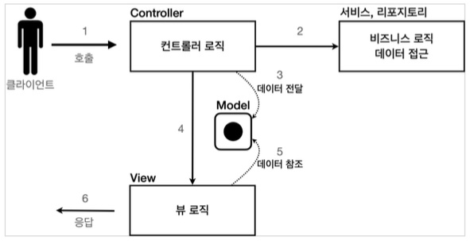
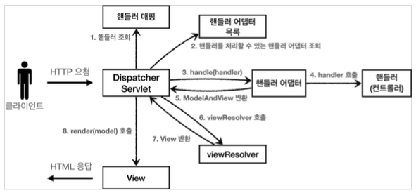

# Model View Controller

## Model
- 뷰에 출력할 데이터를 담아둠
- 뷰가 필요한 데이터를 모두 모델에 담아서 전달해주는 덕분에 뷰는 비즈니스 로직이나 데이터 접근을 몰라도 되고, 화면을 렌더링 하는 일에 집중할 수 있다.

## View
- 모델에 담겨있는 데이터를 사용해서 페이지를 만든다

## Controller
- HTTP 요청을 받아서 파라미터를 검증하고, 비즈니스 로직을 실행한다. 
- 뷰에 전달할 결과 데이터를 조회해서 모델에 담는다.

# Spring MVC 구조

### 동작 순서
1. 핸들러 조회 : 핸들러 매핑을 통해 요청 URL에 매핑된 핸들러(컨트롤러)를 조회한다.
2. 핸들러 어댑터 조회 : 핸들러를 실행할 수 있는 핸들러 어댑터를 조회한다.
3. 핸들러 어댑터 실행 : 핸들러 어댑터를 실행한다.
4. 핸들러 실행 : 핸들러 어댑터가 실제 핸들러를 실행한다.
5. ModelAndView 반환 : 핸들러 어댑터는 핸들러가 반환하는 정보를 ModelAndView로 변환해서 반환한다.
6. viewResolver 호출 : 뷰 리졸버를 찾고 실행한다.
    - JSP의 경우: InternalResourceViewResolver 가 자동 등록되고, 사용된다.
7. View반환 : 뷰 리졸버는 뷰의 논리 이름을 물리 이름으로 바꾸고, 렌더링 역할을 담당하는 뷰객체를 반환한다.
    - JSP의 경우 InternalResourceView(JstlView) 를 반환하는데, 내부에 forward() 로직이 있다.
8. 뷰렌더링 : 뷰를 통해서 뷰를 렌더링한다.