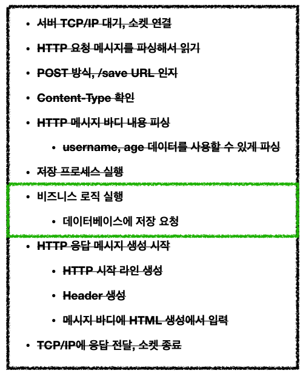
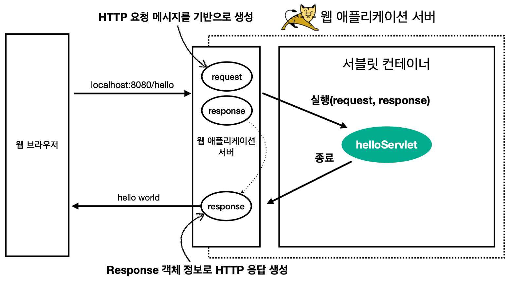

## 웹 서버 (Web Server, WS)
- HTTP 기반으로 동작
- `정적 리소스`(HTMP, CSS, JS, image, 영상) 제공
- ex) `NGINX`, `APACHE`

## 웹 애플리케이션 서버 (Web Application Server, WAS)
- HTTP 기반으로 동작
- `정적 + 동적 리소스` 제공
- 프로그램 코드를 통해 애플리케이션 로직 수행
    - ex) 서블릿, JSP, 스프링 MVC 등
- ex) `Tomcat`, `Jetty`, `Undertow`

## WS vs WAS
- `WS는 정적`, `WAS는 애플리케이션 로직`을 주로 담당
- `서블릿 컨테이너` 기능을 제공하면 WAS
- 위 기능에 특화되어 있다는 것이지 경계는 모호함
- WAS를 정적, 동적을 제공할 수 있지만 과부하를 막기 위해 정적은 WS가 처리

## 서블릿 (Servlet)
- WAS가 해야 하는 `공통적인 일`을 `대신 처리`하여 개발자가 `비즈니스 로직 처리`에만 집중할 수 있게 도와줌
    - 즉, `WAS 내에서` 실행된다
    - 
- HTTP 요청마다 다른 비즈니스 로직을 통해 동적 페이지를 제공할 수 있다

## 서브릿 컨테이너 (Servlet Container)
- 톰캣처럼 `서블릿을 지원하는 WAS`를 서블릿 컨테이너라 함
- 서블릿의 `생명주기` 관리
- 서블릿의 객체를 `싱글톤`으로 관리
- `JSP`도 서블릿으로 변환 되어 사용

**동작 과정 설명**

- 서블릿의 생성 시점은 설정에 따라 `로딩 시점`, `요청 시점`에 생성
- HTTP 요청이 들어오면 서블릿 컨테이너는 request, response 객체를 만들어 서블릿 호출
- 서블릿 컨테이너는 요청 메시지를 파싱하는 등 WAS의 역할을 수행

## 스프링 부트 (Spring Boot)
- Tomcat같은 `WAS를 내장`하여 별도 설치 필요 X
- `starter 종속성`을 통해 손쉬운 빌드 제공
- 스프링과 외부 라이브러리 `자동 구성`