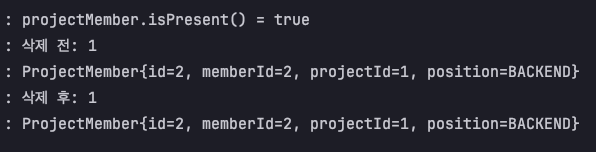
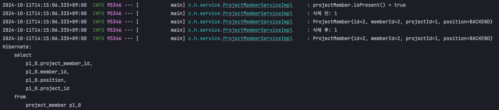
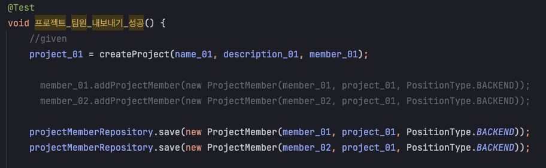
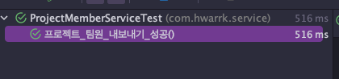
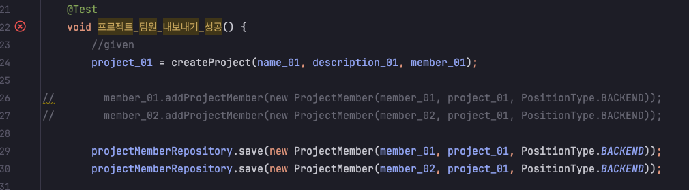

# **🔍** Situation (상황)

> 직면한 상황
> 

- 필요한 정보만 요약해서 첨부된 코드입니다 
- Member와 ProjectMember는 1:N, 양방향 관계를 이룸

``` java 
@Table(name = "MEMBER")
public class Member extends BaseEntity {
    @OneToMany(mappedBy = "member", fetch = FetchType.LAZY, cascade = CascadeType.ALL, orphanRemoval = true)
    @BatchSize(size = 10)
    private List<ProjectMember> projectMembers = new ArrayList<>();
    
    public void addProjectMember(ProjectMember projectMember) {
	    if (Optional.ofNullable(projectMembers).isEmpty()) {
	        projectMembers = new ArrayList<>();
	    }
	    this.projectMembers.add(projectMember);
	  }
}
@Table(name = "PROJECT_MEMBER")
public class ProjectMember {
    @ManyToOne(fetch = FetchType.LAZY)
    @JoinColumn(name = "member_id")
    private Member member;

    @ManyToOne(fetch = FetchType.LAZY)
    @JoinColumn(name = "project_id")
    private Project project;
}
```

- Service 코드와 이를 테스트 하는 테스트 코드
``` java
// ProjectMemberService
@Override
    public void removeProjectMember(Long loginId, Long projectId, Long memberId) {
        Project project = entityFacade.getProject(projectId);
        Member member = entityFacade.getMember(memberId);

        Optional<ProjectMember> projectMember = projectMemberRepository.findByProjectAndMember(project, member);

        projectMember.ifPresentOrElse(
                projectMemberRepository::delete,
                () -> {
                    throw new GeneralHandler(ErrorStatus.PROJECT_MEMBER_NOT_FOUND);
                }
        );
    }

@SpringBootTest
@Transactional
class Test{

	@Test
  void 프로젝트_팀원_내보내기_성공() {
      //given
      project_01 = createProject(name_01, description_01, member_01);

      member_01.addProjectMember(new ProjectMember(member_01, project_01, PositionType.BACKEND));
      member_02.addProjectMember(new ProjectMember(member_02, project_01, PositionType.BACKEND));

      //when
      projectMemberService.removeProjectMember(member_01.getId(), project_01.getId(), member_02.getId());

      //then
      List<ProjectMember> projectMembers = projectMemberRepository.findAll();

      assertThat(projectMembers.size()).isEqualTo(1);
  }
}
```

- 양방향 관계에서 pk를 가지고 있는(연관관계의 주인인) ProjectMember를 delete했지만 반영이 되지 않았다. 
- 따라서 테스트 코드에서 ProjectMember가 2개에서 1개가 삭제 되어 1개가 남아있기를 기대했지만 여전히 2개로 테스트에 실패했다.

# **📝** Task (일)

> 어떤 작업을 해야하는지 기술
> 
Service 메소드는 projectMember를 내보내는 기능으로 내보내려는 projectMember를 찾아서 ProjectMember 엔티티와 Member가 가지고 있는 List<ProjectMember> projectMembers 엔티티가 모두 삭제되어야 한다

# **🏃** Action (행동)

> 어떤 행동을 취했는지
> 

## 1. 로그를 통한 문제 분석
- 먼저 서비스 메소드의 로그를 찍어보았다.
``` java
log.info("projectMember.isPresent() = {}", projectMember.isPresent());

        projectMember.ifPresentOrElse(
                pm -> {
                    log.info("삭제 전: {}", member.getProjectMembers().size());
                    member.getProjectMembers().forEach(pmBefore -> log.info("{}", pmBefore));

                    projectMemberRepository.delete(pm);

                    log.info("삭제 후: {}", member.getProjectMembers().size());
                    member.getProjectMembers().forEach(pmAfter -> log.info("{}", pmAfter));
                },
//                projectMemberRepository::delete,
                () -> {
                    throw new GeneralHandler(ErrorStatus.PROJECT_MEMBER_NOT_FOUND);
                }
        );
```

위 로그를 통해서 GeneralHandler가 발생하지 않았고 repo에서 찾아온 projectMember가 존재하지만 delete가 작동되지 않았음을 확인했다.

그렇다면 delete 쿼리는 나갔을까?

사진을 보니 delete 쿼리 자체가 안 나갔다. 밑에 select 쿼리는 테스트 코드에서 검증을 위해 `projectMemberRepository.findAll()`을 사용하여 발생한 쿼리이다

여기까지 상황을 유추해 봤을 때 Member의 `List<ProjectMember> projectMembers`에 삭제하려는 projectMember가 존재해서 삭제되지 않았던 걸까? 라고 생각을 했지만 연관관계에서 pk를 가지고 있는 주인만이 데이터를 수정할 수 있지 않나?라는 의견과 계속 혼동됐다.

## 문제 원인
결론은 `cascade = CascadeType.ALL, orphanRemoval = true`을 적용했기 때문에 부모 엔티티에서 `List<ProjectMember> projectMembers`에 <span style="color:red">연관관계가 남아있다면 영속성 컨텍스트를 관리하는 EntityManager 입장에서는 projectMember를 삭제하려고 하지 않을 것이다.</span>

즉, member가 가지고 있는 `List<ProjectMember> projectMembers`에서 삭제하려는 projectMember를 제거하여 연관관계를 끊어내면 cascade, orphanRemobal 속성을 통해 자식 엔티티까지 삭제 전파가 이루어질 것이다.

난 계속 연관관계 주인을 의식해서 projectMember를 삭제하면 member.projectMembers에도 반영될 줄 알았지만 cascade, orphanRemobal을 통해 논리적으로 연관관계의 주인을 변경했다고 봐야할 것 같다.

## 요약
1. 테스트 코드에서는 양방향 관계를 통해 Project Member를 `List<ProjectMember> projectMembers`에 추가하고 있다.
    - ``` java
        member_01.addProjectMember(new ProjectMember(member_01, project_01, PositionType.BACKEND));
        member_02.addProjectMember(new ProjectMember(member_02, project_01, PositionType.BACKEND));
        ```
2. 삭제하려는 ProjectMember를 조회하여 delete 해주었다.
3. `List<ProjectMember> projectMembers`에는 연관관계가 그대로 남아있었다.
4. delete 쿼리가 나가지 않아서 테스트에 실패했다.

## 해결 방법
### 1. projectMemberRepository.save() 활용
- projectMember를 추가해줄 때 `List<ProjectMember> projectMembers`에 직접 넣어주지 않고 save()메소드를 활용하여 projectMember를 저장하면 된다.
- 하지만, projectMembers에 값을 추가할 수 있는 가능성을 남겨둔 채 save()만을 사용하여 에러를 피하겠다는 방법은 좋은 방법이 아닌 것 같다

### 2. 연관관계 끊어주기
- 삭제하려는 projectMember를 delete하는 것이 아니라 `List<ProjectMember> projectMembers`에서 연관관계를 끊어주는 것이다.
    - ``` java
        // Member
        public void removeProjectMember(ProjectMember projectMember) {
            this.projectMembers.remove(projectMember);
        }

        // ProjectMemberService
        projectMember.ifPresentOrElse(
                pm -> pm.getMember().removeProjectMember(pm),
                () -> {
                    throw new GeneralHandler(ErrorStatus.PROJECT_MEMBER_NOT_FOUND);
                }
        );
        ```
- 하지만 이 방법도 같은 문제가 발생한다.
- `projectMemberRepository.save()`을 통해 저장했다면 이후에 member를 조회할 때 projectMembers를 fetchJoin()하지 않는다면 저장했던 projectMember가 `List<ProjectMember> projectMembers`에 반영되지 않을 것이다. 따라서 `projectMembers.remove()`만 한다면 바로 위에 테스트 코드를 성공시킬 수 없다
- 

### 결론 
- JPARepository의 save(), delete()는 위와 같은 상황을 모두 만족시킬 수 없다.
- 따라서 삭제 시 양방향 관계에서 연관관계도 끊고 엔티티도 delete() 해줘야 한다.
    - ``` java
        projectMember.ifPresentOrElse(
            pm -> {
                pm.getMember().removeProjectMember(pm);
                projectMemberRepository.delete(pm);
            },
            () -> {
                throw new GeneralHandler(ErrorStatus.PROJECT_MEMBER_NOT_FOUND);
            }
        );
      ```
- 되도록 양방향 연관관계는 쓰지 않는 걸로..

# **✅** Result (결과)

> 그 행동들의 결과
> 

이제는 `addProjectMember()`, `save()` 어떤 걸 하든 `projectMemberService.removeProjectMember()`을 통해 정상적으로 삭제되어 테스트에 성공한다

``` java
// 1
member_01.addProjectMember(new ProjectMember(member_01, project_01, PositionType.BACKEND));
member_02.addProjectMember(new ProjectMember(member_02, project_01, PositionType.BACKEND));

// 2
projectMemberRepository.save(new ProjectMember(member_01, project_01, PositionType.BACKEND));
projectMemberRepository.save(new ProjectMember(member_02, project_01, PositionType.BACKEND));
```
