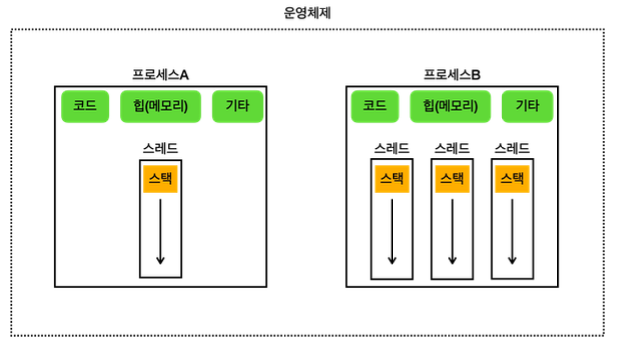

# 멀티 태스킹
> - 하나의 컴퓨터 시스템이 동시에 여러 작업을 수행하는 능력
> - 각 프로그램의 실행 시간을 분할해서 마치 동시에 실행되는 것 처럼 하는 기법을 시분할(Time Sharing, 시간 공유) 기법
> - CPU 코어가 하나만 있어도 여러 프로그램이 동시에 실행되는 것 처럼 느낄 수 있다

 

# 멀티 프로세싱
> 컴퓨터 시스템에서 둘 이상의 프로세서(CPU 코어)를 사용하여 여러 작업을 동시 에 처리하는 기술
>
> 필요 이유: 하나의 프로그램도 그 안에서 동시에 여러 작업이 필요하기 때문
>
> ex) 유튜브 영상재생 + 댓글 작성 / 문서 편집 + 맞춤법 검사
> > 참고! 
> > - CPU 안에는 실제 연산을 처리할 수 있는 코어라는 것이 있다.
> > - 과거에는 하나의 CPU 안에 보통 하나의 코어만 들어있었다.
> > - 최근에는 하나의 CPU 안에 보통 2개 이상의 코어가 들어있다.

## 프로세스
> 실행 중인 프로그램

## 프로세스의 메모리 구성
- 코드 섹션: 실행할 프로그램의 코드가 저장되는 부분
- 데이터 섹션: 전역 변수 및 정적 변수가 저장되는 부분(그림에서 기타에 포함)
- 힙 (Heap): 동적으로 할당되는 메모리 영역
- 스택 (Stack): 메서드(함수) 호출 시 생성되는 지역 변수와 반환 주소가 저장되는 영역(스레드에 포함)

- 

 

# 스레드
> - 프로세스는 하나 이상의 스레드를 반드시 포함
> - 프로세스의 코드를 실행하는 흐름
> - 프로세스 내에서 실행되는 작업의 단위
> - 프로세스가 제공하는 동일한 메모리 공간을 공유

 

- 단일 스레드: 한 프로세스 내에 하나의 스레드만 존재 
- 멀티 스레드: 한 프로세스 내에 여러 스레드가 존재
