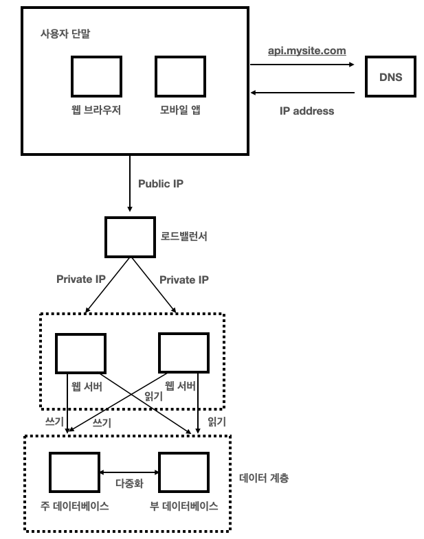

# 01 사용자 수에 따른 규모 확장성

## 단일 서버
- 
1. 사용자는 도메인 이름을 이용해 DNS에 질의하여 IP주소로 변환
    - DNS는 보통 제3 사업자가 제공하는 유로 서비스를 이용
2. 반환된 IP 주소로 HTTP 요청이 전달
3. 요청을 받은 웹 서버는 HTML or JSON 형태의 응답을 반환

## 데이터베이스
- 사용자가 늘면 여러 서버를 두어야 한다.
- 하나는 웹/앱 트래픽 처리 서버, 다른 하나는 DB 서버
- 

### 어떤 DB를 사용할 것인가?
- 크게 `RDBMS`, `NoSQL`로 나뉨
- RDBMS
    - 대표적으로 MySQL, Oracle, PostgreSQL
    - `관계`에 따라 join 하여 데이터를 합쳐서 사용하기 위함
- NoSQL
    - 대표적으로 CouchDB, Neo4j, HBase, DynamoDB
    - 저장 형식은 크게 key-value, graph, column, document로 나뉘어짐
    - 사용 목적
        1. `비정형 데이터`
        2. 아주 `낮은 응답 지연시간`
        3. 아주 `많은 양의 데이터`를 저장

## 수직적 규모 확장 vs 수평적 규모 확장
- 수직적 규모 확장: 서버에 `고사양 자원`(더 좋은 CPU, 더 많은 RAM)을 추가하는 것, `스케일 업(scale up)`으로 불림
- 수평적 규모 확장: 더 많은 `서버를 추가`하여 성능을 개선하는 행위, `스케일 아웃(scale out)`으로 부림
- 서버에 유입되는 트래픽 양이 적다 -> 수직적 확장

### 수직적 규모 확장의 단점
1. CPU나 메모리를 증설하는데 한계 존재
2. 장애복구 방안이나 다중화 방안을 고안해야 한다

=> 이러한 단점때문에, 대규모 애플리케이션을 지원하는 데는 수평적 규모 확장이 적절하다

## 로드 밸런서
- 
- 부하 분산 집합에 속한 웹 서버들에게 트래픽 부하를 고르게 `분산`하는 역할
- 사용자는 로드밸런서의 `Public IP`로 접속
- 서버 간(로드 밸런서, 웹 서버) 통신에는 `보안`을 위해 `Private IP`를 이용
    - 같은 네트워크에 속한 서버 사이의 통신만 가능
- 여러 웹 서버를 통해 자동복구 문제 해서, 웹 계층의 가용성 향상

## 데이터베이스 다중화
- Master(주)-Slave(부) 관계의 DB를 만들어 데이터 원본은 주 서버에, 사본은 부 서버에 저장하는 방식
- 쓰기 연산은 Master에서만 지원하고, Slave에서는 Master로부터 사본을 전달 받아, 읽기 연산만을 지원한다.
- 대부분 쓰기 작업보다 읽기 작업이 많기 때문에 Slave DB가 훨씬 많다
    - 

### DB 다중화의 장점
1. 더 나은 성능
    - 쓰기 연산은 Master, 읽기 연산은 Slave로 분산하여 병렬 처리될 수 있는 쿼리 증가
2. 안정성
    - DB 다중화를 통해 복구 가능
3. 가용성
    - DB 다중화를 통해 하나의 DB 서버가 장애가 나더라도 다른 DB 서버로 계속 서비스 가능

### 로드 밸런서 + DB 다중화 설계

- 동작 과정
    1. 사용자는 DNS로부터 로드밸런서의 공개 IP 주소를 받는다.
    2. 사용자는 해당 IP 주소를 사용해 로드밸런서에 접속한다.
    3. HTTP 요청은 서버 1이나 서버 2로 전송된다.
    4. 웹 서버는 사용자의 데이터를 부 데이터베이스 서버에서 읽는다.
    5. 웹 서버는 데이터 변경 연산은 주 데이터베이스로 전달한다.

## 캐시
- 값비싼 연산 결과 또는 자주 참조되는 데이터를 메모리 안에 두고, 뒤이은 요청이 보다 빨리 처리될 수 있도록 하는 저장소
- DB 호출을 줄여 성능 향상

### 캐시 계층

- 데이터가 잠시 보관되는 곳
- DB보다 훨씬 빠름
- 동작 과정
    1. 웹 서버는 캐시에 응답이 저장되어 있는지를 확인
    2. 저장되어 있다면 해당 데이터를 클라이언트에 반환
    3. 없는 경우 DB에서 찾아 캐시에 저장한 뒤 클라이언트에 반환

### 캐시 사용 시 유의할 점
1. 캐싱은 갱신이 자주 일어나지 않지만 참조는 빈번하게 일어나는 경우에 적합
2. 캐시는 휘발성 메모리에 두므로, 영속적 보관을 필요로 하는 데이터는 부적합
3. 보관된 캐시 데이터의 만료 정책을 강구
    - 정책이 없으면 캐시에 데이터가 계속 남게 돈다
4. DB와 캐시의 일관성을 유지해야 한다
5. 캐시 서버를 한 대만 두는 경우 해당 서버는 단일 장애 지점(SPOF)이 되어 버릴 수 있다
    - SPOF란? 전체 시스템의 동작을 중단시켜버리는 특정 지점
6. 캐시 메모리 크기가 너무 작으면 데이터가 자주 캐시되어 밀려나 성능이 떨어진다
7. 상황에 맞는 데이터 방출 정책(LRU, LFU, FIFO 등)을 적용해야 한다

## 콘텐츠 전송 네트워크 (CDN)

- CDN은 `정적 콘텐츠`를 전송할 때 쓰이는 지리적으로 `분산된 서버의 네트워크`이다
- 이미지, 비디오, CSS, JS 파일 등을 캐시할 수 있다
- CDN을 통해 정적 콘텐츠를 웹 서버를 통해 요청하지 않아 DB의 부하를 막고 `성능 향상`시켜줌

- 동작 과정
    - 

### 로드 밸런서 + DB 다중화 + CDN + 캐시

## 무상태(Stateless) 웹 계층

- 웹 계층을 수평 확장하기 위해선 `상태 정보`(세션 등)를 제거해야 한다
- 서버 내부 메모리를 사용하지 않고 `외부 공유 저장소`를 통해 상태 정보를 유지한다
- 장점
    - 서버의 `확장성`이 높아 대량 트래픽 처리가 수월할 수 있다
- 단점
    - 매 요청 시 자신을 식별하기 위한 부가정보를 줘야 해서 상대적으로 `더 많은 자원`을 소모

## 데이터 센터

- 장애가 없는 상황에서 사용자는 가장 가까운 데이터 센터로 안내되는데, 이 절차를 지리적 라우팅(geo-routing)이라 한다
- `geoDNS`를 통해 사용자의 `위치에 따라` 어떤 IP 주소를 변환할지 결정한다
- 여러 데이터 센터 중 하나가 `심각한 장애`가 발생하면 모든 트래픽은 장애가 없는 데이터 센터로 전송된다

### 다중 데이터 센터의 고려사항
1. 트래픽 우회
    - 올바른 데이터 센터로 트래픽을 보내는 효과적인 방법 모색(geoDNS와 같은)
2. 데이터 동기화
    - 데이터를 여러 센터의 걸쳐 다중화 하여, 어느 센터에 요청을 보내도 `동일한 응답`을 보장받아야 한다
3. 테스트와 배포
    - 모든 데이터 센터에 동일한 서비스가 이루어질 수 있도록 `여러 위치`에서 테스트가 필요

## 메시지 큐

- 메시지의 `무손실`을 보장하는, `비동기 통신`을 지원하는 컴포넌트
    - 무손실이란? 소비자가 꺼낼 때까지 안전히 보관된다는 특성
- 메시지의 `버퍼 역할`을 하며, `비동기 전송`을 지원
- `Publish/Producer`를 통해 메시지를 큐에 발행
- `Consumer/Subscribe`을 통해 메시지를 꺼내어 사용
- 서버 간 `결합이 느슨`해져 `규모 확장성`이 보장
    - 소비자 프로세스가 다운되어도 메시지를 발행가능
    - 생산자 프로세스가 다운되어도 메시지 수신 가능

## 로그, 메트릭 그리고 자동화
- 로그: `에러 모니터링`을 위해. 로그를 단일 서비스로 모아주는 도구를 사용할 수도 있음
- 메트릭: 유용한 `정보 수집`, 시스템의 현 `상태를 파악`하기 위함
- 자동화: `생산성`과 `안정성`을 높이기 위해

### + 메시지 큐, 로그, 매트릭, 모니터링, 자동화

## 데이터베이스의 규모 확장
- 저장할 데이터가 많아지면 DB부하가 증가하기 때문에 DB 증설이 필요하다
- `수직적 규모 확장법`, `수평적 규모 확장법`이 존재
- 

### 수직적 규모 확장법
- `스케일 업`이라고 부름
- 기존 서버에 `고성능 자원`(CPU, RAM, 디스크 등)을 증설
- 한계
    1. 자원을 무한히 증설 불가능
    2. 단일 장애 지점(SPOF, Single Point Of Failure) 위험성 증가
    3. 많은 비용 부담

### 수평적 규모 확장법
- `샤딩`이라고 부름
- `더 많은 DB서버`를 추가하여 성능 향상을 얻음
- 대규모 DB를 샤드라는 작은 단위로 분활
- 샤딩 적용 예시
    - user_id % 4를 통해 데이터가 보관될 샤드를 정함
    - 

### 샤딩 고려사항
1. 데이터의 재 샤딩
    - 데이터가 많아져 샤딩을 증설할 때, `샤드 키 계산함수를 변경`하고 `데이터를 재배치`해야 한다
2. 유명 인사 문제
    - `핫스팟 키 문제`라고도 부름
    - 유명 인사로 인해 `특정 샤드에 질의가 집중`되어 서버에 과부하가 걸리는 문제  
3. 조인과 비정규화
    - DB를 샤드로 쪼개고 나면 여러 샤드에 걸쳐 `join하기 힘들어`진다.
    - 이를 해결하기 위해 `비정규화`하거나 `한 테이블에서 질의`가 수행되도록 해야 한다