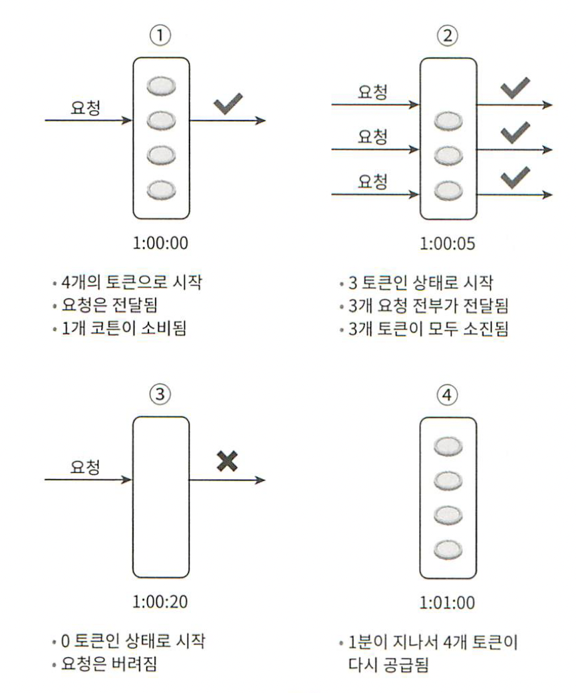
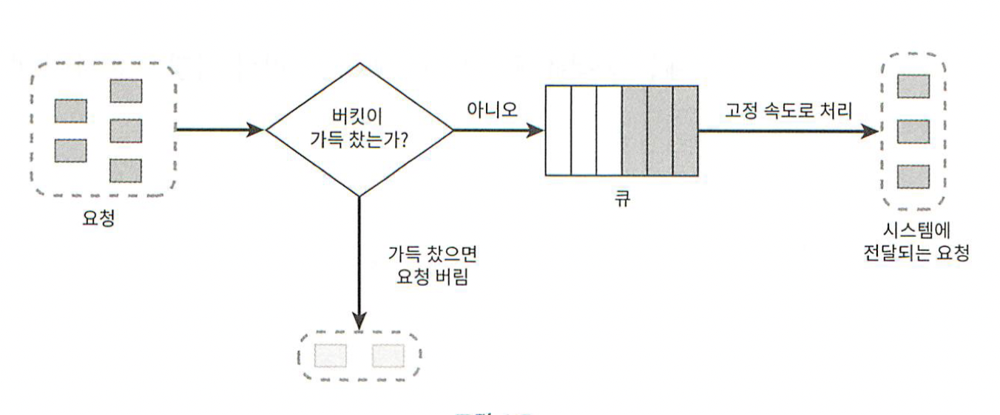
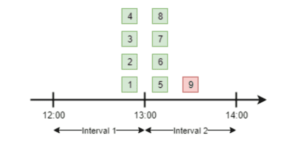
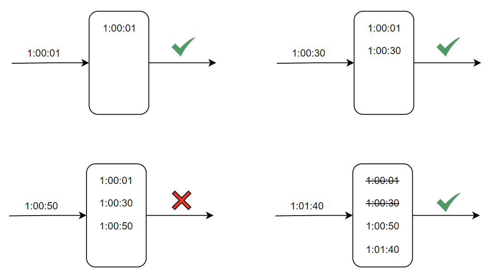
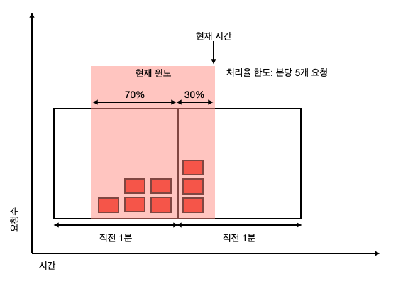

# 처리율 제한 장치의 설계
- 클라이언트 또는 서비스가 보내는 트래픽의 처리율을 제어하기 위한 장치
- HTTP를 예로, API 요청 횟수가 제한 장치에 정의된 임계치(threshold)를 넘어서면 추가로 도달한 모든 호출은 처리 중단된다

## API 처리율 제한의 장점
1. DoS 공격 방지
2. 비용 절감
    - 서버를 많이 두지 않아도 됨
    - 우선순위 높은 API가 더 많은 자원을 할당
3. 서버 과부하 방지
    - 봇(bot)에 의한 트래픽이나 사용자의 잘못된 이용 패턴으로 유발된 트래픽을 거르는 데 활용

## 시스템 설계 4단계 접근법
### 1단계. 문제 이해 및 설계 범위 확정
**시스템 요구 사항**
1. 설정된 처리율을 초과하는 요청은 정확하게 제한한다
2. 낮은 응답시간
    - 이 처리율 제한 장치는 HTTP 응답시간에 나쁜 영향을 주어서는 곤란하다.
3. 적은 메모리
4. 분산형 처리율 제한
    - 하나의 처리율 제한 장치를 여러 서버나 프로세스에 공유할 수 있어야 한다.
5. 예외 처리
    - 요청이 제한되었을 때는 그 사실을 사용자에게 분명하게 보여주어야 한다.
6. 높은 결함 감내성
    - 제한 장치에 장애가 생기더라도 전체 시스템에 영향을 주어서는 안 된다.

### 2단계. 개략적 설계안 제시 및 동의 구하기
**처리율 장치의 위치**
1. 클라이언트
    - 위변조 가능
    - 모든 클라이언트의 구현을 통제하는 것이 어려움
2. 서버
3. 미들웨어
    - MSA의 경우 보통 API Gateway에 구현됨
    - API Gateway는 미들웨어로 처리율 제한, SSL 종단, 사용자 인증, IP 허용 목록 관리 등을 지원하는 완전 위탁관리형 서비스

**그래서 어디에 두라는 거지?**
- 정답은 없고 다음 몇 가지 지츰을 활용하여 정하자
1. 현재 기술 스택이 서버 측에 기능 구현이 가능한지 점검
2. 상황에 맞는 알고리즘 사용
3. MSA를 사용한다면, IP 허용 같은 기능을 이미 API Gateway에 적용했을 수 있다. 그러면 처리율 제한도 API Gateway에 포함하는 것이 좋다
4. 충분한 인력이 없다면 상용 솔루션을 고려

**처리율 제한 알고리즘**
1. 토큰 버킷 알고리즘
    - 
    - 처리율 제한에 폭넓게 이용되는 간단하고 보편적인 알고리즘
    - 동작 원리
        - 각 요청이 처리될 떄 하나의 토큰을 사용
        - 토큰이 주기적으로 채워진다
        - 토큰이 없다면 해당 요청은 버려짐
    - 장점
        1. 쉬운 구현
        2. 효율적인 메모리 사용
        3. 짧은 시간에 집중되는 트래픽 처리 가능
    - 단점
        1. 버킷 크기, 토큰 공급률을 적절히 튜닝하는 것이 까다로움
2. 누출 버킷 알고리즘
    - 
    - 토큰 버킷 알고리즘과 비슷하지만 `요청 처리율이 고정`되어 있다는 점이 다르다
    - 보통 `FIFO 큐`로 구현
    - 동작 원리
        - 요청이 들어오면 큐가 가득 찼는지 체크
            - 빈 자리가 있다면 큐에 요청 추가
            - 큐가 가득 차 있다면 요청 버림
        - `지정된 시간`마다 큐에서 요청을 꺼내어 처리
    - 장점
        1. 큐의 크기 제한 -> 효율적인 메모리 사용
        2. 고정된 처리율 -> 안정적 출력
    - 단점
        1. 단시간에 많은 트래픽이 몰리면 오래된 요청이 쌓이고 제때 처리하지 못하면 최신 요청들이 버려진다
        2. 버킷 크기, 토큰 공급률을 적절히 튜닝하는 것이 까다로움
3. 고정 윈도 카운터 알고리즘
    - 
    - 동작 원리
        - 타임라인을 고정된 간격의 윈도로 두고, 각 윈도마다 카운터를 붙인다
        - 요청이 접수 -> 카운터의 값을 1씩 증가
        - 카운터가 임계치에 도달하면 새로운 요청을 버림
    - 장점
        1. 좋은 메모리 효율
        2. 이해하기 쉬움
        3. 윈도가 닫히는 시점에 카운터를 초기화하는 방식으로 특정한 트래픽 패턴을 처리하기에 적합
    - 단점
        1. 윈도 경계 부근에서 일시적으로 많은 트래픽이 몰려드는 경우, 기대했던 시스템의 처리 한도보다 많은 양의 요청을 처리하게 된다
            - 위 사진에서 12~13 타임의 4개의 요청, 13~14 타임의 5개의 요청이 존재한다.
            - 이를 12:30~13:30으로 쪼개면 9개의 요청을 처리하게 되는 것이다.
4. 이동 윈도 로깅 알고리즘
    - 
        - 분당 2개의 요청이 한도인 시스템의 예시
    - 고정 윈도 카운터 알고리즘에 단점을 해결
    - 동작 원리
        - 타임 스탬프를 추적
            - 보통 redis의 정렬 집합 같은 캐시에 보관한다
        - 새 요청이 오면 만료된 타임스템프는 제거
        - 로그의 크기가 허용치보다 같거나 작으면 시스템에 전달
        - 허용치보다 크면 처리 거부
    - 장점
        1. 처리율 제한 메커니즘이 매우 정교
        2. 어느 순간의 윈도를 봐도 처리율 한도를 넘지 않는다
    - 단점
        1. 거부된 요청의 타임스탬프도 보관하기 때문에 메모리를 많이 사용
5. 이동 윈도 카운터 알고리즘
    - 
    - 고정 윈도 카운터 + 이동 윈도 카운터
    - 현재 윈도의 요청 = 직전 1분간의 요청 수 * 이동 윈도와 직전 1분이 겹치는 비율 + 현재 1분간의 요청 수
    - 장점
        1. 이전 시간대의 평균 처리율에 따라 현재 윈도의 상태를 계산하므로 짧은 시간에 몰리는 트래픽 대응에 용이하다
        2. 좋은 메모리 효율
    - 단점
        - 직전 시간대에 도착한 요청이 균등하게 분포되어 있다고 가정하기 때문에 추정치 계산이 100% 정확하지 않다
            - 하지만 클라우드 플레어에서 수행한 실험에 의하면 오탐은 0.003%에 불과했다

## 3단계. 상세 설계
- 3단계 상세 설계에서는 제한 규칙이 어떻게 만들어지고 어디에 저장되는지, 그리고 어떻게 처리되는지 설계한다

### 처리율 한도 초과 트래픽의 처리
- `HTTP 429`(Too many requests) 응답 
    - 경우에 따라 제한된 메시지를 큐에 보관하여 나중에 처리

### 처리율 제한 장치가 사용하는 HTTP Header
- X-Ratelimit-Remaining: 윈도 내 남은 처리가능 요청 수
- X-Ratelimit-Limit: 매 윈도마다 클라이언트가 전송할 수 있는 요청의 수
- X-Ratelimit-Retry-After: 한도 제한에 걸리지 않으려면 몇 초 뒤에 요청을 보내야하는 지 알림

### 분산 환경에서의 처리율 제한 장치의 구현
- `여러 대의 서버`를 운영하는 경우에 처리율 제한 장치를 구현할 때는 다음 두 문제를 해결해야 한다

**1. 경쟁 조건**  
- 앞서 다룬 알고리즘에서 `카운터` 값이 경쟁 조건을 가진다
- 보통 카운터는 `레디스`에서 관리한다
- 레디스는 `sorted set`, `set then get` 을 사용하여 경쟁 조건을 해결할 수 있다

**2. 동기화**  
- 여러 대의 처리율 제한 장치를 사용할 경우 요청이 분산될 수 있다
- `Sticky session`을 사용하여 항상 같은 처리율 제한 장치로 보내어 해결할 수 있다

### 성능 최적화
- 데이터 센터에서 멀리 떨어진 사용자를 지원하려다 보면 지연시간이 증가할 수밖에 없다
- 사용자의 트래픽을 가장 가까운 에지 서버(edge server)로 전달하여 지연시간을 줄인다

### 모니터링
- 처리율 제한 장치를 설치한 이후에도 효과적으로 동작하고 있는지 보기 위해 `데이터`를 모을 필요가 있다
- 모니터링으로 확인하려는 것
    1. 채택된 처리율 제한 알고리즘이 효과적이다
    2. 정의한 처리율 제한 규칙이 효과적이다
- 처리율 규칙이 너무 빡빡하다 -> 유효 요청이 버려진다 -> `규칙을 완화`하여 해결한다
- `단기간 트래픽 급증`(깜짝 세일 같은 이벤트 때문에)로 인해 처리율 제한 장치가 비효율적으로 작동한다면 토큰 버킷과 같은 다른 알고리즘으로 바꾸는 것을 고려해야 한다

## 4단계. 마무리
- 알아두면 좋은 것들을 배워보자

### 경성 또는 연성 처리율 제한
- 경성 처리율 제한 : 요청 개수는 임계치를 절대 `넘어설 수 없다`
- 연성 처리율 제한 : 요청 개수는 잠시 동안은 임계치를 `넘어설 수 있다`

### 다양한 계층에서의 처리율 제한
- 위에서는 OSI 7계층 중 애플리케이션 계층에서의 처리율 제한을 다뤘다.
- 다른 계층에서도 처리율 제한이 가능하다
- Iptables를 사용하면 IP주소에 처리율 제한을 적용하는 것이 가능하다

### 처리율 제한을 회피하는 방법
- 요청을 제한하는 것보다, 제한을 회피하는 것이 더 좋다
- 회피 방법
    1. 클라이언트 측 `캐시`를 사용하여 API 호출 횟수 줄이기
    2. 처리율 제한의 `임계치`를 이해하고, 짧은 시간에 많은 메시지를 보내지 않는다
    3. 예외나 에러를 처리하는 코드를 도입하여, 클라이언트가 예외적 상황으로부터 `우아하게 복구`될 수 있도록 한다
    4. 재시도 로직을 구현할 때는 충분한 `백오프` 시간을 두도록 한다.