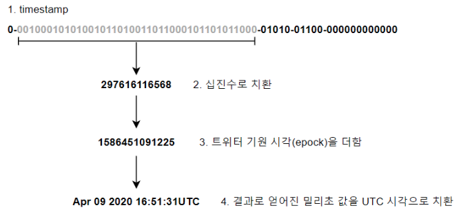

# 07. 분산 시스템을 위한 유일 ID 생성기 설계
DB가 단일 서버라면 `auto_increment`가 답이 될 수 있다.
하지만 DB 서버를 분산화하면 `auto_increment`만으로는 유일성을 보장할 수 없기에 이를 동기화하는 작업이 필요한데 지연시간을 낮추기가 매우 힘들 수 있다.

그리고 NoSQL을 사용한다면, 애초에 선택지가 존재하질 않는다는 문제가 존재한다.

## 1단계) 문제 이해 및 설계 범위 확정
📌 요구 사항
- ID는 유일성을 보장해야 한다.
- ID는 숫자로만 구성되어 있어야 한다.
- ID는 64bit로 표현 가능해야 한다.
- ID는 발급 날짜에 따라 정렬 가능해야 한다.
- 초당 10,000개의 ID를 만들 수 있어야 한다.
 

📌 분산 시스템에서 유일성이 보장되는 ID 생성 방법
일반적으로 다음 방법을 사용한다.

- 다중 마스터 복제
- UUID
- 티켓 서버
- 트위터 스노플레이크 접근법

## 2단계) 계략적 설계안 제시 및 동의 구하기
### 다중 마스터 복제
데이터베이스의 auto_increment를 사용하는데, ID의 값을 1만큼 증가시키지 않고 k만큼 증가시킨다. (k는 사용 중인 DB 서버의 수)

장점
- DB의 수를 늘리면 초당 생산 가능 ID 수도 늘릴 수 있으므로, 자연스레 성능 또한 보장된다.

단점
- 여러 데이터 센터에 걸쳐 규모를 늘리기 어렵다. (k를 매번 모두 수정해야 한다.)
- ID의 유일성은 보장되지만, 시간의 흐름에 맞추어 커짐을 보장하지는 않는다. - (id 10,000이 9,999보다 먼저 생성되었을 수도 있다.)
- 서버를 추가하거나 삭제할 때도 잘 동작하도록 만들기 어렵다.

### UUID(Universally Unique Identifier)
컴퓨터 시스템에 저장되는 정보를 유일하게 식별하기 위한 128bit 수. 워낙 유명해서 자세한 설명은 필요 없을 것이다.

UUID는 랜덤 문자열을 생성하지만, 충돌 가능성이 매우 낮다고 판단한다. (고유성을 완벽하게 보장하진 못 하지만, 사실상 고유하다고 취급)

wiki에 적혀있는 말을 인용하면, "최소한 한 번의 충돌 확률이 50%가 되도록 생성해야 하는 4UUID의 수는 2.71조개로, 약 86년 동안 초당 10억개의 UUID를 약 86년 동안 생성해야 한다. 따라서 103조 개의 4UUID 버전에서 중복을 찾을 확률은 10억 분의 1이다."

장점
- 서버 간의 조율이 필요 없으므로, 동기화 이슈도 없다.
- 각 서버가 알아서 ID를 생성하므로, 규모 확장에 용이하다.

단점
- ID가 128 bit이므로, 현재 요구 사항에서 벗어난다.
- ID를 시간순으로 정렬할 수 없다. (인덱싱에 용이하질 않다.)
- ID에 숫자(numeric)이 아닌 값을 포함할 수 있다.

## 티켓 서버(ticket server)
auto_increment가 여러 데이터베이스에서 보장할 수 없으니, 하나의 데이터베이스만을 사용한다는 전략이다.

사용자가 사진을 업로드 할 때마다, 하나의 데이터베이스에서 새 행을 삽입하여 만들어진 auto_increment 값을 사용한다는 것이다.

장점
- 유일성이 보장
- 오직 숫자로만 구성된 ID를 매우 쉽게 만들 수 있기에 중소 규모 애플리케이션에선 적합하다.

단점
- 서버가 1대이므로 성능 저하를 피할 수 없고, 티켓 서버가 SPOF가 된다.
- 이 문제를 해결하려면 티켓 서버를 여러 대 준비해야 하는데, 그러면 데이터 동기화 문제가 발생한다.

## 트위터 스노플레이크(twitter snowflake) 접근법
생성해야 하는 64-bit ID를 단순히 랜덤값 혹은 증가값으로 지정하는 것이 아닌, ID의 구조를 여러 section으로 분할하는 방법이다.

- 사인(sign) 비트
    - 크기: 1bit
    - 현재로는 쓰임새가 없지만, 추후 변경 사항에 대비하기 위한 여분 bit
- 타임스탬프(timestamp)
    - 크기: 41bit
    - 기원 시각(epoch) 이후로 몇 밀리초(millisecond)가 경과했는지를 나타내는 값. (책에 있어서 적긴 했는데, 그냥 timestamp에 대한 설명)
    - ID 생성기가 돌고 있는 중에 만들어진다.
- 데이터센터 ID
    - 크기: 5bit
    - 2^5 = 32개의 데이터 센터를 지원 가능하다.
    - 시스템이 시작할 때 결정되며, 일반적으로 시스템 운영 도중 변경되지 않는다.
- 서버 ID
    - 크기: 5bit
    - 데이터 센터당 32개의 서버를 사용 가능하다.
    - 시스템이 시작할 때 결정되며, 일반적으로 시스템 운영 도중 변경되지 않는다.
- 일련번호
    - 크기: 12bit
    - 각 서버에서 ID를 생성할 때마다 일련 번호를 1씩 증가시킨다.
    - 이 값은 1밀리초가 경과할 때마다 0으로 초기화된다.
    - 동시에 생성된 데이터를 구분해주기 위한 값이다.
    - ID 생성기가 돌고 있는 중에 만들어진다.

## 3단계) 상세 설계
### Timestamp

Timestamp 값을 사용하면, 시간의 흐름에 따라 점점 큰 값을 가지므로 ID를 시간순으로 정렬할 수 있게 된다.

단, 41-bit로 표현 가능한 timestamp의 최댓값이 2^(41)-1 = 2199023255551ms ≅ 69 year 이라는 점을 유의해야 한다. 

트위터 기원 시각을 사용하는 이유는 기원 시각을 현재에 가깝게 맞추어 오버 플로가 발생하는 시점을 늦추기 위함이다.

따라서 69년이 지나면 기원 시각을 바꾸거나, ID 체계를 migration해야 한다.

### 일련 번호
일련 번호는 12bit이므로, 4,096개의 값을 가질 수 있다.

어떠한 서버가 같은 밀리초 동안 하나 이상의 ID를 만들어 낸 경우에만 0보다 큰 값을 갖게 된다.

이는 단순히 고유성 보장 뿐만 아니라, 같은 worker 내에서 같은 밀리초에 생성된 ID 순서를 보장한다.

그리고 밀리초 단위의 timestamp 만으로는 초당 1,000개의 고유 ID만을 생성 가능하지만, 일련 번호 필드를 사용하면 이론적으로 4,096,000개/sec의 ID를 생성할 수 있다.

 