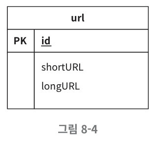
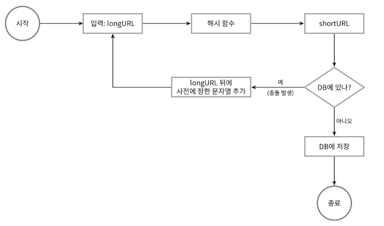
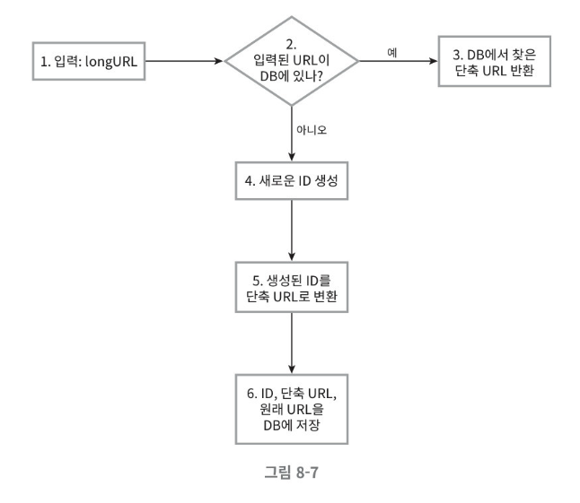
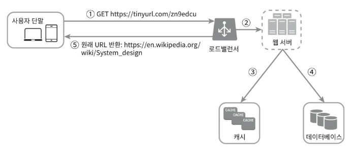

# 08. URL 단축기 설계

## 1단계) 문제 이해 및 설계 범위 확장
📌 요구 사항
- URL 단축 : 주어진 긴 URL을 훨씬 짧게 줄인다
- URL 리디렉션 : 축약된 URL로 HTTP 요청이 오면 원래 URL로 안내
- 높은 가용성과 규모 확장성, 그리고 장애 감내가 요구됨

## 2단계) 개략적 해결 방안 및 동의 구하기
### API 엔드포인트
URL 단축기는 기본적으로 두 개의 엔드포인트가 필요하다
- URL 단축용 엔드 포인트
    - 새 단축 URL을 생성하고자 하는 클라이언트는 이 엔드 포인트에 단축할 URL을 인자로 실어서 POST 요청을 보내야 한다.
    - POST "/api/v1/data/shorten"
    - 인자 : {long URL : longURLString }
    - 반환 : 단축 URL

- URL 리다이렉션용 엔드포인트
    - 단축 URL에 대해서 HTTP 요청이 오면 원래 URL로 보내기 위한 용도의 엔드 포인트.
    - GET "/api/v1/shotUrl"
    - 반환 : HTTP 리다렉션 목적지가 될 원래 URL

### URL 리디렉션 
URL을 받은 서버는 그 URL을 원래 URL로 바꾸어서 301or302 응답의 Location 해더에 넣어 반환한다.

- 301 Permanently Moved :

    해당 URL에 대한 HTTP 요청의 처리 책임이 영구적으로 Location 헤더에 반환된 URL로 이전되었다는 응답니다.
    
    영구적으로 이전되었으므로, 브라우저는 이 응답을 캐시(cache)한다. 이후 단축 URL에 요청을 보낼 필요 있을 때 브라우저는 캐시된 원래 URL로 요청을 보내게 된다. 
- 302 Found

    URL로의 오청이 '일시적으로' Location 헤더가 지정하는 URL에 의해 처리되어야 한다는 응답이다. 따라서 클라이언트의 요청은 언제나 단축 URL에 의해 처리되어야 한다.

    클라이언트의 요청은 언제나 단축 URL서버에 먼저 보내진 후에 원래 URL로 리디렉션되어야 한다.

301은 첫 번째 요청만 단축 URL 서버로 전송되기 때문에(캐싱으로 인해) 서버 부하를 줄이는 것이 중요할 때 사용된다.

302는 클릭 발생률이나 발생 위치를 추적하는 데 좀 더 유리하다.

### URL 단축
단축 URL이 Domain.com/{hashValue} 같은 형태라고 해 보자. 결국 중요한 것은 긴 URL을 이 해시 값으로 대응시킬 해시 함수 Fx를 찾는 일이 될 것이다.

이 해시 함수 Fx는 다음을 만족해야 한다.
- 입력으로 주어지는 긴 URL이 다른 값이면 해시 값도 달라야 한다.
- 계산된 해시 값은 원래 입력으로 주어졌던 긴 URL로 복원될 수 있어야 한다.

## 3단계) 상세 설계
### 데이터 모델
초기 전략으로 개략적 설계에서는 모든 정보를 해시 테이블에 두었지만, 메모리는 유한한 데다 비싸기 때문에 적절하지 않다.

따라서 관계형 DB에 저장하는 것이 효율적일 수 있다.

### 해시 함수
원래 URL을 단축 URL로 변환하는 함수로 해시 함수가 계산하는 단축 URL 값을 hashValue라고 가정한다.

hashValue는 [0-9, a-z, A-Z]의 문자들로 구성. ⇒ 총 62개

만약 3650억 개의 url을 필요로 하는 시스템에서는 62^n ≥ 3650억인 n의 최솟값인 7이 될것이다. 따라서 hashValue의 길이는 7이 되어야 한다.

해시 함수 구현에 쓰일 기술로는 해시 후 충돌 해소 방법과 base-62 방법이 있다.

**[ 해시 후 충돌 해소 ]**

긴 URL을 줄이려면, 원래 URL을 7글자 문자열로 줄이는 해시 함수가 필요하다. 손쉬운 방법은 CRC32, MD5, SHA-1 같이 잘 알려진 해시 함수를 이용하는 것이다.

각 해시 함수는 7글자가 넘을 수 있고, 넘게 되면 앞의 7글자만 사용한다.
이 경우 해시 결과가 충돌할 수 있고, 이를 해소하기 위해 사전에 정의한 문자열을 해시값데 덧붙인다.

한 번 이상 데이터베이스에 질의해야 하므로 오버헤드가 큰 편이다.

**[ base-62 변환]**

진법 변환은 URL 단축기를 구현할 때 흔히 사용되는 접근법
hashValue에 사용할 수 있는 문자가 62개이므로 62진법을 사용

- 62진법은 수를 표현하기 위해 총 62개의 문자를 사용하는 진법이다. 따라서 0은 0으로, 9는 9로, 10은 a로, 61은 Z로 대응시켜 표현하도록 할 것이다.
- 11157(10진수) = 2 x 62^2 + 55 x 62 ^1 + 59 x 62 ^ 0 = [2, 55, 59] => [2, T, X] => 2TX(62진수)이다.
- 따라서 단축 URL은 https://tinyurl.com/2TX가 된다.

| 구분 | 해시 후 충돌 해소 전략 | Base-62 변환 |
|------|-------------------------|---------------|
| **단축 URL 길이** | 단축 URL의 길이가 **고정됨** | 단축 URL의 길이가 **가변적**이며, ID 값이 커질수록 같이 길어짐 |
| **유일성 보장 방식** | **유일성이 보장되는 ID 생성기 불필요** | **유일성 보장 ID 생성기 필요** |
| **충돌 가능성** | **충돌이 발생할 수 있어** 별도의 **충돌 해소 전략 필요** | **ID의 유일성이 보장**된 후 변환되므로 **충돌 불가능** |
| **URL 예측 가능성** | 해시를 통해 계산되므로 **다음 URL을 예측 불가능** | ID가 1씩 증가하는 경우 **다음 URL을 쉽게 추측 가능**해 **보안상 위험** |

### URL 단축기 상세 설계
**처리 흐름 순서도**

입력된 URL이 https://en.wikipedia.org/wiki/Systems_design이라고 하면 이 URL에 대해 ID 생성기가 반환한 ID는 2009215674938이다.

이 ID를 62진수로 변환하면 zn9edcu를 얻는다.
| ID | shortURL | longURL |
| -- | -------- | ------- |
|2009215674938 |	zn9edcu	| https://en.wikipedia.org/wiki/Systems_design

### URL 리다이렉션 상세 설계

쓰기보다 읽기를 더 자주 하는 시스템이므로 <단축 URL, 원래 URL>의 쌍을 캐시에 저장하여 성능을 높인다.

**로드밸런서의 동작 흐름**
1. 사용자가 단축 URL을 클릭한다.
2. 로드밸런서가 해당 클릭으로 발생한 요청을 웹 서버에 전달한다.
3. 단축 URL이 이미 캐시에 있는 경우에는 원래 URL을 바로 꺼내서 클라이언트에게 전달한다.
4. 캐시에 해당 단축 URL이 없는 경우에는 데이터베이스에서 꺼낸다. 데이터베이스에 없다면 아마 사용자가 잘못된 단축 URL을 입력한 경우일 것이다.
5. 데이터베이스 꺼낸 URL을 캐시에 넣은 후 사용자에게 반환한다.