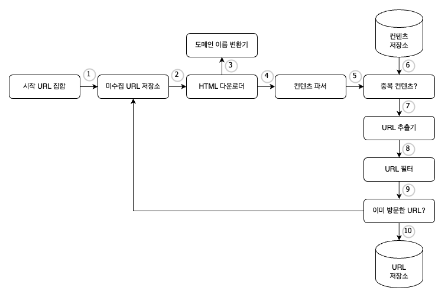

# 09. 웹 크롤러 설계
크롤러는 로봇 또는 스파이더라고도 부른다.  
크롤러는 다양하게 활용된다.
- 검색 엔진 인덱신 (Search Engine Indexing): 크롤러의 가장 보편적인 용례. 검색 엔진을 위한 로컬 인덱스를 만든다. (google bot: 구글 검색엔진이 사용하는 웹 크롤러)
- 웹 아카이빙: 나중에 사용할 목적으로 장기보관하기 위해 웹에서 정보를 모으는 절차를 말한다. 많은 국립 도서관이 크롤러를 돌려 웹사이트를 아카이빙한다.
- 웹 마이닝: 웹 마이닝을 통해 인터넷에서 유용한 지식을 도출해 낼 수 있다.
- 웹 모니터링: 크롤러를 사용하면 인터넷에서 저작권이나 상표권이 침해되는 사례를 모니터링할 수 있다. (Digimarc의 웹 크롤러 보고)

크롤러의 복잡도는 처리해야 하는 데이터 규모에 따라 달라진다. 따라서 크롤러 설계시 가장 우선은 데이터의 규모와 기능을 정의하는 것이다.

## 1단계) 문제 이해 및 설계 범위 확정
웹 크롤러의 기본 알고리즘
1. URL 집합이 입력으로 주어지면, 해당 URL들이 가리키는 모든 웹 페이지를 다운로드
2. 다운받은 웹 페이지에서 URL들을 추출한다
3. 추출된 URL들을 다운로드할 URL 목록에 추가하고 위의 과정을 처음부터 반복한다.

하지만 실제 설계는 이처럼 단순하지 않다. 웹 크롤러는 다음과 같은 특성을 지녀야 한다.
- 규모 확장성: parallelism(병행성)을 활용하면 보다 효과적으로 웹 크롤링을 할 수 있을 것이다.
- 안정성(robustness): 잘못 작성된 HTML, 아무 반응이 없는 서버, 장애, 악성코드가 붙어있는 링크 등 비정상적 입력이나 환경에 대응할 수 있어야한다.
- 예절(politeness): 수집 대상 웹 사이트에 짧은 시간 동안 너무 많은 요청을 보내서는 안된다.
- 확장성(extensibility): 새로운 형태의 콘텐츠를 지원하기가 쉬워야한다. ex) 이미지 파일도 크롤링하고 싶다면 쉽게 기능을 추가할 수 있어야 한다.

### 개략적 규모 추정
**조회 연산량**
- 매달 10억개의 웹 페이지를 다운로드한다.
- QPS = 10억/30일/24시간/3600초 = 대략 400페이지/초
- 최대(peak) QPS = 2 * QPS = 800
**저장 용량**
- 웹 페이지의 크기 평균은 500k라고 가정
- 10억 페이지 * 500k = 500TB/월
- 1개월치 데이터를 보관하는 데는 500TB, 5년간 보관한다고 가정하면 결국 500TB 12개월 5년 = 30PB의 저장용량이 필요

## 2단계) 개략적 설계안 제시 및 동의 구하기

이 설계안을 보구 웹 크롤러의 작업 흐름을 살펴보자.

### 시작 URL 집합
웹 크롤러가 작동하는 출발점  
전체 웹을 크롤링해야 하는 경우 가능한 한 많은 링크를 탐색할 수 있도록 방법을 고안해야 한다.
- 전체 URL 공간을 작은 부분 집합으로 나누는 전략
- 주제별로 세분화하고 그 각각에 다른 시작 URL을 사용하는 전략

### 미수집 URL 저장소
다운로드 할 URL을 저장/관리하는 컴포넌트로 FIFO Queue이다.

### HTML 다운로더
인터넷에서 웹페이지를 다운로드하는 컴포넌트, 다운하려는 URL은 URL 프론티어에서 받아온다.

### 도메인 이름 변환기
웹페이지를 다운받으려면 URL을 IP로 변환하는 절차가 필요하다. HTML 다운로더가 이를 위해 도메인 이름 변환기를 이용한다.

### 콘텐츠 파서
웹페이지를 다운로드하면 파싱과 검증 절차를 거쳐야한다.

### 중복 컨텐츠
웹에 공개된 연구결과에 따르면, 29% 가량의 웹 페이지 컨텐츠는 중복이다. 따라서 같은 컨텐츠를 여러번 저장하게 될 수 있다.  
본 설계안의 경우, 이 문제를 해결하기 위한 자료구조를 도입하여 데이터 중복을 줄이고 데이터 처리에 소요되는 시간을 줄인다. 이때 두 문 서를 비교하는 방법은 해시 값을 사용할 수 있다.

### 콘텐츠 저장소
HTML 문서를 보관하는 시스템, 저장소를 구현하는 데 쓰일 기술을 고를 대는 저장할 데이터의 유형, 크기, 저장소 접근 빈도, 데이터의 유효 기간 등을 종합적으로 고려해야한다. 본 설계안의 경우에는 디스크와 메모리를 동시에 사용하는 저장소를 택할 것이다.
- 데이터 양이 너무 많으므로 대부분의 컨텐츠는 디스크에 저장한다.
- 인기있는 컨텐츠는 메모리에 두어 접근 지연시간을 줄일 것이다.

### URL 추출기
저장한 HTML 문서들을 파싱해 링크들을 골라내는 역할.
상대경로는 전부 절대경로로 변환해준다.

### URL 필터
URL 필터는, URL 저장소에 저장하기 전 
- 특정한 컨텐츠 타입이나 파일 확장자를 갖는 URL
- 접속 시 오류가 발생하는 URL
- 접근 제외 목록(deny list) 에 포함된 URL

을 필터링한다.

### 이미 방문한 URL
같은 URL을 여러 번 처리하는 일을 방지하여 서버 부하를 줄이고 시스템이 무한 루프에 빠지는 일을 방지한다.
이를 위해 이미 방문한 URL 저장소, 미수집 URL 저장소에 저장된 URL을 추적할 수 있도록 하는 자료 구조를 사용한다. 해당 자료 구조로는 블룸 필터나 해시 테이블이 널리 쓰인다.

### URL 저장소
이미 방문한 URL을 보관

### 전체 작업 흐름

1. 시작 URL들을 미수집 URL 저장소에 저장
2. HTML 다운로더는 미수집 URL 저장소에서 URL 목록을 가져온다.
3. HTML 다운로더는 도메인 이름 변환기를 사용하여 URL의 IP 주소를 알아내고, 해당 IP 주소로 접속하여 웹페이지를 다운받는다.
4. 컨텐츠 파서는 다운된 HTML 페이지를 파싱하여 올바른 형식을 갖춘 페이지인지 검증한다.
5. 컨텐츠 파싱과 검증이 끝나면 중복 컨텐츠인지 확인하는 절차를 개시한다.
6. 중복 컨텐츠인지 확인하기 위해서, 해당 페이지가 이미 저장소에 있는지 본다.
    - 이미 저장소에 있는 컨텐츠인 경우에는 처리하지 않고 버린다
    - 저장소에 없는 컨텐츠인 경우에는 저장소에 저장한 뒤 URL 추출기로 전달한다.
7. URL 추출기는 해당 HTMl 페이지에서 링크를 골라낸다.
8. 골라낸 링크를 URL 필터로 전달한다.
9. 필터링이 끝나고 남은 URL만 중복 URL 판별 단계로 전달한다.
10. 이미 처리한 URL인지 확인하기 위하여, URL 저장소에 보관된 URL인지 살핀다. 이미 있으면 버림
11. 저장소에 없는 URL은 URL 저장소에 저장할 뿐 아니라 미수집 URL 저장소에도 전달한다.

## 3단계) 상세 설계
웹은 유향 그래프와 같다. 따라서 크롤링은 그래프를 탐색하는 과정으로 DFS, BFS 탐색 알고리즘을 사용할 수 있다. 하지만 그래프 크기가 클 경우 얼마나 깊이 탐색하게 될지 가늠하기 어려워지는 DFS 보단 BFS가 주로 활용된다.

하지만 BFS에는 두 가지 문제점이 있다.
- 한 페이지에서 나오는 링크의 상당수는 같은 서버로 되돌아감. => politeness 위배
- 우선순위가 없다. 페이지 순위, 사용자 트래픽의 양, 업데이트 빈도 등 여러가지 척도에 비추어 구현하려면 표준적 알고리즘만 사용해서는 안된다.

### 미수집 URL 저장소
미수집 URL 저장소를 활용하면 위의 문제를 좀 쉽게 해결할 수 있다.

앞서 살펴본 대로 URL 저장소는 다운로드할 URL을 보관하는 장소다. 이 저장소를 잘 구현하면 politeness 를 갖추면서, 우선순위를 구별하는 크롤러를 구현할 수 있다.

**[ 예의 ]**  
- 동일 웹사이트에 대해서는 한 번에 한 페이지만 요청한다.
- 같은 페이지를 다운받는 태스크는 시간차를 두고 실행한다.

이를 처리하기 위해 웹사이트의 호스트명과 다운로드를 수행할 작업 스레드 사이의 관계를 유지하기 위한 큐를 관리하는 것

- queue router: 같은 호스트에 속한 URL은 언제나 같은 큐로 가도록 보장하는 역할
- mapping table: 호스트 이름과 큐 사이의 관계를 보관하는 테이블
- FIFO 큐: 같은 호스트에 속한 URL은 언제나 같은 큐에 보관된다.
- queue selector: 큐 선택기는 큐들을 순회하면서 큐에서 URL을 꺼내서 해당 큐에서 나온 URL을 다운로드하도록 지정된 작업스레드에 전달하는 역할을 한다.
- 작업스레드(worker thread): 작업 스레드는 전달된 URL을 다운로드하는 작업을 수행한다. 전달된 URL은 순차적으로 처리될 것이며, 작업들 사이에는 일정한 지연시간을 둘 수 있다.

**[ 우선순위 ]**  
유용성에 따라 URL의 우선순위를 나눌 때는 페이지 랭크, 트래픽 양, 갱신 빈도 등 다양한 척도를 사용할 수 있을 것이다.

본 절에서 설명할 prioritizer는 URL 우선순위를 정하는 컴포넌트다.

큐에 URL을 저장하기 전에 prioritizer(순위 결정 장치) 를 거치도록 설계를 변경한다.

- 순위 결정 장치: URL 을 입력으로 받아 우선순위를 계산.
- 우선순위 별로 큐가 하나씩 할당된다. 우선순위가 높으면 선택될 확률도 올라간다.
- 큐 선택기: 임의 큐에서 처리할 URL을 꺼낸다. 순위가 높은 큐에서 더 자주 꺼내도록 프로그램 되어있다.

이를 반영한 전체 설계도는 다음과 같다

**[ 신선도 ]**  
웹페이지는 수시로 추가되고, 삭제되고, 변경되므로 데이터의 신선함(freshness)를 유지하기 위해서 이미 다운받은 페이지라고 해도 재수집할 필요가 있다. 이 작업을 최적화하기 위한 전략으로는 다음과 같은 것들이 있다.

- 웹 페이지의 변경 이력 활용
- 우선순위가 높은 페이지는 더 자주 재수집

**[ 미수집 URL 저장소를 위한 지속성 저장장치 ]**
검색 엔진을 위한 크롤러는 수억 개에 달하는 URL을 처리해야 한다. 전부 메모리에 저장하면 안정성과 확장성이 떨어지고, 전부 디스크에 저장하면 느려저서 쉽게 성능 병목지점이 된다.

따라서 본 설계안은 대부분의 URL은 디스크에 두지만 I/O 비용을 줄이기 위해 메모리 버퍼에 큐를 두는 절충안을 택한다. 이때 버퍼에 있는 데이터는 주기적으로 디스크에 기록한다

### HTML 다운로더
HTML 다운로더는 HTTP 프로토콜을 통해 웹페이지를 내려 받는다. 

HTML 다운로더는 HTTP 프로토콜을 통해 웹페이지를 내려 받는다. 다운로더에 대해 알아보기 전에 먼저 로봇 제외 프로토콜(Robot exclusion Protocol)에 대해 알아보자.

**[ Robots.txt ]**  
로봇 제외 프로토콜로, 웹사이트가 크롤러와 소통하는 표준적인 방법이다.

- 이 파일에는 크롤러가 수집해도 되는 페이지 목록이 담겨있음
- 크롤러는 크롤링 전 해당 파일에 나열된 규칙을 먼저 확인
- 해당 파일을 계속 다운하는 것을 방지하기 위해 주기적으로 다시 다운받아 캐싱
- 아마존 robots.txt: https://www.amazon.com/robots.txt

**[ 성능 최적화 ]**  
HTML 다운로더를 설계할 때는 성능최적화도 아주 중요하다. 다음은 HTML 다운로더에 사용할 수 있는 성능 최적화 기법들이다.

- 분산 크롤링 : 성능을 높이기 위해 크롤링 작업을 여러 서버에 분산하는 방법이다.
    - 각 서버는 여러 스레드를 돌려 다운로드 작업 처리
    - URL 공간은 작은 단위로 분할하여, 각 서버는 그중 일부의 다운로드를 담당
- 도메인 이름 변환 결과 캐시 : DNS 요청과 응답 과정이 동기적이라 크롤러 성능의 병목이 생길 수 있다. 따라서 DNS 조회 결과로 얻은 도메인 이름과 IP 주소 사이의 관계를 캐싱하는 식으로 성능을 개선할 수 있다.
    - 크론 잡(cron job) 등을 돌려 주기적으로 캐시를 갱신하여 성능을 높일 수 있다.
- 지역성: 크롤링 작업을 수행하는 서버를 지역별로 분산하는 방법이다. 크롤링 서버(혹은 다른 컴포넌트)가 크롤링 대상 서버와 지역적으로 가까우면 페이지 다운로드 시간이 줄어들것이다.

- 짧은 타임아웃: 어떤 웹서버는 응답이 느리거나 아예 응답하지 않는데, 이런 경우를 대비해 크롤러가 최대 얼마나 기다릴지를 미리 정해두는 것이다. 타임아웃의 경우 해당 페이지 다운로드를 중단한다.

**[ 안전성 ]**
- 안정 해시(consistent hashing): 다운로더 서버(분산 HTML 다운로더)들에 부하를 고르게 분산하기 위해 적용 가능
- 크롤링 상태 및 수집 데이터 저장: 장애 복구를 위해 크롤링 상태와 수집된 데이터를 지속적으로 저장장치에 기록
- 예외 처리: 예외가 발생해도 전체 시스템이 중단되지 않도록 미리 처리
- 데이터 검증: 시스템 오류를 방지, 비정상적 입력이나 환경을 대비

**[ 확장성 ]**
본 예제의 경우 확장 모듈을 끼워 넣음으로써 새로운 형태의 컨텐츠를 지원할 수 있도록 설계하였다.

**[ 문제가 있는 콘텐츠 감지 및 회피 ]**
- 중복 컨텐츠: 웹 컨텐츠의 30% 가량은 중복, 해시나 체크섬 등의 방법을 사용해 중복 컨텐츠를 탐지 가능
- 거미 덫(spider trap): 크롤러를 무한루프에 빠뜨리도록 설계한 웹 페이지
    - 예시) spidertrapexample.com/foo/bar/foo/bar/foo/bar/...
    - URL의 최대 길이를 제한
    - 사람이 수작업으로 찾아낸 후, 이런 사이트를 크롤러 탐색 대상에서 제외하거나 URL 필터 목록에 거는 방식 사용
- 데이터 노이즈: 가치 없는 콘텐츠는 가능하면 제외하는 것이 좋음

### 마무리
**[ 좋은 크롤러가 갖추어야하는 특성 ]**

- 규모 확장성(scalability)
- 예의(politeness)
- 확장성(extensibility)
- 안정성
- 문제 있는 콘텐츠 감지 및 회피

**[ 추가로 논의해보면 좋은 것 ]**

- 서버 측 렌더링 (server-side rendering): 웹 페이지를 그냥 있는 그대로 다운받아서 파싱해보면 그렇게 동적으로 생성되는 링크는 발견할 수 없을 것이다. 이 문제는 페이지를 파싱하기 전에 서버 측 렌더링을 적용하면 해결할 수 있다.
    - 파이썬 크롤링 도구인 Selenium은 동적인 크롤링이 가능하게끔 한다.
- 원치 않는 페이지 필터링: 스팸 방지 컴포넌트를 두어 품질이 조약하거나 스팸성인 페이지를 필터링
- 데이터베이스 다중화 및 샤딩: 다중화나 샤딩 적용 시 데이터 계층 가용성, 규모 확장성, 안정성 향상
- 수평적 규모 확장성: 대규모 분산 다운로드 서버로 확장하기 위해 무상태 서버로 구성
- 데이터 분석 솔루션(analytics)
