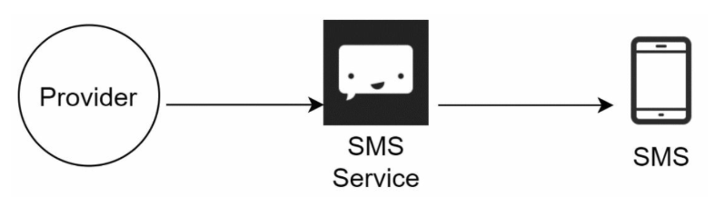
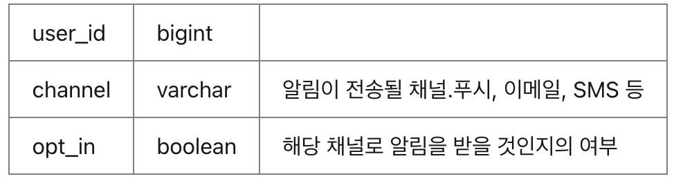

# 10. 알림 시스템 설계
## 1단계) 문제 이해 및 설계 범위 확정
확장성 높은 알림 시스템에 대한 요구사항은 다음과 같다.

- 지원 알림: 푸시 알림, SMS 메시지, 이메일
- 실시간성: 연성 실시간(soft real-time) 시스템, 일부 지연 허용
- 지원 단말: iOS, 안드로이드, 랩톱, 데스크톱
- 알림 제공자: 클라이언트 어플리케이션 프로그램 or 서버 측 스케줄링
- 사용자가 알림을 받지 않도록 설정 가능해야함
- 가용 알림 수 (하루 기준): 모바일 푸시알림 천만 건, SMS 메시지 백만 건, 이메일 5백만 건 전송 가능

## 2단계) 계략적 설계안 제시 및 동의 구하기
### 알림 유형별 지원 방안
우선 각각의 알림 메커니즘이 어떻게 동작하는지 알아보자.

대부분의 알림은 알림 전송 서비스만 달라질 뿐 알림 제공자 -> 원격 서비스 -> 알림 수신 단말의 흐름으로 전송된다.

**[ iOS 푸시 알림 ]**

APNS(Appli Push Notification Service): 애플이 제공하는 원격 서비스로, 푸시 알림을 iOS 장치로 보내는 역할
- 알림 제공자: 알림 요청을 만들어 알림 전송 서비스로 보내주는 주체로, 알림 요청에는 단말 토큰과 페이로드 필요
    - 단말 토큰: 알림 요청을 보내는 데 필요한 고유 식별자
    - 페이로드: 알림 내용을 담은 json 딕셔너리
- 원격 서비스: 푸시 알림, 메시지, 이메일 등 알림을 단말기로 전송하는 장치 (대부분 써드파티 서비스를 사용)
- 알림 수신 단말: 알림을 받는 주체

**[ 안드로이드 푸시 알림 ]**

Firebase를 통해 안드로이드 장치로 푸시 알림 전송

**[ SMS 메시지 ]**

SMS 메시지를 보낼땐 보통 Twilio, Nexmo 같은 제3 사업자의 서비스를 많이 이용 (유료)

**[ 이메일 ]**

고유 이메일 서버를 사용해도 되지만, 높은 전송 성공률과 데이터 분석 서비스를 제공한다는 점에서 대부분 상용 이메일 서비스(Sendgird, Mailchimp 등) 사용

### 연락처 정보 수집 절차
알림을 보내려면 모바일 단말 토큰, 전화번호, 이메일 주소 등의 정보가 필요하다.

사용자가 앱을 설치하거나 처음으로 계정을 등록 하면 API 서버는 해당 사용자의 정보를 수집하여 데이터베이스에 저장한다.

### 알림 전송 및 수신 절차

**[ 개략적 설계안 (초안) ]**

- 서비스(1~N): 각각의 서비스들은 마이크로서비스 일 수도 있고 크론잡일 수도 있고, 분산 시스템 컴포넌트일 수도 있다.
- 알림 시스템(Notification System): 알림 전송/수신 처리의 핵심으로, 알림을 생성한다.
    - 우선은 1개 서버만 사용하는 것으로 가정
    - 서비스 1~N에 대해 알림 전송을 위한 API를 제공해야 함
    - 제3자 서비스에 전달할 알림 페이로드를 만들어낼 수 있어야함
- 제3자 서비스(써드파티 서비스): 이 서비스들은 사용자에게 알림을 실제로 전달하는 역할을 한다.
    - 확장성: 제3자 서비스에 대해 쉽게 새로운 서비스를 통합하거나 기존 서비스를 제거할 수 있어야함
    - 특정 서비스는 국가, 지역에 따라 지원 여부를 고려해야함 (중국에선 FCM 사용 불가)
- 단말: 사용자는 자신의 단말에서 알림을 수신한다.

**[ 해당 설계안의 문제점 ]**
- SPOF: 알림 서비스에 서버가 하나뿐이라 단일 장애 지점이 된다.
- 규모 확장성: 한 대의 서비스로 푸시 알림에 관계된 모든 것을 처리하므로, DB나 캐시 등 중요 컴포넌트의 규모를 개별적으로 늘리기 어렵다.
- 성능 병목: 알림 처리 및 전송이 자원을 많이 필요로 할 수 있다. 모든 것을 한 서버로 처리하면 트래픽이 몰리는 시간에 시스템 과부하 상태에 빠질 수 있다.

**[ 개략적 설계안 (개선) ]**  
앞서 제시한 문제점에 대해 다음과 같은 방향으로 개선해보자.
- DB와 캐시를 알림 시스템의 주 서버에서 분리
- 알림 서버 증설, 오토 스케일링이 가능하도록 변경
- 메시지 큐를 이용해 시스템 컴포넌트 사이의 강결합을 제거

 

- 서비스(1~N): 알림 서버에 API를 통해 알림을 보낼 서비스들 (변경사항 없음)
- 알림 서버(Notification servers): 오토스케일링 가능한 구조로 변경하고 컴포넌트를 분리
    - 알림 전송 API: 사내 서비스 또는 인증된 클라이언트만 이용 가능한 API 제공
    - 알림 검증: 이메일 주소, 전화번호 등 입력에 대한 기본적 검증 수행
    - DB 또는 캐시 질의: 알림에 포함시킬 데이터를 가져옴
    - 알림 전송: 알림 데이터를 메시지 큐에 삽입, 여러 큐를 사용하므로 병렬 처리 가능
- 캐시: 사용자 정보, 단말 정보, 알림 템플릿 등 캐싱
- DB: 사용자, 알림, 설정 등 다양한 정보 저장
- 메시지 큐: 시스템 컴포넌트 간 의존성 제거(알림 생성과 알림 전송을 서로 다른 컴포넌트로 분리) 및 버퍼 역할도 수행
- 작업 서버(workers): 메시지 큐에서 전송할 알림을 꺼내서 제3자 서비스로 전달하는 서버
- 제3자 서비스, 단말: 변경사항 없음

**컴포넌트의 동작 흐름**
1. API를 호출하여 알림 서버로 알림을 보낸다.
2. 알림 서버는 사용자 정보, 단말 토큰, 알림 설정 같은 메타데이터(metadata)를 캐시나 데이터베이스에서 가져온다.
3. 알림 서버는 전송할 알림에 맞는 이벤트를 만들어서 해당 이벤트를 위한 큐에 넣는다.
4. 작업 서버는 메시지 큐에서 알림 이벤트를 꺼낸다.
5. 작업 서버는 알림을 서드파티로 보낸다.
6. 서드파티는 사용자 단말로 알림을 전송한다.

## 3단계) 상세 설계
이번에는 안정성, 그리고 추가 컴포넌트 및 고려사항에 대해 알아보고, 더 개선된 설계안을 도출할 것이다.

### 안정성
분산 환경에서 운영될 알림 시스템을 설계할 때는 안정성을 확보하기 위한 사항 몇 가지를 반드시 고려해야 한다.

**[ 데이터 손실 방지 ]**  
알림 전송 시스템의 가장 중요한 요구사항 가운데 하나는 어떤 상황에서도 알림이 소실되면 안 된다는 것이다. 알림이 지연되거나 순서가 달라질 수는 있지만 사라지면 곤란하다.

아래 그림과 같이 알림 데이터(로그)를 DB에 보관하는 방식으로 데이터 손실을 방지할 수 있다.

**[ 알림 중복 전송 방지 ]**  
같은 알림이 여러번 반복되는 것을 완전히 막는 것은 가능하지 않다. 분산 시스템의 특성상 가끔은 같은 알림이 중복되어 전송되기도 한다. 다음은 간단한 중복 방지 로직의 사례다.

1. 보내야 할 알림이 도착하면 이벤트 ID를 검사하여 이전에 본 적이 있는 이벤트인지 살핀다.
2. 중복된 이벤트라면 버리고, 그렇지 않으면 알림을 발송한다.

### 추가로 필요한 컴포넌트 및 고려사항
**[ 알림 템플릿 ]**  
- 알림 템플릿은 인자(parameter)나 스타일, 추적 링크를 조정하기만 하면 사전에 지정한 형식에 맞춰 알람을 만들어 내는 틀이다.
- 알림들의 형식을 일관성 있게 유지하고, 오류 가능성과 알림 작성 시간을 줄일 수 있다.

**[ 알림 설정 ]**  
- 너무 많은 알림을 피로감을 유발시키므로, 사용자가 알림 설정을 상세히 조절할 수 있도록 제공하는 것이 좋다.
- 알림 설정 테이블 예시
    
    특정 알림 전송 전에 opt_in 설정을 확인해야 할 것이다.

**[ 전송률 제한 ]**  
- 사용자에게 너무 많은 알림을 보내지 않도록 사용자가 받을 수 있는 알림의 빈도를 제한한다.
- 알림을 너무 많이 보내면 사용자가 알림 기능을 아예 꺼 버릴 수도 있다.

**[ 재시도 방법 ]**  
- 제 3자 서비스가 알림 전송에 실패하면 해당 알림을 재시도 전용 큐에 넣고 같은 문제가 계속해서 발생하면 개발자에게 통지한다.

**[ 푸시 알림과 보안 ]**  
- iOS와 안드로이드 앱의 경우, 알림 전송 API는 appKey와 appSecret을 사용하여 보안을 유지한다.
- 인증된(authenticated), 혹인 승인된(verified) 클라이언트만 해당 API를 사용하여 알림을 보낼 수 있도록 한다.

**[ 큐 모니터링 ]**  
- 알림 시스템의 중요한 메트릭 중 하나는 큐에 쌓인 알림의 개수이다.
- 큐에 쌓인 알림의 수가 많은 경우 → 작업 서버들이 이벤트를 너무 느리게 처리 or 너무 많은 알림 생성

**[ 이벤트 추적 ]**  
- 알림 확인율, 클릭율, 실제 앱 사용으로 이어지는 비율 같은 메트릭은 사용자를 이해하는데 중요하다.
- 데이터 분석 서비스는 그림과 같이 이벤트 추적을 하기도 한다.

    - 이벤트 추적 및 에러 감지
    - 클릭과 알림 거부 등 사용자 데이터 분석

### 수정된 설계안
설명한 내용을 모두 반영하여 수정한 설계안은 다음과 같다.

- 알림 서버에 인증과 전송률 제한 기능 추가
- 전송 실패 대응을 위한 재시도 기능 추가
- 알림 템플릿을 사용하여 알림 생성 과정 단순화, 알림 내용 일관성 확보
- 모니터링과 추적을 위한 분석 서비스 추가